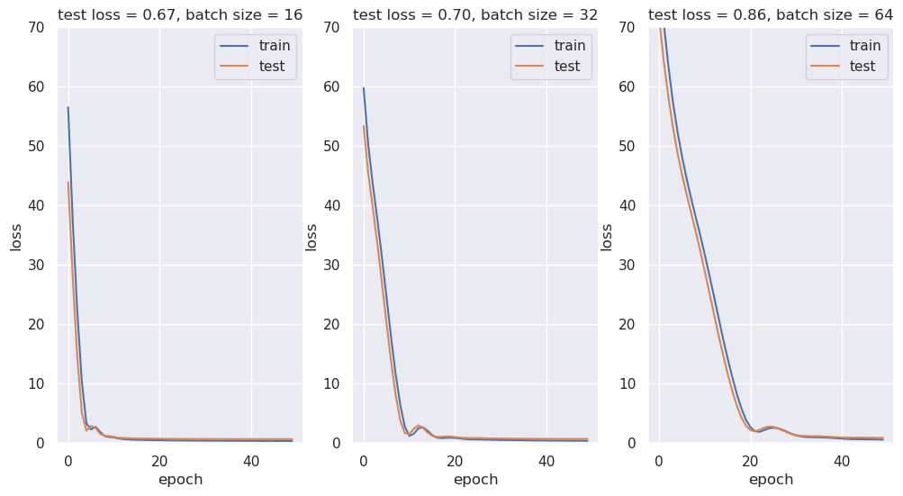
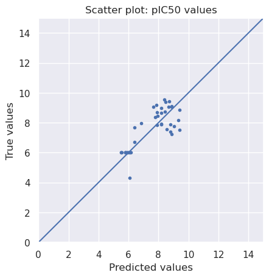
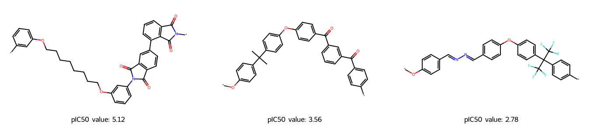

### <font color='lightskyblue'> 0. Import all necessary Libraries </font>


```python
from pathlib import Path
from warnings import filterwarnings

# Silence some expected warnings
filterwarnings("ignore")
!pip install rdkit
!pip install tensorflow
!pip install pandas
!pip install numpy
!pip install scikit-learn
!pip install matplotlib
!pip install seaborn
import pandas as pd
import numpy as np
import rdkit
from rdkit import Chem
from rdkit.Chem import MACCSkeys, Draw, rdFingerprintGenerator
from sklearn.model_selection import train_test_split
import matplotlib.pyplot as plt
from sklearn import metrics
import seaborn as sns

# Neural network specific libraries
from tensorflow.keras.models import Sequential, load_model
from tensorflow.keras.layers import Dense
from tensorflow.keras.callbacks import ModelCheckpoint

print("works")
%matplotlib inline

from IPython.core.interactiveshell import InteractiveShell
InteractiveShell.ast_node_interactivity = "all"
```

    Defaulting to user installation because normal site-packages is not writeable
    Requirement already satisfied: scikit-learn in /software.9/software/Anaconda3/2024.02-1/lib/python3.11/site-packages (1.2.2)
    Requirement already satisfied: numpy>=1.17.3 in /software.9/software/Anaconda3/2024.02-1/lib/python3.11/site-packages (from scikit-learn) (1.26.4)
    Requirement already satisfied: scipy>=1.3.2 in /software.9/software/Anaconda3/2024.02-1/lib/python3.11/site-packages (from scikit-learn) (1.11.4)
    Requirement already satisfied: joblib>=1.1.1 in /software.9/software/Anaconda3/2024.02-1/lib/python3.11/site-packages (from scikit-learn) (1.2.0)
    Requirement already satisfied: threadpoolctl>=2.0.0 in /software.9/software/Anaconda3/2024.02-1/lib/python3.11/site-packages (from scikit-learn) (2.2.0)
    Defaulting to user installation because normal site-packages is not writeable
    Requirement already satisfied: matplotlib in /software.9/software/Anaconda3/2024.02-1/lib/python3.11/site-packages (3.8.0)
    Requirement already satisfied: contourpy>=1.0.1 in /software.9/software/Anaconda3/2024.02-1/lib/python3.11/site-packages (from matplotlib) (1.2.0)
    Requirement already satisfied: cycler>=0.10 in /software.9/software/Anaconda3/2024.02-1/lib/python3.11/site-packages (from matplotlib) (0.11.0)
    Requirement already satisfied: fonttools>=4.22.0 in /software.9/software/Anaconda3/2024.02-1/lib/python3.11/site-packages (from matplotlib) (4.25.0)
    Requirement already satisfied: kiwisolver>=1.0.1 in /software.9/software/Anaconda3/2024.02-1/lib/python3.11/site-packages (from matplotlib) (1.4.4)
    Requirement already satisfied: numpy<2,>=1.21 in /software.9/software/Anaconda3/2024.02-1/lib/python3.11/site-packages (from matplotlib) (1.26.4)
    Requirement already satisfied: packaging>=20.0 in /software.9/software/Anaconda3/2024.02-1/lib/python3.11/site-packages (from matplotlib) (23.1)
    Requirement already satisfied: pillow>=6.2.0 in /software.9/software/Anaconda3/2024.02-1/lib/python3.11/site-packages (from matplotlib) (10.2.0)
    Requirement already satisfied: pyparsing>=2.3.1 in /software.9/software/Anaconda3/2024.02-1/lib/python3.11/site-packages (from matplotlib) (3.0.9)
    Requirement already satisfied: python-dateutil>=2.7 in /software.9/software/Anaconda3/2024.02-1/lib/python3.11/site-packages (from matplotlib) (2.8.2)
    Requirement already satisfied: six>=1.5 in /software.9/software/Anaconda3/2024.02-1/lib/python3.11/site-packages (from python-dateutil>=2.7->matplotlib) (1.16.0)
    Defaulting to user installation because normal site-packages is not writeable
    Requirement already satisfied: seaborn in /software.9/software/Anaconda3/2024.02-1/lib/python3.11/site-packages (0.12.2)
    Requirement already satisfied: numpy!=1.24.0,>=1.17 in /software.9/software/Anaconda3/2024.02-1/lib/python3.11/site-packages (from seaborn) (1.26.4)
    Requirement already satisfied: pandas>=0.25 in /software.9/software/Anaconda3/2024.02-1/lib/python3.11/site-packages (from seaborn) (2.1.4)
    Requirement already satisfied: matplotlib!=3.6.1,>=3.1 in /software.9/software/Anaconda3/2024.02-1/lib/python3.11/site-packages (from seaborn) (3.8.0)
    Requirement already satisfied: contourpy>=1.0.1 in /software.9/software/Anaconda3/2024.02-1/lib/python3.11/site-packages (from matplotlib!=3.6.1,>=3.1->seaborn) (1.2.0)
    Requirement already satisfied: cycler>=0.10 in /software.9/software/Anaconda3/2024.02-1/lib/python3.11/site-packages (from matplotlib!=3.6.1,>=3.1->seaborn) (0.11.0)
    Requirement already satisfied: fonttools>=4.22.0 in /software.9/software/Anaconda3/2024.02-1/lib/python3.11/site-packages (from matplotlib!=3.6.1,>=3.1->seaborn) (4.25.0)
    Requirement already satisfied: kiwisolver>=1.0.1 in /software.9/software/Anaconda3/2024.02-1/lib/python3.11/site-packages (from matplotlib!=3.6.1,>=3.1->seaborn) (1.4.4)
    Requirement already satisfied: packaging>=20.0 in /software.9/software/Anaconda3/2024.02-1/lib/python3.11/site-packages (from matplotlib!=3.6.1,>=3.1->seaborn) (23.1)
    Requirement already satisfied: pillow>=6.2.0 in /software.9/software/Anaconda3/2024.02-1/lib/python3.11/site-packages (from matplotlib!=3.6.1,>=3.1->seaborn) (10.2.0)
    Requirement already satisfied: pyparsing>=2.3.1 in /software.9/software/Anaconda3/2024.02-1/lib/python3.11/site-packages (from matplotlib!=3.6.1,>=3.1->seaborn) (3.0.9)
    Requirement already satisfied: python-dateutil>=2.7 in /software.9/software/Anaconda3/2024.02-1/lib/python3.11/site-packages (from matplotlib!=3.6.1,>=3.1->seaborn) (2.8.2)
    Requirement already satisfied: pytz>=2020.1 in /software.9/software/Anaconda3/2024.02-1/lib/python3.11/site-packages (from pandas>=0.25->seaborn) (2023.3.post1)
    Requirement already satisfied: tzdata>=2022.1 in /software.9/software/Anaconda3/2024.02-1/lib/python3.11/site-packages (from pandas>=0.25->seaborn) (2023.3)
    Requirement already satisfied: six>=1.5 in /software.9/software/Anaconda3/2024.02-1/lib/python3.11/site-packages (from python-dateutil>=2.7->matplotlib!=3.6.1,>=3.1->seaborn) (1.16.0)


    WARNING: All log messages before absl::InitializeLog() is called are written to STDERR
    I0000 00:00:1776200081.375511 3146271 port.cc:153] oneDNN custom operations are on. You may see slightly different numerical results due to floating-point round-off errors from different computation orders. To turn them off, set the environment variable `TF_ENABLE_ONEDNN_OPTS=0`.
    I0000 00:00:1776200081.379118 3146271 cudart_stub.cc:31] Could not find cuda drivers on your machine, GPU will not be used.
    I0000 00:00:1776200081.416513 3146271 cpu_feature_guard.cc:227] This TensorFlow binary is optimized to use available CPU instructions in performance-critical operations.
    To enable the following instructions: AVX2 AVX512F AVX512_VNNI AVX512_BF16 FMA, in other operations, rebuild TensorFlow with the appropriate compiler flags.
    WARNING: All log messages before absl::InitializeLog() is called are written to STDERR
    I0000 00:00:1776200093.064043 3146271 port.cc:153] oneDNN custom operations are on. You may see slightly different numerical results due to floating-point round-off errors from different computation orders. To turn them off, set the environment variable `TF_ENABLE_ONEDNN_OPTS=0`.
    I0000 00:00:1776200093.066573 3146271 cudart_stub.cc:31] Could not find cuda drivers on your machine, GPU will not be used.


    works


### <font color='lightskyblue'> Set path to this notebook </font>


```python
# Set path to this notebook
HERE = Path(_dh[-1])
DATA = HERE / "data"
```

### <font color='lightskyblue'> 1. Data preparation </font>
Load table and use important columns


```python
# Load data
df = pd.read_csv(DATA / "GPCR.csv", index_col=0, sep=";")
df = df.reset_index(drop=True)
df.head()

# Check the dimension and missing value of the data
print("Shape of dataframe : ", df.shape)
df.info()
```


<div>
<style scoped>
    .dataframe tbody tr th:only-of-type {
        vertical-align: middle;
    }

    .dataframe tbody tr th {
        vertical-align: top;
    }

    .dataframe thead th {
        text-align: right;
    }
</style>
<table border="1" class="dataframe">
  <thead>
    <tr style="text-align: right;">
      <th></th>
      <th>Molecule Name</th>
      <th>Molecule Max Phase</th>
      <th>Molecular Weight</th>
      <th>#RO5 Violations</th>
      <th>AlogP</th>
      <th>Compound Key</th>
      <th>Smiles</th>
      <th>Standard Type</th>
      <th>Standard Relation</th>
      <th>Standard Value</th>
      <th>...</th>
      <th>Document ChEMBL ID</th>
      <th>Source ID</th>
      <th>Source Description</th>
      <th>Document Journal</th>
      <th>Document Year</th>
      <th>Cell ChEMBL ID</th>
      <th>Properties</th>
      <th>Action Type</th>
      <th>Standard Text Value</th>
      <th>Value</th>
    </tr>
  </thead>
  <tbody>
    <tr>
      <th>0</th>
      <td>NaN</td>
      <td>NaN</td>
      <td>491.60</td>
      <td>1.0</td>
      <td>6.70</td>
      <td>BDBM349625</td>
      <td>Cc1cc(F)cc(C)c1C(=O)c1sc2cc(O)ccc2c1-c1ccc(CCN...</td>
      <td>IC50</td>
      <td>'&lt;'</td>
      <td>1000.0</td>
      <td>...</td>
      <td>CHEMBL5726517</td>
      <td>37</td>
      <td>BindingDB Patent Bioactivity Data</td>
      <td>NaN</td>
      <td>2019</td>
      <td>NaN</td>
      <td>NaN</td>
      <td>NaN</td>
      <td>NaN</td>
      <td>1000.0</td>
    </tr>
    <tr>
      <th>1</th>
      <td>NaN</td>
      <td>NaN</td>
      <td>507.60</td>
      <td>2.0</td>
      <td>6.54</td>
      <td>BDBM349626</td>
      <td>Cc1cc(F)cc(C)c1C(=O)c1sc2cc(O)ccc2c1-c1ccc(OCC...</td>
      <td>IC50</td>
      <td>'&lt;'</td>
      <td>50000.0</td>
      <td>...</td>
      <td>CHEMBL5726517</td>
      <td>37</td>
      <td>BindingDB Patent Bioactivity Data</td>
      <td>NaN</td>
      <td>2019</td>
      <td>NaN</td>
      <td>NaN</td>
      <td>NaN</td>
      <td>NaN</td>
      <td>50000.0</td>
    </tr>
    <tr>
      <th>2</th>
      <td>NaN</td>
      <td>NaN</td>
      <td>521.63</td>
      <td>2.0</td>
      <td>6.93</td>
      <td>BDBM349627</td>
      <td>Cc1cc(F)cc(C)c1C(=O)c1sc2cc(O)ccc2c1-c1ccc(OCC...</td>
      <td>IC50</td>
      <td>'&lt;'</td>
      <td>50000.0</td>
      <td>...</td>
      <td>CHEMBL5726517</td>
      <td>37</td>
      <td>BindingDB Patent Bioactivity Data</td>
      <td>NaN</td>
      <td>2019</td>
      <td>NaN</td>
      <td>NaN</td>
      <td>NaN</td>
      <td>NaN</td>
      <td>50000.0</td>
    </tr>
    <tr>
      <th>3</th>
      <td>NaN</td>
      <td>NaN</td>
      <td>535.66</td>
      <td>2.0</td>
      <td>7.32</td>
      <td>BDBM349628</td>
      <td>Cc1cc(F)cc(C)c1C(=O)c1sc2cc(O)ccc2c1-c1ccc(OCC...</td>
      <td>IC50</td>
      <td>'&lt;'</td>
      <td>1000.0</td>
      <td>...</td>
      <td>CHEMBL5726517</td>
      <td>37</td>
      <td>BindingDB Patent Bioactivity Data</td>
      <td>NaN</td>
      <td>2019</td>
      <td>NaN</td>
      <td>NaN</td>
      <td>NaN</td>
      <td>NaN</td>
      <td>1000.0</td>
    </tr>
    <tr>
      <th>4</th>
      <td>NaN</td>
      <td>NaN</td>
      <td>491.63</td>
      <td>1.0</td>
      <td>7.27</td>
      <td>BDBM349618</td>
      <td>CCN(CC)CCc1ccc(Oc2c(C(=O)c3c(C)cc(F)cc3C)sc3cc...</td>
      <td>IC50</td>
      <td>'&lt;'</td>
      <td>1000.0</td>
      <td>...</td>
      <td>CHEMBL5726517</td>
      <td>37</td>
      <td>BindingDB Patent Bioactivity Data</td>
      <td>NaN</td>
      <td>2019</td>
      <td>NaN</td>
      <td>NaN</td>
      <td>NaN</td>
      <td>NaN</td>
      <td>1000.0</td>
    </tr>
  </tbody>
</table>
<p>5 rows × 47 columns</p>
</div>


    Shape of dataframe :  (141, 47)
    <class 'pandas.core.frame.DataFrame'>
    RangeIndex: 141 entries, 0 to 140
    Data columns (total 47 columns):
     #   Column                      Non-Null Count  Dtype  
    ---  ------                      --------------  -----  
     0   Molecule Name               2 non-null      object 
     1   Molecule Max Phase          2 non-null      float64
     2   Molecular Weight            137 non-null    float64
     3   #RO5 Violations             137 non-null    float64
     4   AlogP                       137 non-null    float64
     5   Compound Key                141 non-null    object 
     6   Smiles                      137 non-null    object 
     7   Standard Type               141 non-null    object 
     8   Standard Relation           141 non-null    object 
     9   Standard Value              141 non-null    float64
     10  Standard Units              141 non-null    object 
     11  pChEMBL Value               91 non-null     float64
     12  Data Validity Comment       0 non-null      float64
     13  Comment                     137 non-null    float64
     14  Uo Units                    141 non-null    object 
     15  Ligand Efficiency BEI       87 non-null     float64
     16  Ligand Efficiency LE        87 non-null     float64
     17  Ligand Efficiency LLE       87 non-null     float64
     18  Ligand Efficiency SEI       87 non-null     float64
     19  Potential Duplicate         141 non-null    int64  
     20  Assay ChEMBL ID             141 non-null    object 
     21  Assay Description           141 non-null    object 
     22  Assay Type                  141 non-null    object 
     23  BAO Format ID               141 non-null    object 
     24  BAO Label                   141 non-null    object 
     25  Assay Organism              139 non-null    object 
     26  Assay Tissue ChEMBL ID      0 non-null      float64
     27  Assay Tissue Name           0 non-null      float64
     28  Assay Cell Type             2 non-null      object 
     29  Assay Subcellular Fraction  0 non-null      float64
     30  Assay Parameters            0 non-null      float64
     31  Assay Variant Accession     0 non-null      float64
     32  Assay Variant Mutation      0 non-null      float64
     33  Target ChEMBL ID            141 non-null    object 
     34  Target Name                 141 non-null    object 
     35  Target Organism             141 non-null    object 
     36  Target Type                 141 non-null    object 
     37  Document ChEMBL ID          141 non-null    object 
     38  Source ID                   141 non-null    int64  
     39  Source Description          141 non-null    object 
     40  Document Journal            4 non-null      object 
     41  Document Year               141 non-null    int64  
     42  Cell ChEMBL ID              2 non-null      object 
     43  Properties                  0 non-null      float64
     44  Action Type                 0 non-null      float64
     45  Standard Text Value         0 non-null      float64
     46  Value                       141 non-null    float64
    dtypes: float64(22), int64(3), object(22)
    memory usage: 51.9+ KB


```python
#Preprocessing data
#Eliminate 0-values, turn into pIC50, keep necessary columns
chembl_df = df.copy()
chembl_df = chembl_df[chembl_df["Standard Value"] > 0].copy()
chembl_df = chembl_df[chembl_df["Smiles"].notnull()]
chembl_df["pIC50"]=(-1)*np.log10(chembl_df["Standard Value"]/(1000000000))
chembl_df = chembl_df[["Smiles","pIC50"]]
chembl_df.head()
```


<div>
<style scoped>
    .dataframe tbody tr th:only-of-type {
        vertical-align: middle;
    }

    .dataframe tbody tr th {
        vertical-align: top;
    }

    .dataframe thead th {
        text-align: right;
    }
</style>
<table border="1" class="dataframe">
  <thead>
    <tr style="text-align: right;">
      <th></th>
      <th>Smiles</th>
      <th>pIC50</th>
    </tr>
  </thead>
  <tbody>
    <tr>
      <th>0</th>
      <td>Cc1cc(F)cc(C)c1C(=O)c1sc2cc(O)ccc2c1-c1ccc(CCN...</td>
      <td>6.00000</td>
    </tr>
    <tr>
      <th>1</th>
      <td>Cc1cc(F)cc(C)c1C(=O)c1sc2cc(O)ccc2c1-c1ccc(OCC...</td>
      <td>4.30103</td>
    </tr>
    <tr>
      <th>2</th>
      <td>Cc1cc(F)cc(C)c1C(=O)c1sc2cc(O)ccc2c1-c1ccc(OCC...</td>
      <td>4.30103</td>
    </tr>
    <tr>
      <th>3</th>
      <td>Cc1cc(F)cc(C)c1C(=O)c1sc2cc(O)ccc2c1-c1ccc(OCC...</td>
      <td>6.00000</td>
    </tr>
    <tr>
      <th>4</th>
      <td>CCN(CC)CCc1ccc(Oc2c(C(=O)c3c(C)cc(F)cc3C)sc3cc...</td>
      <td>6.00000</td>
    </tr>
  </tbody>
</table>
</div>


    pIC50    10.39794
    dtype: float64


### <font color='lightskyblue'> 2. Molecular encoding</font>


```python
# needed to import rdkit as a whole because it would give an error message when trying to apply function
# error says "name 'rdkit' is not defined"
def smiles_to_fp(smiles, method="maccs", n_bits=2048):
    """
    Encode a molecule from a SMILES string into a fingerprint.

    Parameters
    ----------
    smiles : str
        The SMILES string defining the molecule.

    method : str
        The type of fingerprint to use. Default is MACCS keys.

    n_bits : int
        The length of the fingerprint.

    Returns
    -------
    array
        The fingerprint array.
    """

    # Convert smiles to RDKit mol object
    mol = rdkit.Chem.MolFromSmiles(smiles)

    if method == "maccs":
        return np.array(MACCSkeys.GenMACCSKeys(mol))
    if method == "morgan2":
        fpg = rdFingerprintGenerator.GetMorganGenerator(radius=2, fpSize=n_bits)
        return np.array(fpg.GetCountFingerprint(mol))
    if method == "morgan3":
        fpg = rdFingerprintGenerator.GetMorganGenerator(radius=3, fpSize=n_bits)
        return np.array(fpg.GetCountFingerprint(mol))
    else:
        print(f"Warning: Wrong method specified: {method}." " Default will be used instead.")
        return np.array(MACCSkeys.GenMACCSKeys(mol))
```


```python
# Converting SMILES to MACCS fingerprints
chembl_df["fingerprints_df"] = chembl_df["Smiles"].apply(smiles_to_fp)
# Look at head
print("Shape of dataframe:", chembl_df.shape)
chembl_df.head(3)
# NBVAL_CHECK_OUTPUT
```

    Shape of dataframe: (137, 3)


<div>
<style scoped>
    .dataframe tbody tr th:only-of-type {
        vertical-align: middle;
    }

    .dataframe tbody tr th {
        vertical-align: top;
    }

    .dataframe thead th {
        text-align: right;
    }
</style>
<table border="1" class="dataframe">
  <thead>
    <tr style="text-align: right;">
      <th></th>
      <th>Smiles</th>
      <th>pIC50</th>
      <th>fingerprints_df</th>
    </tr>
  </thead>
  <tbody>
    <tr>
      <th>0</th>
      <td>Cc1cc(F)cc(C)c1C(=O)c1sc2cc(O)ccc2c1-c1ccc(CCN...</td>
      <td>6.00000</td>
      <td>[0, 0, 0, 0, 0, 0, 0, 0, 1, 0, 0, 1, 0, 0, 0, ...</td>
    </tr>
    <tr>
      <th>1</th>
      <td>Cc1cc(F)cc(C)c1C(=O)c1sc2cc(O)ccc2c1-c1ccc(OCC...</td>
      <td>4.30103</td>
      <td>[0, 0, 0, 0, 0, 0, 0, 0, 1, 0, 0, 1, 0, 0, 0, ...</td>
    </tr>
    <tr>
      <th>2</th>
      <td>Cc1cc(F)cc(C)c1C(=O)c1sc2cc(O)ccc2c1-c1ccc(OCC...</td>
      <td>4.30103</td>
      <td>[0, 0, 0, 0, 0, 0, 0, 0, 0, 0, 0, 0, 0, 0, 0, ...</td>
    </tr>
  </tbody>
</table>
</div>


```python
# Split the data into training and test set
x_train, x_test, y_train, y_test = train_test_split(
    chembl_df2["fingerprints_df"], chembl_df2["pIC50"], test_size=0.3, random_state=42
)
# Print the shape of training and testing data
print("Shape of training data:", x_train.shape)
print("Shape of test data:", x_test.shape)
# NBVAL_CHECK_OUTPUT
```

    Shape of training data: (95,)
    Shape of test data: (42,)


### <font color='lightskyblue'> 3. Define Neural Network </font>


```python
def neural_network_model(hidden1, hidden2):
    """
    Creating a neural network from two hidden layers
    using ReLU as activation function in the two hidden layers
    and a linear activation in the output layer.

    Parameters
    ----------
    hidden1 : int
        Number of neurons in first hidden layer.

    hidden2: int
        Number of neurons in second hidden layer.

    Returns
    -------
    model
        Fully connected neural network model with two hidden layers.
    """

    model = Sequential()
    # First hidden layer
    model.add(Dense(hidden1, activation="relu", name="layer1"))
    # Second hidden layer
    model.add(Dense(hidden2, activation="relu", name="layer2"))
    # Output layer
    model.add(Dense(1, activation="linear", name="layer3"))

    # Compile model
    model.compile(loss="mean_squared_error", optimizer="adam", metrics=["mse", "mae"])
    return model
```

### <font color='lightskyblue'> 4. Train The Model </font>


```python
# Neural network parameters
batch_sizes = [16, 32, 64]
nb_epoch = 50
layer1_size = 64
layer2_size = 32
```


```python
# Plot
fig = plt.figure(figsize=(12, 6))
sns.set(color_codes=True)
for index, batch in enumerate(batch_sizes):
    fig.add_subplot(1, len(batch_sizes), index + 1)
    model = neural_network_model(layer1_size, layer2_size)

    # Fit model on x_train, y_train data
    history = model.fit(
        np.array(list((x_train))).astype(float),
        y_train.values,
        batch_size=batch,
        validation_data=(np.array(list((x_test))).astype(float), y_test.values),
        verbose=1,
        epochs=nb_epoch,
    )
    plt.plot(history.history["loss"], label="train")
    plt.plot(history.history["val_loss"], label="test")
    plt.legend(["train", "test"], loc="upper right")
    plt.ylabel("loss")
    plt.xlabel("epoch")
    plt.ylim((0, 70))
    plt.title(
        f"test loss = {history.history['val_loss'][nb_epoch-1]:.2f}, " f"batch size = {batch}"
    )
plt.show()
```


    <Axes: >


    Epoch 1/50
    6/6 ━━━━━━━━━━━━━━━━━━━━ 1s 22ms/step - loss: 56.5439 - mae: 7.3425 - mse: 56.5439 - val_loss: 43.9527 - val_mae: 6.4923 - val_mse: 43.9527
    Epoch 2/50
    6/6 ━━━━━━━━━━━━━━━━━━━━ 0s 7ms/step - loss: 37.4440 - mae: 5.9256 - mse: 37.4440 - val_loss: 28.0302 - val_mae: 5.1212 - val_mse: 28.0302
    Epoch 3/50
    6/6 ━━━━━━━━━━━━━━━━━━━━ 0s 7ms/step - loss: 22.2152 - mae: 4.4633 - mse: 22.2152 - val_loss: 14.4768 - val_mae: 3.5467 - val_mse: 14.4768
    Epoch 4/50
    6/6 ━━━━━━━━━━━━━━━━━━━━ 0s 7ms/step - loss: 10.3197 - mae: 2.8321 - mse: 10.3197 - val_loss: 5.1452 - val_mae: 1.9093 - val_mse: 5.1452
    Epoch 5/50
    6/6 ━━━━━━━━━━━━━━━━━━━━ 0s 7ms/step - loss: 3.3117 - mae: 1.5231 - mse: 3.3117 - val_loss: 2.1003 - val_mae: 1.2383 - val_mse: 2.1003
    Epoch 6/50
    6/6 ━━━━━━━━━━━━━━━━━━━━ 0s 7ms/step - loss: 2.2951 - mae: 1.2157 - mse: 2.2951 - val_loss: 2.8701 - val_mae: 1.4237 - val_mse: 2.8701
    Epoch 7/50
    6/6 ━━━━━━━━━━━━━━━━━━━━ 0s 7ms/step - loss: 2.7434 - mae: 1.2784 - mse: 2.7434 - val_loss: 2.5668 - val_mae: 1.3616 - val_mse: 2.5668
    Epoch 8/50
    6/6 ━━━━━━━━━━━━━━━━━━━━ 0s 7ms/step - loss: 1.8927 - mae: 1.0825 - mse: 1.8927 - val_loss: 1.5762 - val_mae: 1.0715 - val_mse: 1.5762
    Epoch 9/50
    6/6 ━━━━━━━━━━━━━━━━━━━━ 0s 7ms/step - loss: 1.1773 - mae: 0.8562 - mse: 1.1773 - val_loss: 1.2029 - val_mae: 0.8731 - val_mse: 1.2029
    Epoch 10/50
    6/6 ━━━━━━━━━━━━━━━━━━━━ 0s 7ms/step - loss: 1.0232 - mae: 0.8121 - mse: 1.0232 - val_loss: 1.1748 - val_mae: 0.8272 - val_mse: 1.1748
    Epoch 11/50
    6/6 ━━━━━━━━━━━━━━━━━━━━ 0s 7ms/step - loss: 0.9525 - mae: 0.7808 - mse: 0.9525 - val_loss: 1.0388 - val_mae: 0.7733 - val_mse: 1.0388
    Epoch 12/50
    6/6 ━━━━━━━━━━━━━━━━━━━━ 0s 7ms/step - loss: 0.7831 - mae: 0.7043 - mse: 0.7831 - val_loss: 0.9053 - val_mae: 0.7187 - val_mse: 0.9053
    Epoch 13/50
    6/6 ━━━━━━━━━━━━━━━━━━━━ 0s 7ms/step - loss: 0.6804 - mae: 0.6581 - mse: 0.6804 - val_loss: 0.8614 - val_mae: 0.6960 - val_mse: 0.8614
    Epoch 14/50
    6/6 ━━━━━━━━━━━━━━━━━━━━ 0s 7ms/step - loss: 0.6335 - mae: 0.6349 - mse: 0.6335 - val_loss: 0.8378 - val_mae: 0.6804 - val_mse: 0.8378
    Epoch 15/50
    6/6 ━━━━━━━━━━━━━━━━━━━━ 0s 7ms/step - loss: 0.5864 - mae: 0.6025 - mse: 0.5864 - val_loss: 0.8023 - val_mae: 0.6669 - val_mse: 0.8023
    Epoch 16/50
    6/6 ━━━━━━━━━━━━━━━━━━━━ 0s 7ms/step - loss: 0.5527 - mae: 0.5890 - mse: 0.5527 - val_loss: 0.7767 - val_mae: 0.6702 - val_mse: 0.7767
    Epoch 17/50
    6/6 ━━━━━━━━━━━━━━━━━━━━ 0s 7ms/step - loss: 0.5328 - mae: 0.5811 - mse: 0.5328 - val_loss: 0.7656 - val_mae: 0.6698 - val_mse: 0.7656
    Epoch 18/50
    6/6 ━━━━━━━━━━━━━━━━━━━━ 0s 7ms/step - loss: 0.5211 - mae: 0.5730 - mse: 0.5211 - val_loss: 0.7560 - val_mae: 0.6662 - val_mse: 0.7560
    Epoch 19/50
    6/6 ━━━━━━━━━━━━━━━━━━━━ 0s 7ms/step - loss: 0.5050 - mae: 0.5624 - mse: 0.5050 - val_loss: 0.7491 - val_mae: 0.6631 - val_mse: 0.7491
    Epoch 20/50
    6/6 ━━━━━━━━━━━━━━━━━━━━ 0s 7ms/step - loss: 0.4964 - mae: 0.5537 - mse: 0.4964 - val_loss: 0.7412 - val_mae: 0.6580 - val_mse: 0.7412
    Epoch 21/50
    6/6 ━━━━━━━━━━━━━━━━━━━━ 0s 7ms/step - loss: 0.4847 - mae: 0.5426 - mse: 0.4847 - val_loss: 0.7325 - val_mae: 0.6527 - val_mse: 0.7325
    Epoch 22/50
    6/6 ━━━━━━━━━━━━━━━━━━━━ 0s 7ms/step - loss: 0.4748 - mae: 0.5364 - mse: 0.4748 - val_loss: 0.7269 - val_mae: 0.6481 - val_mse: 0.7269
    Epoch 23/50
    6/6 ━━━━━━━━━━━━━━━━━━━━ 0s 7ms/step - loss: 0.4652 - mae: 0.5308 - mse: 0.4652 - val_loss: 0.7205 - val_mae: 0.6433 - val_mse: 0.7205
    Epoch 24/50
    6/6 ━━━━━━━━━━━━━━━━━━━━ 0s 7ms/step - loss: 0.4578 - mae: 0.5257 - mse: 0.4578 - val_loss: 0.7150 - val_mae: 0.6400 - val_mse: 0.7150
    Epoch 25/50
    6/6 ━━━━━━━━━━━━━━━━━━━━ 0s 7ms/step - loss: 0.4512 - mae: 0.5211 - mse: 0.4512 - val_loss: 0.7082 - val_mae: 0.6370 - val_mse: 0.7082
    Epoch 26/50
    6/6 ━━━━━━━━━━━━━━━━━━━━ 0s 7ms/step - loss: 0.4449 - mae: 0.5161 - mse: 0.4449 - val_loss: 0.7040 - val_mae: 0.6352 - val_mse: 0.7040
    Epoch 27/50
    6/6 ━━━━━━━━━━━━━━━━━━━━ 0s 7ms/step - loss: 0.4375 - mae: 0.5136 - mse: 0.4375 - val_loss: 0.6993 - val_mae: 0.6343 - val_mse: 0.6993
    Epoch 28/50
    6/6 ━━━━━━━━━━━━━━━━━━━━ 0s 7ms/step - loss: 0.4293 - mae: 0.5098 - mse: 0.4293 - val_loss: 0.6950 - val_mae: 0.6311 - val_mse: 0.6950
    Epoch 29/50
    6/6 ━━━━━━━━━━━━━━━━━━━━ 0s 7ms/step - loss: 0.4235 - mae: 0.5030 - mse: 0.4235 - val_loss: 0.6924 - val_mae: 0.6287 - val_mse: 0.6924
    Epoch 30/50
    6/6 ━━━━━━━━━━━━━━━━━━━━ 0s 7ms/step - loss: 0.4195 - mae: 0.4990 - mse: 0.4195 - val_loss: 0.6898 - val_mae: 0.6267 - val_mse: 0.6898
    Epoch 31/50
    6/6 ━━━━━━━━━━━━━━━━━━━━ 0s 7ms/step - loss: 0.4130 - mae: 0.4964 - mse: 0.4130 - val_loss: 0.6853 - val_mae: 0.6266 - val_mse: 0.6853
    Epoch 32/50
    6/6 ━━━━━━━━━━━━━━━━━━━━ 0s 7ms/step - loss: 0.4081 - mae: 0.4948 - mse: 0.4081 - val_loss: 0.6818 - val_mae: 0.6266 - val_mse: 0.6818
    Epoch 33/50
    6/6 ━━━━━━━━━━━━━━━━━━━━ 0s 7ms/step - loss: 0.4029 - mae: 0.4911 - mse: 0.4029 - val_loss: 0.6798 - val_mae: 0.6259 - val_mse: 0.6798
    Epoch 34/50
    6/6 ━━━━━━━━━━━━━━━━━━━━ 0s 7ms/step - loss: 0.3996 - mae: 0.4879 - mse: 0.3996 - val_loss: 0.6780 - val_mae: 0.6233 - val_mse: 0.6780
    Epoch 35/50
    6/6 ━━━━━━━━━━━━━━━━━━━━ 0s 7ms/step - loss: 0.3963 - mae: 0.4815 - mse: 0.3963 - val_loss: 0.6759 - val_mae: 0.6226 - val_mse: 0.6759
    Epoch 36/50
    6/6 ━━━━━━━━━━━━━━━━━━━━ 0s 7ms/step - loss: 0.3906 - mae: 0.4783 - mse: 0.3906 - val_loss: 0.6738 - val_mae: 0.6235 - val_mse: 0.6738
    Epoch 37/50
    6/6 ━━━━━━━━━━━━━━━━━━━━ 0s 7ms/step - loss: 0.3862 - mae: 0.4767 - mse: 0.3862 - val_loss: 0.6721 - val_mae: 0.6228 - val_mse: 0.6721
    Epoch 38/50
    6/6 ━━━━━━━━━━━━━━━━━━━━ 0s 7ms/step - loss: 0.3899 - mae: 0.4809 - mse: 0.3899 - val_loss: 0.6756 - val_mae: 0.6279 - val_mse: 0.6756
    Epoch 39/50
    6/6 ━━━━━━━━━━━━━━━━━━━━ 0s 7ms/step - loss: 0.3853 - mae: 0.4745 - mse: 0.3853 - val_loss: 0.6736 - val_mae: 0.6222 - val_mse: 0.6736
    Epoch 40/50
    6/6 ━━━━━━━━━━━━━━━━━━━━ 0s 7ms/step - loss: 0.3793 - mae: 0.4709 - mse: 0.3793 - val_loss: 0.6696 - val_mae: 0.6238 - val_mse: 0.6696
    Epoch 41/50
    6/6 ━━━━━━━━━━━━━━━━━━━━ 0s 7ms/step - loss: 0.3745 - mae: 0.4686 - mse: 0.3745 - val_loss: 0.6694 - val_mae: 0.6244 - val_mse: 0.6694
    Epoch 42/50
    6/6 ━━━━━━━━━━━━━━━━━━━━ 0s 7ms/step - loss: 0.3819 - mae: 0.4670 - mse: 0.3819 - val_loss: 0.6697 - val_mae: 0.6197 - val_mse: 0.6697
    Epoch 43/50
    6/6 ━━━━━━━━━━━━━━━━━━━━ 0s 7ms/step - loss: 0.3670 - mae: 0.4583 - mse: 0.3670 - val_loss: 0.6687 - val_mae: 0.6240 - val_mse: 0.6687
    Epoch 44/50
    6/6 ━━━━━━━━━━━━━━━━━━━━ 0s 7ms/step - loss: 0.3630 - mae: 0.4606 - mse: 0.3630 - val_loss: 0.6672 - val_mae: 0.6246 - val_mse: 0.6672
    Epoch 45/50
    6/6 ━━━━━━━━━━━━━━━━━━━━ 0s 7ms/step - loss: 0.3701 - mae: 0.4671 - mse: 0.3701 - val_loss: 0.6686 - val_mae: 0.6295 - val_mse: 0.6686
    Epoch 46/50
    6/6 ━━━━━━━━━━━━━━━━━━━━ 0s 7ms/step - loss: 0.3627 - mae: 0.4554 - mse: 0.3627 - val_loss: 0.6694 - val_mae: 0.6186 - val_mse: 0.6694
    Epoch 47/50
    6/6 ━━━━━━━━━━━━━━━━━━━━ 0s 7ms/step - loss: 0.3590 - mae: 0.4464 - mse: 0.3590 - val_loss: 0.6706 - val_mae: 0.6218 - val_mse: 0.6706
    Epoch 48/50
    6/6 ━━━━━━━━━━━━━━━━━━━━ 0s 7ms/step - loss: 0.3572 - mae: 0.4533 - mse: 0.3572 - val_loss: 0.6703 - val_mae: 0.6318 - val_mse: 0.6703
    Epoch 49/50
    6/6 ━━━━━━━━━━━━━━━━━━━━ 0s 7ms/step - loss: 0.3548 - mae: 0.4564 - mse: 0.3548 - val_loss: 0.6652 - val_mae: 0.6232 - val_mse: 0.6652
    Epoch 50/50
    6/6 ━━━━━━━━━━━━━━━━━━━━ 0s 7ms/step - loss: 0.3485 - mae: 0.4452 - mse: 0.3485 - val_loss: 0.6656 - val_mae: 0.6224 - val_mse: 0.6656


    [<matplotlib.lines.Line2D at 0x7fa404b1b710>]


    [<matplotlib.lines.Line2D at 0x7fa41e2a76d0>]


    <matplotlib.legend.Legend at 0x7fa404bf4cd0>


    Text(0, 0.5, 'loss')


    Text(0.5, 0, 'epoch')


    (0.0, 70.0)


    Text(0.5, 1.0, 'test loss = 0.67, batch size = 16')


    <Axes: >


    Epoch 1/50
    3/3 ━━━━━━━━━━━━━━━━━━━━ 1s 55ms/step - loss: 59.7736 - mae: 7.5619 - mse: 59.7736 - val_loss: 53.3572 - val_mae: 7.1632 - val_mse: 53.3572
    Epoch 2/50
    3/3 ━━━━━━━━━━━━━━━━━━━━ 0s 16ms/step - loss: 50.2395 - mae: 6.9276 - mse: 50.2395 - val_loss: 45.4483 - val_mae: 6.6095 - val_mse: 45.4483
    Epoch 3/50
    3/3 ━━━━━━━━━━━━━━━━━━━━ 0s 16ms/step - loss: 43.5525 - mae: 6.4415 - mse: 43.5525 - val_loss: 39.6633 - val_mae: 6.1613 - val_mse: 39.6633
    Epoch 4/50
    3/3 ━━━━━━━━━━━━━━━━━━━━ 0s 16ms/step - loss: 37.6927 - mae: 5.9764 - mse: 37.6927 - val_loss: 33.5687 - val_mae: 5.6547 - val_mse: 33.5687
    Epoch 5/50
    3/3 ━━━━━━━━━━━━━━━━━━━━ 0s 16ms/step - loss: 31.2811 - mae: 5.4298 - mse: 31.2811 - val_loss: 26.9608 - val_mae: 5.0470 - val_mse: 26.9608
    Epoch 6/50
    3/3 ━━━━━━━━━━━━━━━━━━━━ 0s 16ms/step - loss: 24.6304 - mae: 4.7802 - mse: 24.6304 - val_loss: 20.2303 - val_mae: 4.3411 - val_mse: 20.2303
    Epoch 7/50
    3/3 ━━━━━━━━━━━━━━━━━━━━ 0s 16ms/step - loss: 17.8621 - mae: 4.0344 - mse: 17.8621 - val_loss: 13.7931 - val_mae: 3.5307 - val_mse: 13.7931
    Epoch 8/50
    3/3 ━━━━━━━━━━━━━━━━━━━━ 0s 16ms/step - loss: 11.6225 - mae: 3.1906 - mse: 11.6225 - val_loss: 8.1294 - val_mae: 2.6138 - val_mse: 8.1294
    Epoch 9/50
    3/3 ━━━━━━━━━━━━━━━━━━━━ 0s 16ms/step - loss: 6.5127 - mae: 2.3070 - mse: 6.5127 - val_loss: 3.8903 - val_mae: 1.6420 - val_mse: 3.8903
    Epoch 10/50
    3/3 ━━━━━━━━━━━━━━━━━━━━ 0s 16ms/step - loss: 2.8053 - mae: 1.4095 - mse: 2.8053 - val_loss: 1.6817 - val_mae: 0.9746 - val_mse: 1.6817
    Epoch 11/50
    3/3 ━━━━━━━━━━━━━━━━━━━━ 0s 16ms/step - loss: 1.1988 - mae: 0.8683 - mse: 1.1988 - val_loss: 1.5225 - val_mae: 1.0660 - val_mse: 1.5225
    Epoch 12/50
    3/3 ━━━━━━━━━━━━━━━━━━━━ 0s 16ms/step - loss: 1.6052 - mae: 0.9996 - mse: 1.6052 - val_loss: 2.4544 - val_mae: 1.3813 - val_mse: 2.4544
    Epoch 13/50
    3/3 ━━━━━━━━━━━━━━━━━━━━ 0s 16ms/step - loss: 2.5036 - mae: 1.2907 - mse: 2.5036 - val_loss: 2.9772 - val_mae: 1.5207 - val_mse: 2.9772
    Epoch 14/50
    3/3 ━━━━━━━━━━━━━━━━━━━━ 0s 16ms/step - loss: 2.6641 - mae: 1.3518 - mse: 2.6641 - val_loss: 2.5628 - val_mae: 1.4097 - val_mse: 2.5628
    Epoch 15/50
    3/3 ━━━━━━━━━━━━━━━━━━━━ 0s 16ms/step - loss: 2.0878 - mae: 1.1741 - mse: 2.0878 - val_loss: 1.7779 - val_mae: 1.1697 - val_mse: 1.7779
    Epoch 16/50
    3/3 ━━━━━━━━━━━━━━━━━━━━ 0s 16ms/step - loss: 1.3400 - mae: 0.9205 - mse: 1.3400 - val_loss: 1.2227 - val_mae: 0.9281 - val_mse: 1.2227
    Epoch 17/50
    3/3 ━━━━━━━━━━━━━━━━━━━━ 0s 16ms/step - loss: 0.9213 - mae: 0.7658 - mse: 0.9213 - val_loss: 1.0331 - val_mae: 0.7919 - val_mse: 1.0331
    Epoch 18/50
    3/3 ━━━━━━━━━━━━━━━━━━━━ 0s 16ms/step - loss: 0.8386 - mae: 0.7349 - mse: 0.8386 - val_loss: 1.0689 - val_mae: 0.7714 - val_mse: 1.0689
    Epoch 19/50
    3/3 ━━━━━━━━━━━━━━━━━━━━ 0s 17ms/step - loss: 0.8817 - mae: 0.7258 - mse: 0.8817 - val_loss: 1.1207 - val_mae: 0.7963 - val_mse: 1.1207
    Epoch 20/50
    3/3 ━━━━━━━━━━━━━━━━━━━━ 0s 16ms/step - loss: 0.9180 - mae: 0.7459 - mse: 0.9180 - val_loss: 1.1067 - val_mae: 0.7998 - val_mse: 1.1067
    Epoch 21/50
    3/3 ━━━━━━━━━━━━━━━━━━━━ 0s 16ms/step - loss: 0.8740 - mae: 0.7278 - mse: 0.8740 - val_loss: 1.0301 - val_mae: 0.7733 - val_mse: 1.0301
    Epoch 22/50
    3/3 ━━━━━━━━━━━━━━━━━━━━ 0s 16ms/step - loss: 0.7895 - mae: 0.6883 - mse: 0.7895 - val_loss: 0.9355 - val_mae: 0.7276 - val_mse: 0.9355
    Epoch 23/50
    3/3 ━━━━━━━━━━━━━━━━━━━━ 0s 16ms/step - loss: 0.6894 - mae: 0.6487 - mse: 0.6894 - val_loss: 0.8754 - val_mae: 0.6884 - val_mse: 0.8754
    Epoch 24/50
    3/3 ━━━━━━━━━━━━━━━━━━━━ 0s 16ms/step - loss: 0.6360 - mae: 0.6185 - mse: 0.6360 - val_loss: 0.8525 - val_mae: 0.6817 - val_mse: 0.8525
    Epoch 25/50
    3/3 ━━━━━━━━━━━━━━━━━━━━ 0s 16ms/step - loss: 0.6225 - mae: 0.6169 - mse: 0.6225 - val_loss: 0.8539 - val_mae: 0.6906 - val_mse: 0.8539
    Epoch 26/50
    3/3 ━━━━━━━━━━━━━━━━━━━━ 0s 16ms/step - loss: 0.6159 - mae: 0.6125 - mse: 0.6159 - val_loss: 0.8523 - val_mae: 0.6927 - val_mse: 0.8523
    Epoch 27/50
    3/3 ━━━━━━━━━━━━━━━━━━━━ 0s 16ms/step - loss: 0.6094 - mae: 0.6090 - mse: 0.6094 - val_loss: 0.8395 - val_mae: 0.6845 - val_mse: 0.8395
    Epoch 28/50
    3/3 ━━━━━━━━━━━━━━━━━━━━ 0s 16ms/step - loss: 0.5882 - mae: 0.5946 - mse: 0.5882 - val_loss: 0.8150 - val_mae: 0.6674 - val_mse: 0.8150
    Epoch 29/50
    3/3 ━━━━━━━━━━━━━━━━━━━━ 0s 16ms/step - loss: 0.5617 - mae: 0.5785 - mse: 0.5617 - val_loss: 0.7928 - val_mae: 0.6569 - val_mse: 0.7928
    Epoch 30/50
    3/3 ━━━━━━━━━━━━━━━━━━━━ 0s 16ms/step - loss: 0.5442 - mae: 0.5695 - mse: 0.5442 - val_loss: 0.7788 - val_mae: 0.6597 - val_mse: 0.7788
    Epoch 31/50
    3/3 ━━━━━━━━━━━━━━━━━━━━ 0s 16ms/step - loss: 0.5309 - mae: 0.5575 - mse: 0.5309 - val_loss: 0.7703 - val_mae: 0.6625 - val_mse: 0.7703
    Epoch 32/50
    3/3 ━━━━━━━━━━━━━━━━━━━━ 0s 16ms/step - loss: 0.5184 - mae: 0.5520 - mse: 0.5184 - val_loss: 0.7620 - val_mae: 0.6643 - val_mse: 0.7620
    Epoch 33/50
    3/3 ━━━━━━━━━━━━━━━━━━━━ 0s 16ms/step - loss: 0.5050 - mae: 0.5448 - mse: 0.5050 - val_loss: 0.7524 - val_mae: 0.6622 - val_mse: 0.7524
    Epoch 34/50
    3/3 ━━━━━━━━━━━━━━━━━━━━ 0s 16ms/step - loss: 0.4965 - mae: 0.5397 - mse: 0.4965 - val_loss: 0.7439 - val_mae: 0.6583 - val_mse: 0.7439
    Epoch 35/50
    3/3 ━━━━━━━━━━━━━━━━━━━━ 0s 16ms/step - loss: 0.4842 - mae: 0.5326 - mse: 0.4842 - val_loss: 0.7388 - val_mae: 0.6594 - val_mse: 0.7388
    Epoch 36/50
    3/3 ━━━━━━━━━━━━━━━━━━━━ 0s 16ms/step - loss: 0.4732 - mae: 0.5259 - mse: 0.4732 - val_loss: 0.7345 - val_mae: 0.6602 - val_mse: 0.7345
    Epoch 37/50
    3/3 ━━━━━━━━━━━━━━━━━━━━ 0s 16ms/step - loss: 0.4657 - mae: 0.5208 - mse: 0.4657 - val_loss: 0.7302 - val_mae: 0.6597 - val_mse: 0.7302
    Epoch 38/50
    3/3 ━━━━━━━━━━━━━━━━━━━━ 0s 16ms/step - loss: 0.4544 - mae: 0.5139 - mse: 0.4544 - val_loss: 0.7274 - val_mae: 0.6607 - val_mse: 0.7274
    Epoch 39/50
    3/3 ━━━━━━━━━━━━━━━━━━━━ 0s 16ms/step - loss: 0.4476 - mae: 0.5092 - mse: 0.4476 - val_loss: 0.7228 - val_mae: 0.6595 - val_mse: 0.7228
    Epoch 40/50
    3/3 ━━━━━━━━━━━━━━━━━━━━ 0s 16ms/step - loss: 0.4426 - mae: 0.5051 - mse: 0.4426 - val_loss: 0.7194 - val_mae: 0.6596 - val_mse: 0.7194
    Epoch 41/50
    3/3 ━━━━━━━━━━━━━━━━━━━━ 0s 16ms/step - loss: 0.4341 - mae: 0.4979 - mse: 0.4341 - val_loss: 0.7149 - val_mae: 0.6563 - val_mse: 0.7149
    Epoch 42/50
    3/3 ━━━━━━━━━━━━━━━━━━━━ 0s 16ms/step - loss: 0.4257 - mae: 0.4909 - mse: 0.4257 - val_loss: 0.7120 - val_mae: 0.6550 - val_mse: 0.7120
    Epoch 43/50
    3/3 ━━━━━━━━━━━━━━━━━━━━ 0s 16ms/step - loss: 0.4229 - mae: 0.4869 - mse: 0.4229 - val_loss: 0.7093 - val_mae: 0.6534 - val_mse: 0.7093
    Epoch 44/50
    3/3 ━━━━━━━━━━━━━━━━━━━━ 0s 16ms/step - loss: 0.4155 - mae: 0.4803 - mse: 0.4155 - val_loss: 0.7067 - val_mae: 0.6548 - val_mse: 0.7067
    Epoch 45/50
    3/3 ━━━━━━━━━━━━━━━━━━━━ 0s 16ms/step - loss: 0.4130 - mae: 0.4793 - mse: 0.4130 - val_loss: 0.7062 - val_mae: 0.6634 - val_mse: 0.7062
    Epoch 46/50
    3/3 ━━━━━━━━━━━━━━━━━━━━ 0s 16ms/step - loss: 0.4055 - mae: 0.4792 - mse: 0.4055 - val_loss: 0.7050 - val_mae: 0.6633 - val_mse: 0.7050
    Epoch 47/50
    3/3 ━━━━━━━━━━━━━━━━━━━━ 0s 16ms/step - loss: 0.4014 - mae: 0.4758 - mse: 0.4014 - val_loss: 0.7047 - val_mae: 0.6642 - val_mse: 0.7047
    Epoch 48/50
    3/3 ━━━━━━━━━━━━━━━━━━━━ 0s 16ms/step - loss: 0.3959 - mae: 0.4699 - mse: 0.3959 - val_loss: 0.7044 - val_mae: 0.6611 - val_mse: 0.7044
    Epoch 49/50
    3/3 ━━━━━━━━━━━━━━━━━━━━ 0s 16ms/step - loss: 0.3920 - mae: 0.4646 - mse: 0.3920 - val_loss: 0.7052 - val_mae: 0.6600 - val_mse: 0.7052
    Epoch 50/50
    3/3 ━━━━━━━━━━━━━━━━━━━━ 0s 16ms/step - loss: 0.3876 - mae: 0.4612 - mse: 0.3876 - val_loss: 0.7044 - val_mae: 0.6623 - val_mse: 0.7044


    [<matplotlib.lines.Line2D at 0x7fa428636850>]


    [<matplotlib.lines.Line2D at 0x7fa4110e0f90>]


    <matplotlib.legend.Legend at 0x7fa41063e910>


    Text(0, 0.5, 'loss')


    Text(0.5, 0, 'epoch')


    (0.0, 70.0)


    Text(0.5, 1.0, 'test loss = 0.70, batch size = 32')


    <Axes: >


    Epoch 1/50
    2/2 ━━━━━━━━━━━━━━━━━━━━ 1s 108ms/step - loss: 79.1553 - mae: 8.7373 - mse: 79.1553 - val_loss: 71.4574 - val_mae: 8.3125 - val_mse: 71.4574
    Epoch 2/50
    2/2 ━━━━━━━━━━━━━━━━━━━━ 0s 30ms/step - loss: 70.7684 - mae: 8.2484 - mse: 70.7684 - val_loss: 64.3756 - val_mae: 7.8794 - val_mse: 64.3756
    Epoch 3/50
    2/2 ━━━━━━━━━━━━━━━━━━━━ 0s 30ms/step - loss: 63.6057 - mae: 7.8091 - mse: 63.6057 - val_loss: 58.3449 - val_mae: 7.4951 - val_mse: 58.3449
    Epoch 4/50
    2/2 ━━━━━━━━━━━━━━━━━━━━ 0s 30ms/step - loss: 57.4823 - mae: 7.4195 - mse: 57.4823 - val_loss: 53.2555 - val_mae: 7.1550 - val_mse: 53.2555
    Epoch 5/50
    2/2 ━━━━━━━━━━━━━━━━━━━━ 0s 30ms/step - loss: 52.5115 - mae: 7.0813 - mse: 52.5115 - val_loss: 48.8975 - val_mae: 6.8489 - val_mse: 48.8975
    Epoch 6/50
    2/2 ━━━━━━━━━━━━━━━━━━━━ 0s 30ms/step - loss: 48.2457 - mae: 6.7821 - mse: 48.2457 - val_loss: 45.2368 - val_mae: 6.5811 - val_mse: 45.2368
    Epoch 7/50
    2/2 ━━━━━━━━━━━━━━━━━━━━ 0s 30ms/step - loss: 44.5590 - mae: 6.5092 - mse: 44.5590 - val_loss: 41.9112 - val_mae: 6.3284 - val_mse: 41.9112
    Epoch 8/50
    2/2 ━━━━━━━━━━━━━━━━━━━━ 0s 30ms/step - loss: 41.1800 - mae: 6.2525 - mse: 41.1800 - val_loss: 38.7317 - val_mae: 6.0778 - val_mse: 38.7317
    Epoch 9/50
    2/2 ━━━━━━━━━━━━━━━━━━━━ 0s 31ms/step - loss: 38.0619 - mae: 6.0019 - mse: 38.0619 - val_loss: 35.6146 - val_mae: 5.8190 - val_mse: 35.6146
    Epoch 10/50
    2/2 ━━━━━━━━━━━━━━━━━━━━ 0s 30ms/step - loss: 34.9790 - mae: 5.7405 - mse: 34.9790 - val_loss: 32.3198 - val_mae: 5.5305 - val_mse: 32.3198
    Epoch 11/50
    2/2 ━━━━━━━━━━━━━━━━━━━━ 0s 30ms/step - loss: 31.6924 - mae: 5.4491 - mse: 31.6924 - val_loss: 28.8406 - val_mae: 5.2077 - val_mse: 28.8406
    Epoch 12/50
    2/2 ━━━━━━━━━━━━━━━━━━━━ 0s 31ms/step - loss: 28.2290 - mae: 5.1233 - mse: 28.2290 - val_loss: 25.2716 - val_mae: 4.8538 - val_mse: 25.2716
    Epoch 13/50
    2/2 ━━━━━━━━━━━━━━━━━━━━ 0s 30ms/step - loss: 24.7057 - mae: 4.7638 - mse: 24.7057 - val_loss: 21.6818 - val_mae: 4.4684 - val_mse: 21.6818
    Epoch 14/50
    2/2 ━━━━━━━━━━━━━━━━━━━━ 0s 30ms/step - loss: 21.1224 - mae: 4.3734 - mse: 21.1224 - val_loss: 18.1760 - val_mae: 4.0557 - val_mse: 18.1760
    Epoch 15/50
    2/2 ━━━━━━━━━━━━━━━━━━━━ 0s 30ms/step - loss: 17.5468 - mae: 3.9539 - mse: 17.5468 - val_loss: 14.8172 - val_mae: 3.6152 - val_mse: 14.8172
    Epoch 16/50
    2/2 ━━━━━━━━━━━━━━━━━━━━ 0s 31ms/step - loss: 14.2213 - mae: 3.5087 - mse: 14.2213 - val_loss: 11.6552 - val_mae: 3.1576 - val_mse: 11.6552
    Epoch 17/50
    2/2 ━━━━━━━━━━━━━━━━━━━━ 0s 30ms/step - loss: 11.1386 - mae: 3.0486 - mse: 11.1386 - val_loss: 8.7806 - val_mae: 2.6794 - val_mse: 8.7806
    Epoch 18/50
    2/2 ━━━━━━━━━━━━━━━━━━━━ 0s 30ms/step - loss: 8.2752 - mae: 2.5773 - mse: 8.2752 - val_loss: 6.3064 - val_mae: 2.1726 - val_mse: 6.3064
    Epoch 19/50
    2/2 ━━━━━━━━━━━━━━━━━━━━ 0s 30ms/step - loss: 5.8559 - mae: 2.0767 - mse: 5.8559 - val_loss: 4.3258 - val_mae: 1.7028 - val_mse: 4.3258
    Epoch 20/50
    2/2 ━━━━━━━━━━━━━━━━━━━━ 0s 30ms/step - loss: 3.9137 - mae: 1.6633 - mse: 3.9137 - val_loss: 2.9270 - val_mae: 1.3695 - val_mse: 2.9270
    Epoch 21/50
    2/2 ━━━━━━━━━━━━━━━━━━━━ 0s 31ms/step - loss: 2.6500 - mae: 1.3726 - mse: 2.6500 - val_loss: 2.1578 - val_mae: 1.2352 - val_mse: 2.1578
    Epoch 22/50
    2/2 ━━━━━━━━━━━━━━━━━━━━ 0s 30ms/step - loss: 1.9928 - mae: 1.2165 - mse: 1.9928 - val_loss: 1.9987 - val_mae: 1.2211 - val_mse: 1.9987
    Epoch 23/50
    2/2 ━━━━━━━━━━━━━━━━━━━━ 0s 30ms/step - loss: 1.9093 - mae: 1.1605 - mse: 1.9093 - val_loss: 2.2446 - val_mae: 1.2693 - val_mse: 2.2446
    Epoch 24/50
    2/2 ━━━━━━━━━━━━━━━━━━━━ 0s 31ms/step - loss: 2.1943 - mae: 1.1913 - mse: 2.1943 - val_loss: 2.5965 - val_mae: 1.3612 - val_mse: 2.5965
    Epoch 25/50
    2/2 ━━━━━━━━━━━━━━━━━━━━ 0s 32ms/step - loss: 2.4839 - mae: 1.2320 - mse: 2.4839 - val_loss: 2.7860 - val_mae: 1.4078 - val_mse: 2.7860
    Epoch 26/50
    2/2 ━━━━━━━━━━━━━━━━━━━━ 0s 31ms/step - loss: 2.6007 - mae: 1.2600 - mse: 2.6007 - val_loss: 2.7222 - val_mae: 1.3955 - val_mse: 2.7222
    Epoch 27/50
    2/2 ━━━━━━━━━━━━━━━━━━━━ 0s 31ms/step - loss: 2.5071 - mae: 1.2388 - mse: 2.5071 - val_loss: 2.4802 - val_mae: 1.3362 - val_mse: 2.4802
    Epoch 28/50
    2/2 ━━━━━━━━━━━━━━━━━━━━ 0s 31ms/step - loss: 2.2336 - mae: 1.1743 - mse: 2.2336 - val_loss: 2.1440 - val_mae: 1.2453 - val_mse: 2.1440
    Epoch 29/50
    2/2 ━━━━━━━━━━━━━━━━━━━━ 0s 31ms/step - loss: 1.8904 - mae: 1.0844 - mse: 1.8904 - val_loss: 1.8019 - val_mae: 1.1413 - val_mse: 1.8019
    Epoch 30/50
    2/2 ━━━━━━━━━━━━━━━━━━━━ 0s 31ms/step - loss: 1.5713 - mae: 0.9956 - mse: 1.5713 - val_loss: 1.5246 - val_mae: 1.0424 - val_mse: 1.5246
    Epoch 31/50
    2/2 ━━━━━━━━━━━━━━━━━━━━ 0s 31ms/step - loss: 1.2937 - mae: 0.9163 - mse: 1.2937 - val_loss: 1.3402 - val_mae: 0.9758 - val_mse: 1.3402
    Epoch 32/50
    2/2 ━━━━━━━━━━━━━━━━━━━━ 0s 31ms/step - loss: 1.1380 - mae: 0.8603 - mse: 1.1380 - val_loss: 1.2378 - val_mae: 0.9316 - val_mse: 1.2378
    Epoch 33/50
    2/2 ━━━━━━━━━━━━━━━━━━━━ 0s 31ms/step - loss: 1.0351 - mae: 0.8110 - mse: 1.0351 - val_loss: 1.1945 - val_mae: 0.8932 - val_mse: 1.1945
    Epoch 34/50
    2/2 ━━━━━━━━━━━━━━━━━━━━ 0s 31ms/step - loss: 0.9946 - mae: 0.7920 - mse: 0.9946 - val_loss: 1.1786 - val_mae: 0.8633 - val_mse: 1.1786
    Epoch 35/50
    2/2 ━━━━━━━━━━━━━━━━━━━━ 0s 30ms/step - loss: 0.9781 - mae: 0.7861 - mse: 0.9781 - val_loss: 1.1693 - val_mae: 0.8494 - val_mse: 1.1693
    Epoch 36/50
    2/2 ━━━━━━━━━━━━━━━━━━━━ 0s 30ms/step - loss: 0.9721 - mae: 0.7857 - mse: 0.9721 - val_loss: 1.1530 - val_mae: 0.8429 - val_mse: 1.1530
    Epoch 37/50
    2/2 ━━━━━━━━━━━━━━━━━━━━ 0s 30ms/step - loss: 0.9477 - mae: 0.7754 - mse: 0.9477 - val_loss: 1.1231 - val_mae: 0.8334 - val_mse: 1.1231
    Epoch 38/50
    2/2 ━━━━━━━━━━━━━━━━━━━━ 0s 30ms/step - loss: 0.9124 - mae: 0.7595 - mse: 0.9124 - val_loss: 1.0822 - val_mae: 0.8218 - val_mse: 1.0822
    Epoch 39/50
    2/2 ━━━━━━━━━━━━━━━━━━━━ 0s 30ms/step - loss: 0.8631 - mae: 0.7393 - mse: 0.8631 - val_loss: 1.0348 - val_mae: 0.8053 - val_mse: 1.0348
    Epoch 40/50
    2/2 ━━━━━━━━━━━━━━━━━━━━ 0s 30ms/step - loss: 0.8035 - mae: 0.7154 - mse: 0.8035 - val_loss: 0.9894 - val_mae: 0.7851 - val_mse: 0.9894
    Epoch 41/50
    2/2 ━━━━━━━━━━━━━━━━━━━━ 0s 31ms/step - loss: 0.7514 - mae: 0.6913 - mse: 0.7514 - val_loss: 0.9527 - val_mae: 0.7648 - val_mse: 0.9527
    Epoch 42/50
    2/2 ━━━━━━━━━━━━━━━━━━━━ 0s 30ms/step - loss: 0.7137 - mae: 0.6733 - mse: 0.7137 - val_loss: 0.9295 - val_mae: 0.7496 - val_mse: 0.9295
    Epoch 43/50
    2/2 ━━━━━━━━━━━━━━━━━━━━ 0s 30ms/step - loss: 0.6788 - mae: 0.6526 - mse: 0.6788 - val_loss: 0.9182 - val_mae: 0.7363 - val_mse: 0.9182
    Epoch 44/50
    2/2 ━━━━━━━━━━━━━━━━━━━━ 0s 30ms/step - loss: 0.6676 - mae: 0.6436 - mse: 0.6676 - val_loss: 0.9160 - val_mae: 0.7327 - val_mse: 0.9160
    Epoch 45/50
    2/2 ━━━━━━━━━━━━━━━━━━━━ 0s 30ms/step - loss: 0.6529 - mae: 0.6329 - mse: 0.6529 - val_loss: 0.9147 - val_mae: 0.7309 - val_mse: 0.9147
    Epoch 46/50
    2/2 ━━━━━━━━━━━━━━━━━━━━ 0s 30ms/step - loss: 0.6455 - mae: 0.6271 - mse: 0.6455 - val_loss: 0.9101 - val_mae: 0.7273 - val_mse: 0.9101
    Epoch 47/50
    2/2 ━━━━━━━━━━━━━━━━━━━━ 0s 31ms/step - loss: 0.6333 - mae: 0.6197 - mse: 0.6333 - val_loss: 0.9006 - val_mae: 0.7224 - val_mse: 0.9006
    Epoch 48/50
    2/2 ━━━━━━━━━━━━━━━━━━━━ 0s 31ms/step - loss: 0.6198 - mae: 0.6117 - mse: 0.6198 - val_loss: 0.8873 - val_mae: 0.7182 - val_mse: 0.8873
    Epoch 49/50
    2/2 ━━━━━━━━━━━━━━━━━━━━ 0s 32ms/step - loss: 0.6037 - mae: 0.6043 - mse: 0.6037 - val_loss: 0.8737 - val_mae: 0.7144 - val_mse: 0.8737
    Epoch 50/50
    2/2 ━━━━━━━━━━━━━━━━━━━━ 0s 31ms/step - loss: 0.5891 - mae: 0.5979 - mse: 0.5891 - val_loss: 0.8617 - val_mae: 0.7121 - val_mse: 0.8617


    [<matplotlib.lines.Line2D at 0x7fa407cba1d0>]


    [<matplotlib.lines.Line2D at 0x7fa407cbb8d0>]


    <matplotlib.legend.Legend at 0x7fa41056ab50>


    Text(0, 0.5, 'loss')


    Text(0.5, 0, 'epoch')


    (0.0, 70.0)


    Text(0.5, 1.0, 'test loss = 0.86, batch size = 64')


    

    


```python
# Save the trained model
filepath = DATA / "best_weights_diff_targ.weights.h5"
checkpoint = ModelCheckpoint(
    str(filepath),
    monitor="loss",
    verbose=1,
    save_best_only=True,
    mode="min",
    save_weights_only=True,
)
callbacks_list = [checkpoint]

# Fit the model
# batch size 32 because test loss lowest among the three
model.fit(
    np.array(list((x_train))).astype(float),
    y_train.values,
    epochs=nb_epoch,
    batch_size=16,
    callbacks=callbacks_list,
    verbose=1,
)
```

    Epoch 1/50
    1/6 ━━━━━━━━━━━━━━━━━━━━ 0s 11ms/step - loss: 0.2195 - mae: 0.4004 - mse: 0.2195
    Epoch 1: loss improved from None to 0.30505, saving model to /storage/homefs/xc20t071/data/best_weights_diff_targ.weights.h5
    
    Epoch 1: finished saving model to /storage/homefs/xc20t071/data/best_weights_diff_targ.weights.h5
    6/6 ━━━━━━━━━━━━━━━━━━━━ 0s 7ms/step - loss: 0.3051 - mae: 0.4109 - mse: 0.3051 
    Epoch 2/50
    1/6 ━━━━━━━━━━━━━━━━━━━━ 0s 26ms/step - loss: 0.2731 - mae: 0.4068 - mse: 0.2731
    Epoch 2: loss improved from 0.30505 to 0.30307, saving model to /storage/homefs/xc20t071/data/best_weights_diff_targ.weights.h5
    
    Epoch 2: finished saving model to /storage/homefs/xc20t071/data/best_weights_diff_targ.weights.h5
    6/6 ━━━━━━━━━━━━━━━━━━━━ 0s 5ms/step - loss: 0.3031 - mae: 0.4102 - mse: 0.3031 
    Epoch 3/50
    1/6 ━━━━━━━━━━━━━━━━━━━━ 0s 12ms/step - loss: 0.3994 - mae: 0.4760 - mse: 0.3994
    Epoch 3: loss did not improve from 0.30307
    6/6 ━━━━━━━━━━━━━━━━━━━━ 0s 3ms/step - loss: 0.3047 - mae: 0.4131 - mse: 0.3047 
    Epoch 4/50
    1/6 ━━━━━━━━━━━━━━━━━━━━ 0s 11ms/step - loss: 0.4325 - mae: 0.4773 - mse: 0.4325
    Epoch 4: loss improved from 0.30307 to 0.30260, saving model to /storage/homefs/xc20t071/data/best_weights_diff_targ.weights.h5
    
    Epoch 4: finished saving model to /storage/homefs/xc20t071/data/best_weights_diff_targ.weights.h5
    6/6 ━━━━━━━━━━━━━━━━━━━━ 0s 5ms/step - loss: 0.3026 - mae: 0.4042 - mse: 0.3026 
    Epoch 5/50
    1/6 ━━━━━━━━━━━━━━━━━━━━ 0s 35ms/step - loss: 0.3736 - mae: 0.4163 - mse: 0.3736
    Epoch 5: loss improved from 0.30260 to 0.29594, saving model to /storage/homefs/xc20t071/data/best_weights_diff_targ.weights.h5
    
    Epoch 5: finished saving model to /storage/homefs/xc20t071/data/best_weights_diff_targ.weights.h5
    6/6 ━━━━━━━━━━━━━━━━━━━━ 0s 5ms/step - loss: 0.2959 - mae: 0.4039 - mse: 0.2959 
    Epoch 6/50
    1/6 ━━━━━━━━━━━━━━━━━━━━ 0s 11ms/step - loss: 0.3733 - mae: 0.4445 - mse: 0.3733
    Epoch 6: loss improved from 0.29594 to 0.29517, saving model to /storage/homefs/xc20t071/data/best_weights_diff_targ.weights.h5
    
    Epoch 6: finished saving model to /storage/homefs/xc20t071/data/best_weights_diff_targ.weights.h5
    6/6 ━━━━━━━━━━━━━━━━━━━━ 0s 5ms/step - loss: 0.2952 - mae: 0.4048 - mse: 0.2952 
    Epoch 7/50
    1/6 ━━━━━━━━━━━━━━━━━━━━ 0s 11ms/step - loss: 0.5443 - mae: 0.5611 - mse: 0.5443
    Epoch 7: loss improved from 0.29517 to 0.29367, saving model to /storage/homefs/xc20t071/data/best_weights_diff_targ.weights.h5
    
    Epoch 7: finished saving model to /storage/homefs/xc20t071/data/best_weights_diff_targ.weights.h5
    6/6 ━━━━━━━━━━━━━━━━━━━━ 0s 5ms/step - loss: 0.2937 - mae: 0.4033 - mse: 0.2937 
    Epoch 8/50
    1/6 ━━━━━━━━━━━━━━━━━━━━ 0s 12ms/step - loss: 0.5379 - mae: 0.5534 - mse: 0.5379
    Epoch 8: loss improved from 0.29367 to 0.29221, saving model to /storage/homefs/xc20t071/data/best_weights_diff_targ.weights.h5
    
    Epoch 8: finished saving model to /storage/homefs/xc20t071/data/best_weights_diff_targ.weights.h5
    6/6 ━━━━━━━━━━━━━━━━━━━━ 0s 5ms/step - loss: 0.2922 - mae: 0.4024 - mse: 0.2922 
    Epoch 9/50
    1/6 ━━━━━━━━━━━━━━━━━━━━ 0s 12ms/step - loss: 0.1802 - mae: 0.3425 - mse: 0.1802
    Epoch 9: loss improved from 0.29221 to 0.28773, saving model to /storage/homefs/xc20t071/data/best_weights_diff_targ.weights.h5
    
    Epoch 9: finished saving model to /storage/homefs/xc20t071/data/best_weights_diff_targ.weights.h5
    6/6 ━━━━━━━━━━━━━━━━━━━━ 0s 5ms/step - loss: 0.2877 - mae: 0.3964 - mse: 0.2877 
    Epoch 10/50
    1/6 ━━━━━━━━━━━━━━━━━━━━ 0s 12ms/step - loss: 0.3900 - mae: 0.5017 - mse: 0.3900
    Epoch 10: loss improved from 0.28773 to 0.28687, saving model to /storage/homefs/xc20t071/data/best_weights_diff_targ.weights.h5
    
    Epoch 10: finished saving model to /storage/homefs/xc20t071/data/best_weights_diff_targ.weights.h5
    6/6 ━━━━━━━━━━━━━━━━━━━━ 0s 5ms/step - loss: 0.2869 - mae: 0.3974 - mse: 0.2869 
    Epoch 11/50
    1/6 ━━━━━━━━━━━━━━━━━━━━ 0s 11ms/step - loss: 0.1349 - mae: 0.3059 - mse: 0.1349
    Epoch 11: loss improved from 0.28687 to 0.28642, saving model to /storage/homefs/xc20t071/data/best_weights_diff_targ.weights.h5
    
    Epoch 11: finished saving model to /storage/homefs/xc20t071/data/best_weights_diff_targ.weights.h5
    6/6 ━━━━━━━━━━━━━━━━━━━━ 0s 5ms/step - loss: 0.2864 - mae: 0.3959 - mse: 0.2864 
    Epoch 12/50
    1/6 ━━━━━━━━━━━━━━━━━━━━ 0s 11ms/step - loss: 0.2538 - mae: 0.3378 - mse: 0.2538
    Epoch 12: loss improved from 0.28642 to 0.28324, saving model to /storage/homefs/xc20t071/data/best_weights_diff_targ.weights.h5
    
    Epoch 12: finished saving model to /storage/homefs/xc20t071/data/best_weights_diff_targ.weights.h5
    6/6 ━━━━━━━━━━━━━━━━━━━━ 0s 5ms/step - loss: 0.2832 - mae: 0.3943 - mse: 0.2832 
    Epoch 13/50
    1/6 ━━━━━━━━━━━━━━━━━━━━ 0s 11ms/step - loss: 0.2204 - mae: 0.3469 - mse: 0.2204
    Epoch 13: loss improved from 0.28324 to 0.28297, saving model to /storage/homefs/xc20t071/data/best_weights_diff_targ.weights.h5
    
    Epoch 13: finished saving model to /storage/homefs/xc20t071/data/best_weights_diff_targ.weights.h5
    6/6 ━━━━━━━━━━━━━━━━━━━━ 0s 5ms/step - loss: 0.2830 - mae: 0.3929 - mse: 0.2830 
    Epoch 14/50
    1/6 ━━━━━━━━━━━━━━━━━━━━ 0s 11ms/step - loss: 0.5379 - mae: 0.5905 - mse: 0.5379
    Epoch 14: loss improved from 0.28297 to 0.28186, saving model to /storage/homefs/xc20t071/data/best_weights_diff_targ.weights.h5
    
    Epoch 14: finished saving model to /storage/homefs/xc20t071/data/best_weights_diff_targ.weights.h5
    6/6 ━━━━━━━━━━━━━━━━━━━━ 0s 5ms/step - loss: 0.2819 - mae: 0.3921 - mse: 0.2819 
    Epoch 15/50
    1/6 ━━━━━━━━━━━━━━━━━━━━ 0s 12ms/step - loss: 0.1217 - mae: 0.2588 - mse: 0.1217
    Epoch 15: loss improved from 0.28186 to 0.27754, saving model to /storage/homefs/xc20t071/data/best_weights_diff_targ.weights.h5
    
    Epoch 15: finished saving model to /storage/homefs/xc20t071/data/best_weights_diff_targ.weights.h5
    6/6 ━━━━━━━━━━━━━━━━━━━━ 0s 5ms/step - loss: 0.2775 - mae: 0.3896 - mse: 0.2775 
    Epoch 16/50
    1/6 ━━━━━━━━━━━━━━━━━━━━ 0s 34ms/step - loss: 0.3854 - mae: 0.4814 - mse: 0.3854
    Epoch 16: loss improved from 0.27754 to 0.27692, saving model to /storage/homefs/xc20t071/data/best_weights_diff_targ.weights.h5
    
    Epoch 16: finished saving model to /storage/homefs/xc20t071/data/best_weights_diff_targ.weights.h5
    6/6 ━━━━━━━━━━━━━━━━━━━━ 0s 5ms/step - loss: 0.2769 - mae: 0.3907 - mse: 0.2769 
    Epoch 17/50
    1/6 ━━━━━━━━━━━━━━━━━━━━ 0s 34ms/step - loss: 0.3192 - mae: 0.3896 - mse: 0.3192
    Epoch 17: loss improved from 0.27692 to 0.27522, saving model to /storage/homefs/xc20t071/data/best_weights_diff_targ.weights.h5
    
    Epoch 17: finished saving model to /storage/homefs/xc20t071/data/best_weights_diff_targ.weights.h5
    6/6 ━━━━━━━━━━━━━━━━━━━━ 0s 5ms/step - loss: 0.2752 - mae: 0.3857 - mse: 0.2752 
    Epoch 18/50
    1/6 ━━━━━━━━━━━━━━━━━━━━ 0s 11ms/step - loss: 0.3077 - mae: 0.3855 - mse: 0.3077
    Epoch 18: loss improved from 0.27522 to 0.27497, saving model to /storage/homefs/xc20t071/data/best_weights_diff_targ.weights.h5
    
    Epoch 18: finished saving model to /storage/homefs/xc20t071/data/best_weights_diff_targ.weights.h5
    6/6 ━━━━━━━━━━━━━━━━━━━━ 0s 5ms/step - loss: 0.2750 - mae: 0.3847 - mse: 0.2750 
    Epoch 19/50
    1/6 ━━━━━━━━━━━━━━━━━━━━ 0s 12ms/step - loss: 0.5591 - mae: 0.5657 - mse: 0.5591
    Epoch 19: loss improved from 0.27497 to 0.27126, saving model to /storage/homefs/xc20t071/data/best_weights_diff_targ.weights.h5
    
    Epoch 19: finished saving model to /storage/homefs/xc20t071/data/best_weights_diff_targ.weights.h5
    6/6 ━━━━━━━━━━━━━━━━━━━━ 0s 5ms/step - loss: 0.2713 - mae: 0.3838 - mse: 0.2713 
    Epoch 20/50
    1/6 ━━━━━━━━━━━━━━━━━━━━ 0s 12ms/step - loss: 0.2040 - mae: 0.3602 - mse: 0.2040
    Epoch 20: loss did not improve from 0.27126
    6/6 ━━━━━━━━━━━━━━━━━━━━ 0s 3ms/step - loss: 0.2742 - mae: 0.3849 - mse: 0.2742 
    Epoch 21/50
    1/6 ━━━━━━━━━━━━━━━━━━━━ 0s 12ms/step - loss: 0.2695 - mae: 0.3884 - mse: 0.2695
    Epoch 21: loss did not improve from 0.27126
    6/6 ━━━━━━━━━━━━━━━━━━━━ 0s 3ms/step - loss: 0.2755 - mae: 0.3877 - mse: 0.2755 
    Epoch 22/50
    1/6 ━━━━━━━━━━━━━━━━━━━━ 0s 11ms/step - loss: 0.3102 - mae: 0.4011 - mse: 0.3102
    Epoch 22: loss improved from 0.27126 to 0.26727, saving model to /storage/homefs/xc20t071/data/best_weights_diff_targ.weights.h5
    
    Epoch 22: finished saving model to /storage/homefs/xc20t071/data/best_weights_diff_targ.weights.h5
    6/6 ━━━━━━━━━━━━━━━━━━━━ 0s 5ms/step - loss: 0.2673 - mae: 0.3781 - mse: 0.2673 
    Epoch 23/50
    1/6 ━━━━━━━━━━━━━━━━━━━━ 0s 34ms/step - loss: 0.1534 - mae: 0.2923 - mse: 0.1534
    Epoch 23: loss improved from 0.26727 to 0.26700, saving model to /storage/homefs/xc20t071/data/best_weights_diff_targ.weights.h5
    
    Epoch 23: finished saving model to /storage/homefs/xc20t071/data/best_weights_diff_targ.weights.h5
    6/6 ━━━━━━━━━━━━━━━━━━━━ 0s 5ms/step - loss: 0.2670 - mae: 0.3774 - mse: 0.2670 
    Epoch 24/50
    1/6 ━━━━━━━━━━━━━━━━━━━━ 0s 11ms/step - loss: 0.2099 - mae: 0.3029 - mse: 0.2099
    Epoch 24: loss did not improve from 0.26700
    6/6 ━━━━━━━━━━━━━━━━━━━━ 0s 3ms/step - loss: 0.2672 - mae: 0.3772 - mse: 0.2672 
    Epoch 25/50
    1/6 ━━━━━━━━━━━━━━━━━━━━ 0s 11ms/step - loss: 0.3573 - mae: 0.4134 - mse: 0.3573
    Epoch 25: loss improved from 0.26700 to 0.26250, saving model to /storage/homefs/xc20t071/data/best_weights_diff_targ.weights.h5
    
    Epoch 25: finished saving model to /storage/homefs/xc20t071/data/best_weights_diff_targ.weights.h5
    6/6 ━━━━━━━━━━━━━━━━━━━━ 0s 5ms/step - loss: 0.2625 - mae: 0.3761 - mse: 0.2625 
    Epoch 26/50
    1/6 ━━━━━━━━━━━━━━━━━━━━ 0s 34ms/step - loss: 0.1743 - mae: 0.3309 - mse: 0.1743
    Epoch 26: loss improved from 0.26250 to 0.25951, saving model to /storage/homefs/xc20t071/data/best_weights_diff_targ.weights.h5
    
    Epoch 26: finished saving model to /storage/homefs/xc20t071/data/best_weights_diff_targ.weights.h5
    6/6 ━━━━━━━━━━━━━━━━━━━━ 0s 5ms/step - loss: 0.2595 - mae: 0.3696 - mse: 0.2595 
    Epoch 27/50
    1/6 ━━━━━━━━━━━━━━━━━━━━ 0s 11ms/step - loss: 0.1945 - mae: 0.3318 - mse: 0.1945
    Epoch 27: loss did not improve from 0.25951
    6/6 ━━━━━━━━━━━━━━━━━━━━ 0s 3ms/step - loss: 0.2608 - mae: 0.3723 - mse: 0.2608 
    Epoch 28/50
    1/6 ━━━━━━━━━━━━━━━━━━━━ 0s 11ms/step - loss: 0.3019 - mae: 0.3984 - mse: 0.3019
    Epoch 28: loss did not improve from 0.25951
    6/6 ━━━━━━━━━━━━━━━━━━━━ 0s 3ms/step - loss: 0.2601 - mae: 0.3686 - mse: 0.2601 
    Epoch 29/50
    1/6 ━━━━━━━━━━━━━━━━━━━━ 0s 12ms/step - loss: 0.2283 - mae: 0.3839 - mse: 0.2283
    Epoch 29: loss did not improve from 0.25951
    6/6 ━━━━━━━━━━━━━━━━━━━━ 0s 3ms/step - loss: 0.2597 - mae: 0.3714 - mse: 0.2597 
    Epoch 30/50
    1/6 ━━━━━━━━━━━━━━━━━━━━ 0s 12ms/step - loss: 0.3258 - mae: 0.4191 - mse: 0.3258
    Epoch 30: loss improved from 0.25951 to 0.25363, saving model to /storage/homefs/xc20t071/data/best_weights_diff_targ.weights.h5
    
    Epoch 30: finished saving model to /storage/homefs/xc20t071/data/best_weights_diff_targ.weights.h5
    6/6 ━━━━━━━━━━━━━━━━━━━━ 0s 5ms/step - loss: 0.2536 - mae: 0.3653 - mse: 0.2536 
    Epoch 31/50
    1/6 ━━━━━━━━━━━━━━━━━━━━ 0s 12ms/step - loss: 0.1887 - mae: 0.3360 - mse: 0.1887
    Epoch 31: loss did not improve from 0.25363
    6/6 ━━━━━━━━━━━━━━━━━━━━ 0s 3ms/step - loss: 0.2565 - mae: 0.3687 - mse: 0.2565 
    Epoch 32/50
    1/6 ━━━━━━━━━━━━━━━━━━━━ 0s 46ms/step - loss: 0.2996 - mae: 0.3865 - mse: 0.2996
    Epoch 32: loss improved from 0.25363 to 0.25187, saving model to /storage/homefs/xc20t071/data/best_weights_diff_targ.weights.h5
    
    Epoch 32: finished saving model to /storage/homefs/xc20t071/data/best_weights_diff_targ.weights.h5
    6/6 ━━━━━━━━━━━━━━━━━━━━ 0s 5ms/step - loss: 0.2519 - mae: 0.3670 - mse: 0.2519 
    Epoch 33/50
    1/6 ━━━━━━━━━━━━━━━━━━━━ 0s 12ms/step - loss: 0.2514 - mae: 0.3797 - mse: 0.2514
    Epoch 33: loss did not improve from 0.25187
    6/6 ━━━━━━━━━━━━━━━━━━━━ 0s 3ms/step - loss: 0.2543 - mae: 0.3673 - mse: 0.2543 
    Epoch 34/50
    1/6 ━━━━━━━━━━━━━━━━━━━━ 0s 11ms/step - loss: 0.1390 - mae: 0.3076 - mse: 0.1390
    Epoch 34: loss improved from 0.25187 to 0.24984, saving model to /storage/homefs/xc20t071/data/best_weights_diff_targ.weights.h5
    
    Epoch 34: finished saving model to /storage/homefs/xc20t071/data/best_weights_diff_targ.weights.h5
    6/6 ━━━━━━━━━━━━━━━━━━━━ 0s 6ms/step - loss: 0.2498 - mae: 0.3601 - mse: 0.2498 
    Epoch 35/50
    1/6 ━━━━━━━━━━━━━━━━━━━━ 0s 12ms/step - loss: 0.0909 - mae: 0.2326 - mse: 0.0909
    Epoch 35: loss improved from 0.24984 to 0.24769, saving model to /storage/homefs/xc20t071/data/best_weights_diff_targ.weights.h5
    
    Epoch 35: finished saving model to /storage/homefs/xc20t071/data/best_weights_diff_targ.weights.h5
    6/6 ━━━━━━━━━━━━━━━━━━━━ 0s 5ms/step - loss: 0.2477 - mae: 0.3582 - mse: 0.2477 
    Epoch 36/50
    1/6 ━━━━━━━━━━━━━━━━━━━━ 0s 11ms/step - loss: 0.2073 - mae: 0.3260 - mse: 0.2073
    Epoch 36: loss improved from 0.24769 to 0.24613, saving model to /storage/homefs/xc20t071/data/best_weights_diff_targ.weights.h5
    
    Epoch 36: finished saving model to /storage/homefs/xc20t071/data/best_weights_diff_targ.weights.h5
    6/6 ━━━━━━━━━━━━━━━━━━━━ 0s 5ms/step - loss: 0.2461 - mae: 0.3583 - mse: 0.2461 
    Epoch 37/50
    1/6 ━━━━━━━━━━━━━━━━━━━━ 0s 11ms/step - loss: 0.2050 - mae: 0.3546 - mse: 0.2050
    Epoch 37: loss improved from 0.24613 to 0.24524, saving model to /storage/homefs/xc20t071/data/best_weights_diff_targ.weights.h5
    
    Epoch 37: finished saving model to /storage/homefs/xc20t071/data/best_weights_diff_targ.weights.h5
    6/6 ━━━━━━━━━━━━━━━━━━━━ 0s 5ms/step - loss: 0.2452 - mae: 0.3570 - mse: 0.2452 
    Epoch 38/50
    1/6 ━━━━━━━━━━━━━━━━━━━━ 0s 11ms/step - loss: 0.0767 - mae: 0.2237 - mse: 0.0767
    Epoch 38: loss improved from 0.24524 to 0.24293, saving model to /storage/homefs/xc20t071/data/best_weights_diff_targ.weights.h5
    
    Epoch 38: finished saving model to /storage/homefs/xc20t071/data/best_weights_diff_targ.weights.h5
    6/6 ━━━━━━━━━━━━━━━━━━━━ 0s 5ms/step - loss: 0.2429 - mae: 0.3536 - mse: 0.2429 
    Epoch 39/50
    1/6 ━━━━━━━━━━━━━━━━━━━━ 0s 11ms/step - loss: 0.1845 - mae: 0.3310 - mse: 0.1845
    Epoch 39: loss did not improve from 0.24293
    6/6 ━━━━━━━━━━━━━━━━━━━━ 0s 3ms/step - loss: 0.2436 - mae: 0.3549 - mse: 0.2436 
    Epoch 40/50
    1/6 ━━━━━━━━━━━━━━━━━━━━ 0s 11ms/step - loss: 0.2618 - mae: 0.3538 - mse: 0.2618
    Epoch 40: loss improved from 0.24293 to 0.24095, saving model to /storage/homefs/xc20t071/data/best_weights_diff_targ.weights.h5
    
    Epoch 40: finished saving model to /storage/homefs/xc20t071/data/best_weights_diff_targ.weights.h5
    6/6 ━━━━━━━━━━━━━━━━━━━━ 0s 5ms/step - loss: 0.2409 - mae: 0.3530 - mse: 0.2409 
    Epoch 41/50
    1/6 ━━━━━━━━━━━━━━━━━━━━ 0s 11ms/step - loss: 0.3877 - mae: 0.4837 - mse: 0.3877
    Epoch 41: loss improved from 0.24095 to 0.24040, saving model to /storage/homefs/xc20t071/data/best_weights_diff_targ.weights.h5
    
    Epoch 41: finished saving model to /storage/homefs/xc20t071/data/best_weights_diff_targ.weights.h5
    6/6 ━━━━━━━━━━━━━━━━━━━━ 0s 5ms/step - loss: 0.2404 - mae: 0.3504 - mse: 0.2404 
    Epoch 42/50
    1/6 ━━━━━━━━━━━━━━━━━━━━ 0s 11ms/step - loss: 0.3912 - mae: 0.4855 - mse: 0.3912
    Epoch 42: loss did not improve from 0.24040
    6/6 ━━━━━━━━━━━━━━━━━━━━ 0s 3ms/step - loss: 0.2415 - mae: 0.3517 - mse: 0.2415 
    Epoch 43/50
    1/6 ━━━━━━━━━━━━━━━━━━━━ 0s 12ms/step - loss: 0.3527 - mae: 0.4176 - mse: 0.3527
    Epoch 43: loss improved from 0.24040 to 0.23965, saving model to /storage/homefs/xc20t071/data/best_weights_diff_targ.weights.h5
    
    Epoch 43: finished saving model to /storage/homefs/xc20t071/data/best_weights_diff_targ.weights.h5
    6/6 ━━━━━━━━━━━━━━━━━━━━ 0s 5ms/step - loss: 0.2396 - mae: 0.3482 - mse: 0.2396 
    Epoch 44/50
    1/6 ━━━━━━━━━━━━━━━━━━━━ 0s 12ms/step - loss: 0.4144 - mae: 0.4687 - mse: 0.4144
    Epoch 44: loss improved from 0.23965 to 0.23791, saving model to /storage/homefs/xc20t071/data/best_weights_diff_targ.weights.h5
    
    Epoch 44: finished saving model to /storage/homefs/xc20t071/data/best_weights_diff_targ.weights.h5
    6/6 ━━━━━━━━━━━━━━━━━━━━ 0s 5ms/step - loss: 0.2379 - mae: 0.3467 - mse: 0.2379 
    Epoch 45/50
    1/6 ━━━━━━━━━━━━━━━━━━━━ 0s 35ms/step - loss: 0.3061 - mae: 0.4067 - mse: 0.3061
    Epoch 45: loss did not improve from 0.23791
    6/6 ━━━━━━━━━━━━━━━━━━━━ 0s 3ms/step - loss: 0.2387 - mae: 0.3480 - mse: 0.2387 
    Epoch 46/50
    1/6 ━━━━━━━━━━━━━━━━━━━━ 0s 11ms/step - loss: 0.4135 - mae: 0.4501 - mse: 0.4135
    Epoch 46: loss did not improve from 0.23791
    6/6 ━━━━━━━━━━━━━━━━━━━━ 0s 3ms/step - loss: 0.2443 - mae: 0.3528 - mse: 0.2443 
    Epoch 47/50
    1/6 ━━━━━━━━━━━━━━━━━━━━ 0s 11ms/step - loss: 0.2634 - mae: 0.3386 - mse: 0.2634
    Epoch 47: loss improved from 0.23791 to 0.23648, saving model to /storage/homefs/xc20t071/data/best_weights_diff_targ.weights.h5
    
    Epoch 47: finished saving model to /storage/homefs/xc20t071/data/best_weights_diff_targ.weights.h5
    6/6 ━━━━━━━━━━━━━━━━━━━━ 0s 5ms/step - loss: 0.2365 - mae: 0.3461 - mse: 0.2365 
    Epoch 48/50
    1/6 ━━━━━━━━━━━━━━━━━━━━ 0s 12ms/step - loss: 0.2589 - mae: 0.3825 - mse: 0.2589
    Epoch 48: loss improved from 0.23648 to 0.23367, saving model to /storage/homefs/xc20t071/data/best_weights_diff_targ.weights.h5
    
    Epoch 48: finished saving model to /storage/homefs/xc20t071/data/best_weights_diff_targ.weights.h5
    6/6 ━━━━━━━━━━━━━━━━━━━━ 0s 5ms/step - loss: 0.2337 - mae: 0.3425 - mse: 0.2337 
    Epoch 49/50
    1/6 ━━━━━━━━━━━━━━━━━━━━ 0s 12ms/step - loss: 0.2359 - mae: 0.3161 - mse: 0.2359
    Epoch 49: loss improved from 0.23367 to 0.22989, saving model to /storage/homefs/xc20t071/data/best_weights_diff_targ.weights.h5
    
    Epoch 49: finished saving model to /storage/homefs/xc20t071/data/best_weights_diff_targ.weights.h5
    6/6 ━━━━━━━━━━━━━━━━━━━━ 0s 6ms/step - loss: 0.2299 - mae: 0.3387 - mse: 0.2299 
    Epoch 50/50
    1/6 ━━━━━━━━━━━━━━━━━━━━ 0s 12ms/step - loss: 0.2737 - mae: 0.3346 - mse: 0.2737
    Epoch 50: loss did not improve from 0.22989
    6/6 ━━━━━━━━━━━━━━━━━━━━ 0s 3ms/step - loss: 0.2351 - mae: 0.3433 - mse: 0.2351 


    <keras.src.callbacks.history.History at 0x7fa4060df550>


### <font color='lightskyblue'> 5. Evaluation & prediction on test set </font>


```python
# Evalute the model
print(f"Evaluate the model on the test data")
scores = model.evaluate(np.array(list((x_test))), y_test.values, verbose=0)
print(f" loss: {scores[0]:.2f}")
print(f" mse (same as loss): {scores[1]:.2f}")
print(f" mae: {scores[2]:.2f}")
```

    Evaluate the model on the test data
     loss: 0.70
     mse (same as loss): 0.70
     mae: 0.65


```python
# Predict pIC50 values on x_test data
y_pred = model.predict(np.array(list((x_test))))

# Print 5 first pIC50 predicted values
first_5_prediction = [print(f"{value[0]:.2f}") for value in y_pred[0:5]]
```

    2/2 ━━━━━━━━━━━━━━━━━━━━ 0s 22ms/step
    8.20
    7.87
    6.40
    8.38
    9.40


#### <font color='red'> Scatter Plot </font>


```python
# Scatter plot
limits = 0, 15
fig, ax = plt.subplots()
ax.scatter(y_pred, y_test, marker=".")
lin = np.linspace(*limits, 100)
ax.plot(lin, lin)
ax.set_aspect("equal", adjustable="box")
ax.set_xlabel("Predicted values")
ax.set_ylabel("True values")
ax.set_title("Scatter plot: pIC50 values")
ax.set_xlim(limits)
ax.set_ylim(limits)
plt.show()
```


    <matplotlib.collections.PathCollection at 0x7fa410fb5190>


    [<matplotlib.lines.Line2D at 0x7fa410230810>]


    Text(0.5, 0, 'Predicted values')


    Text(0, 0.5, 'True values')


    Text(0.5, 1.0, 'Scatter plot: pIC50 values')


    (0.0, 15.0)


    (0.0, 15.0)


    

    


#### <font color='cerulean'> Prediction on external/unlabeled data </font>


```python
# Load external/unlabeled data set
external_data = pd.read_csv(DATA / "test.csv", index_col=0)
external_data = external_data.reset_index(drop=True)
external_data.head()
# NBVAL_CHECK_OUTPUT
```


<div>
<style scoped>
    .dataframe tbody tr th:only-of-type {
        vertical-align: middle;
    }

    .dataframe tbody tr th {
        vertical-align: top;
    }

    .dataframe thead th {
        text-align: right;
    }
</style>
<table border="1" class="dataframe">
  <thead>
    <tr style="text-align: right;">
      <th></th>
      <th>SMILES</th>
    </tr>
  </thead>
  <tbody>
    <tr>
      <th>0</th>
      <td>*Oc1ccc(C=NN=Cc2ccc(Oc3ccc(C(c4ccc(*)cc4)(C(F)...</td>
    </tr>
    <tr>
      <th>1</th>
      <td>*Oc1ccc(C(C)(C)c2ccc(Oc3ccc(C(=O)c4cccc(C(=O)c...</td>
    </tr>
    <tr>
      <th>2</th>
      <td>*c1cccc(OCCCCCCCCOc2cccc(N3C(=O)c4ccc(-c5cccc6...</td>
    </tr>
  </tbody>
</table>
</div>


```python
# Convert SMILES strings to MACCS fingerprints
external_data["fingerprints_df"] = external_data["SMILES"].apply(smiles_to_fp)

# Look at head
print("Shape of dataframe : ", external_data.shape)
external_data.head(3)
# NBVAL_CHECK_OUTPUT
```

    Shape of dataframe :  (3, 2)


<div>
<style scoped>
    .dataframe tbody tr th:only-of-type {
        vertical-align: middle;
    }

    .dataframe tbody tr th {
        vertical-align: top;
    }

    .dataframe thead th {
        text-align: right;
    }
</style>
<table border="1" class="dataframe">
  <thead>
    <tr style="text-align: right;">
      <th></th>
      <th>SMILES</th>
      <th>fingerprints_df</th>
    </tr>
  </thead>
  <tbody>
    <tr>
      <th>0</th>
      <td>*Oc1ccc(C=NN=Cc2ccc(Oc3ccc(C(c4ccc(*)cc4)(C(F)...</td>
      <td>[0, 0, 0, 0, 0, 0, 0, 0, 0, 0, 0, 0, 0, 0, 0, ...</td>
    </tr>
    <tr>
      <th>1</th>
      <td>*Oc1ccc(C(C)(C)c2ccc(Oc3ccc(C(=O)c4cccc(C(=O)c...</td>
      <td>[0, 0, 0, 0, 0, 0, 0, 0, 0, 0, 0, 0, 0, 0, 0, ...</td>
    </tr>
    <tr>
      <th>2</th>
      <td>*c1cccc(OCCCCCCCCOc2cccc(N3C(=O)c4ccc(-c5cccc6...</td>
      <td>[0, 0, 0, 0, 0, 0, 0, 0, 0, 0, 0, 0, 0, 0, 0, ...</td>
    </tr>
  </tbody>
</table>
</div>


```python
# Prediction on external/unlabeled data
predictions = model.predict(
    np.array(list((external_data["fingerprints_df"]))).astype(float), callbacks=callbacks_list
)

predicted_pIC50 = pd.DataFrame(predictions, columns=["predicted_pIC50"])
predicted_pIC50_df = external_data.join(predicted_pIC50)

predicted_pIC50_df.head(3)
```

    1/1 ━━━━━━━━━━━━━━━━━━━━ 0s 32ms/step


<div>
<style scoped>
    .dataframe tbody tr th:only-of-type {
        vertical-align: middle;
    }

    .dataframe tbody tr th {
        vertical-align: top;
    }

    .dataframe thead th {
        text-align: right;
    }
</style>
<table border="1" class="dataframe">
  <thead>
    <tr style="text-align: right;">
      <th></th>
      <th>SMILES</th>
      <th>fingerprints_df</th>
      <th>predicted_pIC50</th>
    </tr>
  </thead>
  <tbody>
    <tr>
      <th>0</th>
      <td>*Oc1ccc(C=NN=Cc2ccc(Oc3ccc(C(c4ccc(*)cc4)(C(F)...</td>
      <td>[0, 0, 0, 0, 0, 0, 0, 0, 0, 0, 0, 0, 0, 0, 0, ...</td>
      <td>2.779246</td>
    </tr>
    <tr>
      <th>1</th>
      <td>*Oc1ccc(C(C)(C)c2ccc(Oc3ccc(C(=O)c4cccc(C(=O)c...</td>
      <td>[0, 0, 0, 0, 0, 0, 0, 0, 0, 0, 0, 0, 0, 0, 0, ...</td>
      <td>3.560950</td>
    </tr>
    <tr>
      <th>2</th>
      <td>*c1cccc(OCCCCCCCCOc2cccc(N3C(=O)c4ccc(-c5cccc6...</td>
      <td>[0, 0, 0, 0, 0, 0, 0, 0, 0, 0, 0, 0, 0, 0, 0, ...</td>
      <td>5.119081</td>
    </tr>
  </tbody>
</table>
</div>


```python
# Save the predicted values in a csv file in the data folder
predicted_pIC50_df.to_csv(DATA / "predicted_pIC50_df_diff_targ.csv")
```

#### <font color='cerulean'> Select the top 3 compounds </font>


```python
# Select top 3 drugs
predicted_pIC50_df = pd.read_csv(DATA / "predicted_pIC50_df_diff_targ.csv", index_col=0)
top3_drug = predicted_pIC50_df.nlargest(3, "predicted_pIC50")
top3_drug
```


<div>
<style scoped>
    .dataframe tbody tr th:only-of-type {
        vertical-align: middle;
    }

    .dataframe tbody tr th {
        vertical-align: top;
    }

    .dataframe thead th {
        text-align: right;
    }
</style>
<table border="1" class="dataframe">
  <thead>
    <tr style="text-align: right;">
      <th></th>
      <th>SMILES</th>
      <th>fingerprints_df</th>
      <th>predicted_pIC50</th>
    </tr>
  </thead>
  <tbody>
    <tr>
      <th>2</th>
      <td>*c1cccc(OCCCCCCCCOc2cccc(N3C(=O)c4ccc(-c5cccc6...</td>
      <td>[0 0 0 0 0 0 0 0 0 0 0 0 0 0 0 0 0 0 0 0 0 0 0...</td>
      <td>5.119080</td>
    </tr>
    <tr>
      <th>1</th>
      <td>*Oc1ccc(C(C)(C)c2ccc(Oc3ccc(C(=O)c4cccc(C(=O)c...</td>
      <td>[0 0 0 0 0 0 0 0 0 0 0 0 0 0 0 0 0 0 0 0 0 0 0...</td>
      <td>3.560950</td>
    </tr>
    <tr>
      <th>0</th>
      <td>*Oc1ccc(C=NN=Cc2ccc(Oc3ccc(C(c4ccc(*)cc4)(C(F)...</td>
      <td>[0 0 0 0 0 0 0 0 0 0 0 0 0 0 0 0 0 0 0 0 0 0 0...</td>
      <td>2.779246</td>
    </tr>
  </tbody>
</table>
</div>


```python
# Draw the drug molecules
highest_pIC50 = predicted_pIC50_df["SMILES"][top3_drug.index]

mols_EGFR = [Chem.MolFromSmiles(smile) for smile in highest_pIC50]
pIC50_EGFR = top3_drug["predicted_pIC50"].tolist()
pIC50_values = [(f"pIC50 value: {value:.2f}") for value in pIC50_EGFR]

Draw.MolsToGridImage(mols_EGFR, molsPerRow=3, subImgSize=(450, 300), legends=pIC50_values)
```


    

    


### <font color='navy'> Discussion </font>


```python
top3_drug['SMILES'].iloc[0]
top3_drug['SMILES'].iloc[1]
top3_drug['SMILES'].iloc[2]
```


    '*c1cccc(OCCCCCCCCOc2cccc(N3C(=O)c4ccc(-c5cccc6c5C(=O)N(*)C6=O)cc4C3=O)c2)c1'


    '*Oc1ccc(C(C)(C)c2ccc(Oc3ccc(C(=O)c4cccc(C(=O)c5ccc(*)cc5)c4)cc3)cc2)cc1'


    '*Oc1ccc(C=NN=Cc2ccc(Oc3ccc(C(c4ccc(*)cc4)(C(F)(F)F)C(F)(F)F)cc3)cc2)cc1'


```python

```
