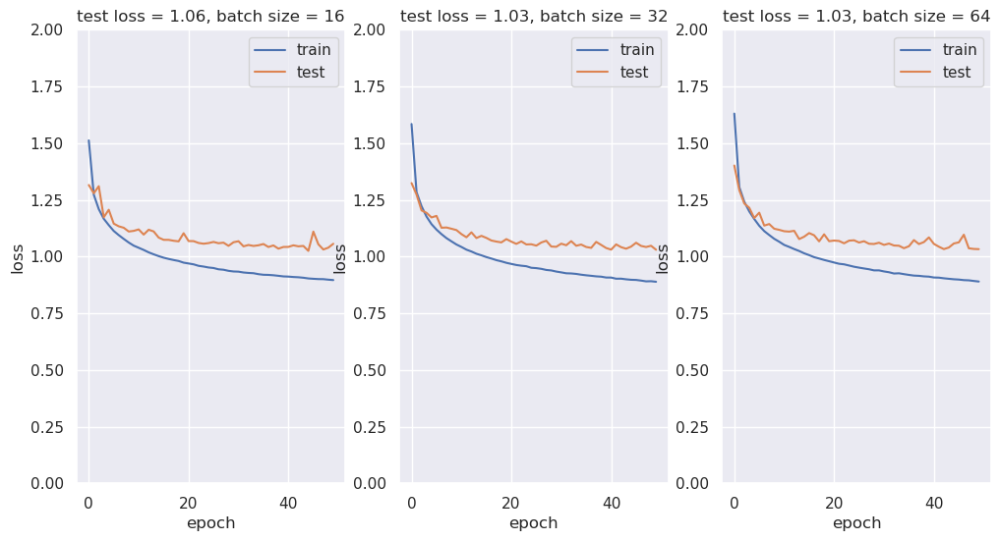
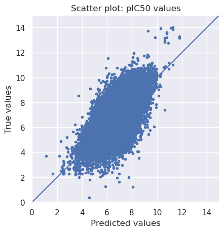
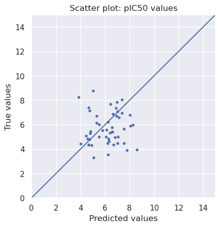
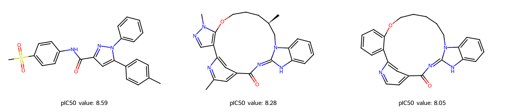

# DSF-Midterm Project
Answers to the questions in the instruction document will be shown in this notebook.

## <font color='blue'> 0. Import all necessary Libraries </font>


```python
# Import all necessary libraries
# rdkit had to be imported as a whole as cell 5 would give an error message mistaking library name as variable

from pathlib import Path
from warnings import filterwarnings

# Silence some expected warnings
filterwarnings("ignore")

!pip install rdkit
!pip install tensorflow
!pip install pandas
!pip install numpy
!pip install scikit-learn
!pip install matplotlib
!pip install seaborn
import pandas as pd
import numpy as np
import rdkit
from rdkit import Chem
from rdkit.Chem import MACCSkeys, Draw, rdFingerprintGenerator
from sklearn.model_selection import train_test_split
import matplotlib.pyplot as plt
from sklearn import metrics
import seaborn as sns

# Neural network specific libraries
from tensorflow.keras.models import Sequential, load_model
from tensorflow.keras.layers import Dense
from tensorflow.keras.callbacks import ModelCheckpoint

print("finished")
%matplotlib inline

# Allow mulitple outputs in one cell
from IPython.core.interactiveshell import InteractiveShell
InteractiveShell.ast_node_interactivity = "all"
```

    Defaulting to user installation because normal site-packages is not writeable
    Requirement already satisfied: rdkit in ./.local/lib/python3.11/site-packages (2026.3.1)
    Requirement already satisfied: numpy in /software.9/software/Anaconda3/2024.02-1/lib/python3.11/site-packages (from rdkit) (1.26.4)
    Requirement already satisfied: Pillow in /software.9/software/Anaconda3/2024.02-1/lib/python3.11/site-packages (from rdkit) (10.2.0)
    Defaulting to user installation because normal site-packages is not writeable
    Requirement already satisfied: tensorflow in ./.local/lib/python3.11/site-packages (2.21.0)
    Requirement already satisfied: absl-py>=1.0.0 in ./.local/lib/python3.11/site-packages (from tensorflow) (2.4.0)
    Requirement already satisfied: astunparse>=1.6.0 in ./.local/lib/python3.11/site-packages (from tensorflow) (1.6.3)
    Requirement already satisfied: flatbuffers>=25.9.23 in ./.local/lib/python3.11/site-packages (from tensorflow) (25.12.19)
    Requirement already satisfied: gast!=0.5.0,!=0.5.1,!=0.5.2,>=0.2.1 in ./.local/lib/python3.11/site-packages (from tensorflow) (0.7.0)
    Requirement already satisfied: google_pasta>=0.1.1 in ./.local/lib/python3.11/site-packages (from tensorflow) (0.2.0)
    Requirement already satisfied: libclang>=13.0.0 in ./.local/lib/python3.11/site-packages (from tensorflow) (18.1.1)
    Requirement already satisfied: opt_einsum>=2.3.2 in ./.local/lib/python3.11/site-packages (from tensorflow) (3.4.0)
    Requirement already satisfied: packaging in /software.9/software/Anaconda3/2024.02-1/lib/python3.11/site-packages (from tensorflow) (23.1)
    Requirement already satisfied: protobuf<8.0.0,>=6.31.1 in ./.local/lib/python3.11/site-packages (from tensorflow) (7.34.1)
    Requirement already satisfied: requests<3,>=2.21.0 in /software.9/software/Anaconda3/2024.02-1/lib/python3.11/site-packages (from tensorflow) (2.31.0)
    Requirement already satisfied: setuptools in /software.9/software/Anaconda3/2024.02-1/lib/python3.11/site-packages (from tensorflow) (68.2.2)
    Requirement already satisfied: six>=1.12.0 in /software.9/software/Anaconda3/2024.02-1/lib/python3.11/site-packages (from tensorflow) (1.16.0)
    Requirement already satisfied: termcolor>=1.1.0 in ./.local/lib/python3.11/site-packages (from tensorflow) (3.3.0)
    Requirement already satisfied: typing_extensions>=3.6.6 in ./.local/lib/python3.11/site-packages (from tensorflow) (4.15.0)
    Requirement already satisfied: wrapt>=1.11.0 in /software.9/software/Anaconda3/2024.02-1/lib/python3.11/site-packages (from tensorflow) (1.14.1)
    Requirement already satisfied: grpcio<2.0,>=1.24.3 in ./.local/lib/python3.11/site-packages (from tensorflow) (1.80.0)
    Requirement already satisfied: keras>=3.12.0 in ./.local/lib/python3.11/site-packages (from tensorflow) (3.14.0)
    Requirement already satisfied: numpy>=1.26.0 in /software.9/software/Anaconda3/2024.02-1/lib/python3.11/site-packages (from tensorflow) (1.26.4)
    Requirement already satisfied: h5py<3.15.0,>=3.11.0 in ./.local/lib/python3.11/site-packages (from tensorflow) (3.14.0)
    Requirement already satisfied: ml_dtypes<1.0.0,>=0.5.1 in ./.local/lib/python3.11/site-packages (from tensorflow) (0.5.4)
    Requirement already satisfied: wheel<1.0,>=0.23.0 in /software.9/software/Anaconda3/2024.02-1/lib/python3.11/site-packages (from astunparse>=1.6.0->tensorflow) (0.41.2)
    Requirement already satisfied: rich in /software.9/software/Anaconda3/2024.02-1/lib/python3.11/site-packages (from keras>=3.12.0->tensorflow) (13.3.5)
    Requirement already satisfied: namex in ./.local/lib/python3.11/site-packages (from keras>=3.12.0->tensorflow) (0.1.0)
    Requirement already satisfied: optree in ./.local/lib/python3.11/site-packages (from keras>=3.12.0->tensorflow) (0.19.0)
    Requirement already satisfied: charset-normalizer<4,>=2 in /software.9/software/Anaconda3/2024.02-1/lib/python3.11/site-packages (from requests<3,>=2.21.0->tensorflow) (2.0.4)
    Requirement already satisfied: idna<4,>=2.5 in /software.9/software/Anaconda3/2024.02-1/lib/python3.11/site-packages (from requests<3,>=2.21.0->tensorflow) (3.4)
    Requirement already satisfied: urllib3<3,>=1.21.1 in /software.9/software/Anaconda3/2024.02-1/lib/python3.11/site-packages (from requests<3,>=2.21.0->tensorflow) (2.0.7)
    Requirement already satisfied: certifi>=2017.4.17 in /software.9/software/Anaconda3/2024.02-1/lib/python3.11/site-packages (from requests<3,>=2.21.0->tensorflow) (2025.1.31)
    Requirement already satisfied: markdown-it-py<3.0.0,>=2.2.0 in /software.9/software/Anaconda3/2024.02-1/lib/python3.11/site-packages (from rich->keras>=3.12.0->tensorflow) (2.2.0)
    Requirement already satisfied: pygments<3.0.0,>=2.13.0 in /software.9/software/Anaconda3/2024.02-1/lib/python3.11/site-packages (from rich->keras>=3.12.0->tensorflow) (2.15.1)
    Requirement already satisfied: mdurl~=0.1 in /software.9/software/Anaconda3/2024.02-1/lib/python3.11/site-packages (from markdown-it-py<3.0.0,>=2.2.0->rich->keras>=3.12.0->tensorflow) (0.1.0)
    Defaulting to user installation because normal site-packages is not writeable
    Requirement already satisfied: pandas in /software.9/software/Anaconda3/2024.02-1/lib/python3.11/site-packages (2.1.4)
    Requirement already satisfied: numpy<2,>=1.23.2 in /software.9/software/Anaconda3/2024.02-1/lib/python3.11/site-packages (from pandas) (1.26.4)
    Requirement already satisfied: python-dateutil>=2.8.2 in /software.9/software/Anaconda3/2024.02-1/lib/python3.11/site-packages (from pandas) (2.8.2)
    Requirement already satisfied: pytz>=2020.1 in /software.9/software/Anaconda3/2024.02-1/lib/python3.11/site-packages (from pandas) (2023.3.post1)
    Requirement already satisfied: tzdata>=2022.1 in /software.9/software/Anaconda3/2024.02-1/lib/python3.11/site-packages (from pandas) (2023.3)
    Requirement already satisfied: six>=1.5 in /software.9/software/Anaconda3/2024.02-1/lib/python3.11/site-packages (from python-dateutil>=2.8.2->pandas) (1.16.0)
    Defaulting to user installation because normal site-packages is not writeable
    Requirement already satisfied: numpy in /software.9/software/Anaconda3/2024.02-1/lib/python3.11/site-packages (1.26.4)
    Defaulting to user installation because normal site-packages is not writeable
    Requirement already satisfied: scikit-learn in /software.9/software/Anaconda3/2024.02-1/lib/python3.11/site-packages (1.2.2)
    Requirement already satisfied: numpy>=1.17.3 in /software.9/software/Anaconda3/2024.02-1/lib/python3.11/site-packages (from scikit-learn) (1.26.4)
    Requirement already satisfied: scipy>=1.3.2 in /software.9/software/Anaconda3/2024.02-1/lib/python3.11/site-packages (from scikit-learn) (1.11.4)
    Requirement already satisfied: joblib>=1.1.1 in /software.9/software/Anaconda3/2024.02-1/lib/python3.11/site-packages (from scikit-learn) (1.2.0)
    Requirement already satisfied: threadpoolctl>=2.0.0 in /software.9/software/Anaconda3/2024.02-1/lib/python3.11/site-packages (from scikit-learn) (2.2.0)
    Defaulting to user installation because normal site-packages is not writeable
    Requirement already satisfied: matplotlib in /software.9/software/Anaconda3/2024.02-1/lib/python3.11/site-packages (3.8.0)
    Requirement already satisfied: contourpy>=1.0.1 in /software.9/software/Anaconda3/2024.02-1/lib/python3.11/site-packages (from matplotlib) (1.2.0)
    Requirement already satisfied: cycler>=0.10 in /software.9/software/Anaconda3/2024.02-1/lib/python3.11/site-packages (from matplotlib) (0.11.0)
    Requirement already satisfied: fonttools>=4.22.0 in /software.9/software/Anaconda3/2024.02-1/lib/python3.11/site-packages (from matplotlib) (4.25.0)
    Requirement already satisfied: kiwisolver>=1.0.1 in /software.9/software/Anaconda3/2024.02-1/lib/python3.11/site-packages (from matplotlib) (1.4.4)
    Requirement already satisfied: numpy<2,>=1.21 in /software.9/software/Anaconda3/2024.02-1/lib/python3.11/site-packages (from matplotlib) (1.26.4)
    Requirement already satisfied: packaging>=20.0 in /software.9/software/Anaconda3/2024.02-1/lib/python3.11/site-packages (from matplotlib) (23.1)
    Requirement already satisfied: pillow>=6.2.0 in /software.9/software/Anaconda3/2024.02-1/lib/python3.11/site-packages (from matplotlib) (10.2.0)
    Requirement already satisfied: pyparsing>=2.3.1 in /software.9/software/Anaconda3/2024.02-1/lib/python3.11/site-packages (from matplotlib) (3.0.9)
    Requirement already satisfied: python-dateutil>=2.7 in /software.9/software/Anaconda3/2024.02-1/lib/python3.11/site-packages (from matplotlib) (2.8.2)
    Requirement already satisfied: six>=1.5 in /software.9/software/Anaconda3/2024.02-1/lib/python3.11/site-packages (from python-dateutil>=2.7->matplotlib) (1.16.0)
    Defaulting to user installation because normal site-packages is not writeable
    Requirement already satisfied: seaborn in /software.9/software/Anaconda3/2024.02-1/lib/python3.11/site-packages (0.12.2)
    Requirement already satisfied: numpy!=1.24.0,>=1.17 in /software.9/software/Anaconda3/2024.02-1/lib/python3.11/site-packages (from seaborn) (1.26.4)
    Requirement already satisfied: pandas>=0.25 in /software.9/software/Anaconda3/2024.02-1/lib/python3.11/site-packages (from seaborn) (2.1.4)
    Requirement already satisfied: matplotlib!=3.6.1,>=3.1 in /software.9/software/Anaconda3/2024.02-1/lib/python3.11/site-packages (from seaborn) (3.8.0)
    Requirement already satisfied: contourpy>=1.0.1 in /software.9/software/Anaconda3/2024.02-1/lib/python3.11/site-packages (from matplotlib!=3.6.1,>=3.1->seaborn) (1.2.0)
    Requirement already satisfied: cycler>=0.10 in /software.9/software/Anaconda3/2024.02-1/lib/python3.11/site-packages (from matplotlib!=3.6.1,>=3.1->seaborn) (0.11.0)
    Requirement already satisfied: fonttools>=4.22.0 in /software.9/software/Anaconda3/2024.02-1/lib/python3.11/site-packages (from matplotlib!=3.6.1,>=3.1->seaborn) (4.25.0)
    Requirement already satisfied: kiwisolver>=1.0.1 in /software.9/software/Anaconda3/2024.02-1/lib/python3.11/site-packages (from matplotlib!=3.6.1,>=3.1->seaborn) (1.4.4)
    Requirement already satisfied: packaging>=20.0 in /software.9/software/Anaconda3/2024.02-1/lib/python3.11/site-packages (from matplotlib!=3.6.1,>=3.1->seaborn) (23.1)
    Requirement already satisfied: pillow>=6.2.0 in /software.9/software/Anaconda3/2024.02-1/lib/python3.11/site-packages (from matplotlib!=3.6.1,>=3.1->seaborn) (10.2.0)
    Requirement already satisfied: pyparsing>=2.3.1 in /software.9/software/Anaconda3/2024.02-1/lib/python3.11/site-packages (from matplotlib!=3.6.1,>=3.1->seaborn) (3.0.9)
    Requirement already satisfied: python-dateutil>=2.7 in /software.9/software/Anaconda3/2024.02-1/lib/python3.11/site-packages (from matplotlib!=3.6.1,>=3.1->seaborn) (2.8.2)
    Requirement already satisfied: pytz>=2020.1 in /software.9/software/Anaconda3/2024.02-1/lib/python3.11/site-packages (from pandas>=0.25->seaborn) (2023.3.post1)
    Requirement already satisfied: tzdata>=2022.1 in /software.9/software/Anaconda3/2024.02-1/lib/python3.11/site-packages (from pandas>=0.25->seaborn) (2023.3)
    Requirement already satisfied: six>=1.5 in /software.9/software/Anaconda3/2024.02-1/lib/python3.11/site-packages (from python-dateutil>=2.7->matplotlib!=3.6.1,>=3.1->seaborn) (1.16.0)


    WARNING: All log messages before absl::InitializeLog() is called are written to STDERR
    I0000 00:00:1776257353.529623 3672657 port.cc:153] oneDNN custom operations are on. You may see slightly different numerical results due to floating-point round-off errors from different computation orders. To turn them off, set the environment variable `TF_ENABLE_ONEDNN_OPTS=0`.
    I0000 00:00:1776257353.533809 3672657 cudart_stub.cc:31] Could not find cuda drivers on your machine, GPU will not be used.
    I0000 00:00:1776257353.574713 3672657 cpu_feature_guard.cc:227] This TensorFlow binary is optimized to use available CPU instructions in performance-critical operations.
    To enable the following instructions: AVX2 AVX512F AVX512_VNNI AVX512_BF16 FMA, in other operations, rebuild TensorFlow with the appropriate compiler flags.
    WARNING: All log messages before absl::InitializeLog() is called are written to STDERR
    I0000 00:00:1776257371.412828 3672657 port.cc:153] oneDNN custom operations are on. You may see slightly different numerical results due to floating-point round-off errors from different computation orders. To turn them off, set the environment variable `TF_ENABLE_ONEDNN_OPTS=0`.
    I0000 00:00:1776257371.415519 3672657 cudart_stub.cc:31] Could not find cuda drivers on your machine, GPU will not be used.


    finished


```python
# Set path to this notebook
HERE = Path(_dh[-1])
DATA = HERE / "data"
```

### <font color='blue'> 1. Data preparation </font>
Load table and use important columns


```python
# Load data
df = pd.read_csv(DATA / "kinase.csv", index_col=0)
df = df.reset_index(drop=True)
df.head()

# Check the dimension and missing value of the data
### Size and info of training set
print("Shape of dataframe : ", df.shape)
df.info()
```


<div>
<style scoped>
    .dataframe tbody tr th:only-of-type {
        vertical-align: middle;
    }

    .dataframe tbody tr th {
        vertical-align: top;
    }

    .dataframe thead th {
        text-align: right;
    }
</style>
<table border="1" class="dataframe">
  <thead>
    <tr style="text-align: right;">
      <th></th>
      <th>molecule_chembl_id</th>
      <th>standard_value</th>
      <th>standard_units</th>
      <th>target_chembl_id</th>
      <th>smiles</th>
    </tr>
  </thead>
  <tbody>
    <tr>
      <th>0</th>
      <td>CHEMBL13462</td>
      <td>4000.0</td>
      <td>nM</td>
      <td>CHEMBL1862</td>
      <td>CC(=O)N[C@@H](Cc1ccc(OP(=O)(O)O)cc1)C(=O)N[C@@...</td>
    </tr>
    <tr>
      <th>1</th>
      <td>CHEMBL13462</td>
      <td>16000.0</td>
      <td>nM</td>
      <td>CHEMBL1862</td>
      <td>CC(=O)N[C@@H](Cc1ccc(OP(=O)(O)O)cc1)C(=O)N[C@@...</td>
    </tr>
    <tr>
      <th>2</th>
      <td>CHEMBL13462</td>
      <td>800.0</td>
      <td>nM</td>
      <td>CHEMBL267</td>
      <td>CC(=O)N[C@@H](Cc1ccc(OP(=O)(O)O)cc1)C(=O)N[C@@...</td>
    </tr>
    <tr>
      <th>3</th>
      <td>CHEMBL13462</td>
      <td>9000.0</td>
      <td>nM</td>
      <td>CHEMBL267</td>
      <td>CC(=O)N[C@@H](Cc1ccc(OP(=O)(O)O)cc1)C(=O)N[C@@...</td>
    </tr>
    <tr>
      <th>4</th>
      <td>CHEMBL13462</td>
      <td>1700.0</td>
      <td>nM</td>
      <td>CHEMBL267</td>
      <td>CC(=O)N[C@@H](Cc1ccc(OP(=O)(O)O)cc1)C(=O)N[C@@...</td>
    </tr>
  </tbody>
</table>
</div>


    Shape of dataframe :  (179827, 5)
    <class 'pandas.core.frame.DataFrame'>
    RangeIndex: 179827 entries, 0 to 179826
    Data columns (total 5 columns):
     #   Column              Non-Null Count   Dtype  
    ---  ------              --------------   -----  
     0   molecule_chembl_id  179827 non-null  object 
     1   standard_value      179827 non-null  float64
     2   standard_units      179827 non-null  object 
     3   target_chembl_id    179827 non-null  object 
     4   smiles              179827 non-null  object 
    dtypes: float64(1), object(4)
    memory usage: 6.9+ MB


```python
# Modifying data
# Eliminate 0-values from standard_value
chembl_df = df.copy()
chembl_df = chembl_df[chembl_df["standard_value"] > 0].copy()
#turn values into pIC50
chembl_df["pIC50"]=(-1)*np.log10(chembl_df["standard_value"]/(1000000000))
#keep necessary columns
chembl_df = chembl_df[["smiles","pIC50"]]
chembl_df.head()
```


<div>
<style scoped>
    .dataframe tbody tr th:only-of-type {
        vertical-align: middle;
    }

    .dataframe tbody tr th {
        vertical-align: top;
    }

    .dataframe thead th {
        text-align: right;
    }
</style>
<table border="1" class="dataframe">
  <thead>
    <tr style="text-align: right;">
      <th></th>
      <th>smiles</th>
      <th>pIC50</th>
    </tr>
  </thead>
  <tbody>
    <tr>
      <th>0</th>
      <td>CC(=O)N[C@@H](Cc1ccc(OP(=O)(O)O)cc1)C(=O)N[C@@...</td>
      <td>5.397940</td>
    </tr>
    <tr>
      <th>1</th>
      <td>CC(=O)N[C@@H](Cc1ccc(OP(=O)(O)O)cc1)C(=O)N[C@@...</td>
      <td>4.795880</td>
    </tr>
    <tr>
      <th>2</th>
      <td>CC(=O)N[C@@H](Cc1ccc(OP(=O)(O)O)cc1)C(=O)N[C@@...</td>
      <td>6.096910</td>
    </tr>
    <tr>
      <th>3</th>
      <td>CC(=O)N[C@@H](Cc1ccc(OP(=O)(O)O)cc1)C(=O)N[C@@...</td>
      <td>5.045757</td>
    </tr>
    <tr>
      <th>4</th>
      <td>CC(=O)N[C@@H](Cc1ccc(OP(=O)(O)O)cc1)C(=O)N[C@@...</td>
      <td>5.769551</td>
    </tr>
  </tbody>
</table>
</div>


### <font color='blue'> 2. Molecular encoding</font>


```python
### Fingerprints are a better format for machines to read
### MACCS are most commonly used. It has 166 bits that encode substructures.
def smiles_to_fp(smiles, method="maccs", n_bits=2048):
    """
    Encode a molecule from a SMILES string into a fingerprint.

    Parameters
    ----------
    smiles : str
        The SMILES string defining the molecule.

    method : str
        The type of fingerprint to use. Default is MACCS keys.

    n_bits : int
        The length of the fingerprint.

    Returns
    -------
    array
        The fingerprint array.
    """

    # Convert smiles to RDKit mol object
    mol = rdkit.Chem.MolFromSmiles(smiles)

    if method == "maccs":
        return np.array(MACCSkeys.GenMACCSKeys(mol))
    if method == "morgan2":
        fpg = rdFingerprintGenerator.GetMorganGenerator(radius=2, fpSize=n_bits)
        return np.array(fpg.GetCountFingerprint(mol))
    if method == "morgan3":
        fpg = rdFingerprintGenerator.GetMorganGenerator(radius=3, fpSize=n_bits)
        return np.array(fpg.GetCountFingerprint(mol))
    else:
        print(f"Warning: Wrong method specified: {method}." " Default will be used instead.")
        return np.array(MACCSkeys.GenMACCSKeys(mol))
```


```python
# Converting SMILES to MACCS fingerprints
chembl_df["fingerprints_df"] = chembl_df["smiles"].apply(smiles_to_fp)
# Look at head
print("Shape of dataframe:", chembl_df.shape)
chembl_df.head(3)
# copy dataset
chembl_df2 = chembl_df.copy()
```

    Shape of dataframe: (179154, 3)


<div>
<style scoped>
    .dataframe tbody tr th:only-of-type {
        vertical-align: middle;
    }

    .dataframe tbody tr th {
        vertical-align: top;
    }

    .dataframe thead th {
        text-align: right;
    }
</style>
<table border="1" class="dataframe">
  <thead>
    <tr style="text-align: right;">
      <th></th>
      <th>smiles</th>
      <th>pIC50</th>
      <th>fingerprints_df</th>
    </tr>
  </thead>
  <tbody>
    <tr>
      <th>0</th>
      <td>CC(=O)N[C@@H](Cc1ccc(OP(=O)(O)O)cc1)C(=O)N[C@@...</td>
      <td>5.39794</td>
      <td>[0, 0, 0, 0, 0, 0, 0, 0, 0, 0, 0, 0, 0, 0, 0, ...</td>
    </tr>
    <tr>
      <th>1</th>
      <td>CC(=O)N[C@@H](Cc1ccc(OP(=O)(O)O)cc1)C(=O)N[C@@...</td>
      <td>4.79588</td>
      <td>[0, 0, 0, 0, 0, 0, 0, 0, 0, 0, 0, 0, 0, 0, 0, ...</td>
    </tr>
    <tr>
      <th>2</th>
      <td>CC(=O)N[C@@H](Cc1ccc(OP(=O)(O)O)cc1)C(=O)N[C@@...</td>
      <td>6.09691</td>
      <td>[0, 0, 0, 0, 0, 0, 0, 0, 0, 0, 0, 0, 0, 0, 0, ...</td>
    </tr>
  </tbody>
</table>
</div>


```python
### Test sets are a fraction of the data set which is used to evaluate the performance of the training set
### The neural network model is challenged by the test set by comparing the prediction set and the test set which isn't used in the training step
### External data sets that aren't part of the data set are used to evaluate the prediction efficacy and possible biases

# Split the data into training and test set
x_train, x_test, y_train, y_test = train_test_split(
    chembl_df2["fingerprints_df"], chembl_df2["pIC50"], test_size=0.3, random_state=42
)
# Print the shape of training and testing data
print("Shape of training data:", x_train.shape)
print("Shape of test data:", x_test.shape)
```

    Shape of training data: (125407,)
    Shape of test data: (53747,)


### <font color='blue'> 3. Define Neural Network </font>


```python
### Defining number of layers and neurons within
def neural_network_model(hidden1, hidden2):
    """
    Creating a neural network from two hidden layers
    using ReLU as activation function in the two hidden layers
    and a linear activation in the output layer.

    Parameters
    ----------
    hidden1 : int
        Number of neurons in first hidden layer.

    hidden2: int
        Number of neurons in second hidden layer.

    Returns
    -------
    model
        Fully connected neural network model with two hidden layers.
    """

    model = Sequential()
    # First hidden layer
    model.add(Dense(hidden1, activation="relu", name="layer1"))
    # Second hidden layer
    model.add(Dense(hidden2, activation="relu", name="layer2"))
    # Output layer
    model.add(Dense(1, activation="linear", name="layer3"))

    # Compile model
    model.compile(loss="mean_squared_error", optimizer="adam", metrics=["mse", "mae"])
    return model
```

### <font color='blue'> 4. Train The Model </font>


```python
# Neural network parameters
# batches are subparts of training set, here three different batch sizes are individually tested
batch_sizes = [16, 32, 64]
# Epoch = One full run of training set
nb_epoch = 50
# number of neurons in hidden layers
layer1_size = 64
layer2_size = 32
```


```python
# Plot
fig = plt.figure(figsize=(12, 6))
sns.set(color_codes=True)
tstlss = {}
for index, batch in enumerate(batch_sizes):
    fig.add_subplot(1, len(batch_sizes), index + 1)
    model = neural_network_model(layer1_size, layer2_size)

    # Fit model on x_train, y_train data
    history = model.fit(
        np.array(list((x_train))).astype(float),
        y_train.values,
        batch_size=batch,
        validation_data=(np.array(list((x_test))).astype(float), y_test.values),
        verbose=1,
        epochs=nb_epoch,
    )
    plt.plot(history.history["loss"], label="train")
    plt.plot(history.history["val_loss"], label="test")
    plt.legend(["train", "test"], loc="upper right")
    plt.ylabel("loss")
    plt.xlabel("epoch")
    plt.ylim((0, 2))
    plt.title(
        f"test loss = {history.history['val_loss'][nb_epoch-1]:.2f}, " f"batch size = {batch}"
    )
    tstlss.update({str(batch):history.history['val_loss'][nb_epoch-1]})
plt.show()
```


    <Axes: >


    E0000 00:00:1776257581.500348 3672657 cuda_platform.cc:52] failed call to cuInit: INTERNAL: CUDA error: Failed call to cuInit: UNKNOWN ERROR (303)


    Epoch 1/50
    7838/7838 ━━━━━━━━━━━━━━━━━━━━ 8s 943us/step - loss: 1.5119 - mae: 0.9692 - mse: 1.5119 - val_loss: 1.3153 - val_mae: 0.9267 - val_mse: 1.3153
    Epoch 2/50
    7838/7838 ━━━━━━━━━━━━━━━━━━━━ 7s 920us/step - loss: 1.2725 - mae: 0.9062 - mse: 1.2725 - val_loss: 1.2788 - val_mae: 0.8986 - val_mse: 1.2788
    Epoch 3/50
    7838/7838 ━━━━━━━━━━━━━━━━━━━━ 8s 1ms/step - loss: 1.2089 - mae: 0.8822 - mse: 1.2089 - val_loss: 1.3100 - val_mae: 0.9254 - val_mse: 1.3100
    Epoch 4/50
    7838/7838 ━━━━━━━━━━━━━━━━━━━━ 7s 904us/step - loss: 1.1664 - mae: 0.8651 - mse: 1.1664 - val_loss: 1.1730 - val_mae: 0.8671 - val_mse: 1.1730
    Epoch 5/50
    7838/7838 ━━━━━━━━━━━━━━━━━━━━ 7s 919us/step - loss: 1.1385 - mae: 0.8541 - mse: 1.1385 - val_loss: 1.2061 - val_mae: 0.8718 - val_mse: 1.2061
    Epoch 6/50
    7838/7838 ━━━━━━━━━━━━━━━━━━━━ 7s 920us/step - loss: 1.1126 - mae: 0.8426 - mse: 1.1126 - val_loss: 1.1449 - val_mae: 0.8582 - val_mse: 1.1449
    Epoch 7/50
    7838/7838 ━━━━━━━━━━━━━━━━━━━━ 7s 911us/step - loss: 1.0943 - mae: 0.8354 - mse: 1.0943 - val_loss: 1.1332 - val_mae: 0.8490 - val_mse: 1.1332
    Epoch 8/50
    7838/7838 ━━━━━━━━━━━━━━━━━━━━ 7s 882us/step - loss: 1.0776 - mae: 0.8283 - mse: 1.0776 - val_loss: 1.1268 - val_mae: 0.8475 - val_mse: 1.1268
    Epoch 9/50
    7838/7838 ━━━━━━━━━━━━━━━━━━━━ 7s 879us/step - loss: 1.0617 - mae: 0.8214 - mse: 1.0617 - val_loss: 1.1102 - val_mae: 0.8370 - val_mse: 1.1102
    Epoch 10/50
    7838/7838 ━━━━━━━━━━━━━━━━━━━━ 10s 877us/step - loss: 1.0479 - mae: 0.8158 - mse: 1.0479 - val_loss: 1.1131 - val_mae: 0.8377 - val_mse: 1.1131
    Epoch 11/50
    7838/7838 ━━━━━━━━━━━━━━━━━━━━ 8s 1ms/step - loss: 1.0385 - mae: 0.8124 - mse: 1.0385 - val_loss: 1.1195 - val_mae: 0.8382 - val_mse: 1.1195
    Epoch 12/50
    7838/7838 ━━━━━━━━━━━━━━━━━━━━ 8s 1ms/step - loss: 1.0290 - mae: 0.8080 - mse: 1.0290 - val_loss: 1.0967 - val_mae: 0.8310 - val_mse: 1.0967
    Epoch 13/50
    7838/7838 ━━━━━━━━━━━━━━━━━━━━ 7s 901us/step - loss: 1.0183 - mae: 0.8030 - mse: 1.0183 - val_loss: 1.1181 - val_mae: 0.8368 - val_mse: 1.1181
    Epoch 14/50
    7838/7838 ━━━━━━━━━━━━━━━━━━━━ 7s 928us/step - loss: 1.0097 - mae: 0.7998 - mse: 1.0097 - val_loss: 1.1106 - val_mae: 0.8442 - val_mse: 1.1106
    Epoch 15/50
    7838/7838 ━━━━━━━━━━━━━━━━━━━━ 10s 940us/step - loss: 1.0018 - mae: 0.7959 - mse: 1.0018 - val_loss: 1.0835 - val_mae: 0.8303 - val_mse: 1.0835
    Epoch 16/50
    7838/7838 ━━━━━━━━━━━━━━━━━━━━ 11s 1ms/step - loss: 0.9948 - mae: 0.7930 - mse: 0.9948 - val_loss: 1.0736 - val_mae: 0.8250 - val_mse: 1.0736
    Epoch 17/50
    7838/7838 ━━━━━━━━━━━━━━━━━━━━ 7s 929us/step - loss: 0.9893 - mae: 0.7904 - mse: 0.9893 - val_loss: 1.0734 - val_mae: 0.8267 - val_mse: 1.0734
    Epoch 18/50
    7838/7838 ━━━━━━━━━━━━━━━━━━━━ 8s 988us/step - loss: 0.9846 - mae: 0.7882 - mse: 0.9846 - val_loss: 1.0694 - val_mae: 0.8250 - val_mse: 1.0694
    Epoch 19/50
    7838/7838 ━━━━━━━━━━━━━━━━━━━━ 8s 964us/step - loss: 0.9803 - mae: 0.7865 - mse: 0.9803 - val_loss: 1.0668 - val_mae: 0.8216 - val_mse: 1.0668
    Epoch 20/50
    7838/7838 ━━━━━━━━━━━━━━━━━━━━ 7s 907us/step - loss: 0.9729 - mae: 0.7832 - mse: 0.9729 - val_loss: 1.1027 - val_mae: 0.8287 - val_mse: 1.1027
    Epoch 21/50
    7838/7838 ━━━━━━━━━━━━━━━━━━━━ 7s 923us/step - loss: 0.9693 - mae: 0.7815 - mse: 0.9693 - val_loss: 1.0681 - val_mae: 0.8213 - val_mse: 1.0681
    Epoch 22/50
    7838/7838 ━━━━━━━━━━━━━━━━━━━━ 7s 887us/step - loss: 0.9655 - mae: 0.7802 - mse: 0.9655 - val_loss: 1.0678 - val_mae: 0.8174 - val_mse: 1.0678
    Epoch 23/50
    7838/7838 ━━━━━━━━━━━━━━━━━━━━ 8s 1ms/step - loss: 0.9589 - mae: 0.7767 - mse: 0.9589 - val_loss: 1.0597 - val_mae: 0.8179 - val_mse: 1.0597
    Epoch 24/50
    7838/7838 ━━━━━━━━━━━━━━━━━━━━ 7s 928us/step - loss: 0.9557 - mae: 0.7760 - mse: 0.9557 - val_loss: 1.0564 - val_mae: 0.8158 - val_mse: 1.0564
    Epoch 25/50
    7838/7838 ━━━━━━━━━━━━━━━━━━━━ 10s 915us/step - loss: 0.9516 - mae: 0.7745 - mse: 0.9516 - val_loss: 1.0592 - val_mae: 0.8153 - val_mse: 1.0592
    Epoch 26/50
    7838/7838 ━━━━━━━━━━━━━━━━━━━━ 7s 946us/step - loss: 0.9492 - mae: 0.7728 - mse: 0.9492 - val_loss: 1.0644 - val_mae: 0.8214 - val_mse: 1.0644
    Epoch 27/50
    7838/7838 ━━━━━━━━━━━━━━━━━━━━ 11s 1ms/step - loss: 0.9436 - mae: 0.7709 - mse: 0.9436 - val_loss: 1.0586 - val_mae: 0.8165 - val_mse: 1.0586
    Epoch 28/50
    7838/7838 ━━━━━━━━━━━━━━━━━━━━ 9s 910us/step - loss: 0.9417 - mae: 0.7692 - mse: 0.9417 - val_loss: 1.0611 - val_mae: 0.8134 - val_mse: 1.0611
    Epoch 29/50
    7838/7838 ━━━━━━━━━━━━━━━━━━━━ 7s 900us/step - loss: 0.9369 - mae: 0.7677 - mse: 0.9369 - val_loss: 1.0470 - val_mae: 0.8126 - val_mse: 1.0470
    Epoch 30/50
    7838/7838 ━━━━━━━━━━━━━━━━━━━━ 7s 905us/step - loss: 0.9341 - mae: 0.7662 - mse: 0.9341 - val_loss: 1.0628 - val_mae: 0.8194 - val_mse: 1.0628
    Epoch 31/50
    7838/7838 ━━━━━━━━━━━━━━━━━━━━ 11s 1ms/step - loss: 0.9332 - mae: 0.7658 - mse: 0.9332 - val_loss: 1.0674 - val_mae: 0.8133 - val_mse: 1.0674
    Epoch 32/50
    7838/7838 ━━━━━━━━━━━━━━━━━━━━ 9s 914us/step - loss: 0.9296 - mae: 0.7638 - mse: 0.9296 - val_loss: 1.0448 - val_mae: 0.8140 - val_mse: 1.0448
    Epoch 33/50
    7838/7838 ━━━━━━━━━━━━━━━━━━━━ 8s 1ms/step - loss: 0.9276 - mae: 0.7631 - mse: 0.9276 - val_loss: 1.0508 - val_mae: 0.8156 - val_mse: 1.0508
    Epoch 34/50
    7838/7838 ━━━━━━━━━━━━━━━━━━━━ 9s 903us/step - loss: 0.9264 - mae: 0.7626 - mse: 0.9264 - val_loss: 1.0466 - val_mae: 0.8101 - val_mse: 1.0466
    Epoch 35/50
    7838/7838 ━━━━━━━━━━━━━━━━━━━━ 7s 920us/step - loss: 0.9222 - mae: 0.7605 - mse: 0.9222 - val_loss: 1.0494 - val_mae: 0.8089 - val_mse: 1.0494
    Epoch 36/50
    7838/7838 ━━━━━━━━━━━━━━━━━━━━ 10s 909us/step - loss: 0.9195 - mae: 0.7593 - mse: 0.9195 - val_loss: 1.0551 - val_mae: 0.8097 - val_mse: 1.0551
    Epoch 37/50
    7838/7838 ━━━━━━━━━━━━━━━━━━━━ 7s 869us/step - loss: 0.9189 - mae: 0.7593 - mse: 0.9189 - val_loss: 1.0419 - val_mae: 0.8090 - val_mse: 1.0419
    Epoch 38/50
    7838/7838 ━━━━━━━━━━━━━━━━━━━━ 7s 901us/step - loss: 0.9173 - mae: 0.7581 - mse: 0.9173 - val_loss: 1.0489 - val_mae: 0.8097 - val_mse: 1.0489
    Epoch 39/50
    7838/7838 ━━━━━━━━━━━━━━━━━━━━ 7s 903us/step - loss: 0.9149 - mae: 0.7572 - mse: 0.9149 - val_loss: 1.0346 - val_mae: 0.8064 - val_mse: 1.0346
    Epoch 40/50
    7838/7838 ━━━━━━━━━━━━━━━━━━━━ 7s 896us/step - loss: 0.9123 - mae: 0.7560 - mse: 0.9123 - val_loss: 1.0421 - val_mae: 0.8097 - val_mse: 1.0421
    Epoch 41/50
    7838/7838 ━━━━━━━━━━━━━━━━━━━━ 7s 949us/step - loss: 0.9114 - mae: 0.7553 - mse: 0.9114 - val_loss: 1.0424 - val_mae: 0.8094 - val_mse: 1.0424
    Epoch 42/50
    7838/7838 ━━━━━━━━━━━━━━━━━━━━ 7s 940us/step - loss: 0.9097 - mae: 0.7550 - mse: 0.9097 - val_loss: 1.0493 - val_mae: 0.8093 - val_mse: 1.0493
    Epoch 43/50
    7838/7838 ━━━━━━━━━━━━━━━━━━━━ 11s 1ms/step - loss: 0.9085 - mae: 0.7539 - mse: 0.9085 - val_loss: 1.0449 - val_mae: 0.8087 - val_mse: 1.0449
    Epoch 44/50
    7838/7838 ━━━━━━━━━━━━━━━━━━━━ 10s 1ms/step - loss: 0.9064 - mae: 0.7530 - mse: 0.9064 - val_loss: 1.0466 - val_mae: 0.8075 - val_mse: 1.0466
    Epoch 45/50
    7838/7838 ━━━━━━━━━━━━━━━━━━━━ 10s 1ms/step - loss: 0.9033 - mae: 0.7518 - mse: 0.9033 - val_loss: 1.0248 - val_mae: 0.8041 - val_mse: 1.0248
    Epoch 46/50
    7838/7838 ━━━━━━━━━━━━━━━━━━━━ 9s 929us/step - loss: 0.9018 - mae: 0.7513 - mse: 0.9018 - val_loss: 1.1098 - val_mae: 0.8278 - val_mse: 1.1098
    Epoch 47/50
    7838/7838 ━━━━━━━━━━━━━━━━━━━━ 11s 1ms/step - loss: 0.9005 - mae: 0.7506 - mse: 0.9005 - val_loss: 1.0541 - val_mae: 0.8101 - val_mse: 1.0541
    Epoch 48/50
    7838/7838 ━━━━━━━━━━━━━━━━━━━━ 7s 927us/step - loss: 0.9002 - mae: 0.7501 - mse: 0.9002 - val_loss: 1.0308 - val_mae: 0.8045 - val_mse: 1.0308
    Epoch 49/50
    7838/7838 ━━━━━━━━━━━━━━━━━━━━ 7s 902us/step - loss: 0.8979 - mae: 0.7490 - mse: 0.8979 - val_loss: 1.0390 - val_mae: 0.8101 - val_mse: 1.0390
    Epoch 50/50
    7838/7838 ━━━━━━━━━━━━━━━━━━━━ 7s 915us/step - loss: 0.8961 - mae: 0.7484 - mse: 0.8961 - val_loss: 1.0562 - val_mae: 0.8090 - val_mse: 1.0562


    [<matplotlib.lines.Line2D at 0x7fe95dbc7b10>]


    [<matplotlib.lines.Line2D at 0x7fe95dbdb4d0>]


    <matplotlib.legend.Legend at 0x7fe95c108110>


    Text(0, 0.5, 'loss')


    Text(0.5, 0, 'epoch')


    (0.0, 2.0)


    Text(0.5, 1.0, 'test loss = 1.06, batch size = 16')


    <Axes: >


    Epoch 1/50
    3919/3919 ━━━━━━━━━━━━━━━━━━━━ 5s 1ms/step - loss: 1.5843 - mae: 0.9840 - mse: 1.5843 - val_loss: 1.3237 - val_mae: 0.9264 - val_mse: 1.3237
    Epoch 2/50
    3919/3919 ━━━━━━━━━━━━━━━━━━━━ 5s 1ms/step - loss: 1.2839 - mae: 0.9106 - mse: 1.2839 - val_loss: 1.2732 - val_mae: 0.9040 - val_mse: 1.2732
    Epoch 3/50
    3919/3919 ━━━━━━━━━━━━━━━━━━━━ 4s 1ms/step - loss: 1.2218 - mae: 0.8872 - mse: 1.2218 - val_loss: 1.2032 - val_mae: 0.8802 - val_mse: 1.2032
    Epoch 4/50
    3919/3919 ━━━━━━━━━━━━━━━━━━━━ 5s 937us/step - loss: 1.1761 - mae: 0.8684 - mse: 1.1761 - val_loss: 1.1927 - val_mae: 0.8694 - val_mse: 1.1927
    Epoch 5/50
    3919/3919 ━━━━━━━━━━━━━━━━━━━━ 4s 902us/step - loss: 1.1427 - mae: 0.8561 - mse: 1.1427 - val_loss: 1.1723 - val_mae: 0.8615 - val_mse: 1.1723
    Epoch 6/50
    3919/3919 ━━━━━━━━━━━━━━━━━━━━ 4s 1ms/step - loss: 1.1186 - mae: 0.8454 - mse: 1.1186 - val_loss: 1.1791 - val_mae: 0.8707 - val_mse: 1.1791
    Epoch 7/50
    3919/3919 ━━━━━━━━━━━━━━━━━━━━ 4s 900us/step - loss: 1.0986 - mae: 0.8368 - mse: 1.0986 - val_loss: 1.1268 - val_mae: 0.8467 - val_mse: 1.1268
    Epoch 8/50
    3919/3919 ━━━━━━━━━━━━━━━━━━━━ 4s 944us/step - loss: 1.0811 - mae: 0.8300 - mse: 1.0811 - val_loss: 1.1280 - val_mae: 0.8445 - val_mse: 1.1280
    Epoch 9/50
    3919/3919 ━━━━━━━━━━━━━━━━━━━━ 4s 911us/step - loss: 1.0668 - mae: 0.8235 - mse: 1.0668 - val_loss: 1.1225 - val_mae: 0.8446 - val_mse: 1.1225
    Epoch 10/50
    3919/3919 ━━━━━━━━━━━━━━━━━━━━ 4s 976us/step - loss: 1.0530 - mae: 0.8175 - mse: 1.0530 - val_loss: 1.1166 - val_mae: 0.8437 - val_mse: 1.1166
    Epoch 11/50
    3919/3919 ━━━━━━━━━━━━━━━━━━━━ 4s 902us/step - loss: 1.0421 - mae: 0.8128 - mse: 1.0421 - val_loss: 1.0987 - val_mae: 0.8343 - val_mse: 1.0987
    Epoch 12/50
    3919/3919 ━━━━━━━━━━━━━━━━━━━━ 3s 887us/step - loss: 1.0302 - mae: 0.8088 - mse: 1.0302 - val_loss: 1.0848 - val_mae: 0.8281 - val_mse: 1.0848
    Epoch 13/50
    3919/3919 ━━━━━━━━━━━━━━━━━━━━ 4s 959us/step - loss: 1.0220 - mae: 0.8050 - mse: 1.0220 - val_loss: 1.1065 - val_mae: 0.8319 - val_mse: 1.1065
    Epoch 14/50
    3919/3919 ━━━━━━━━━━━━━━━━━━━━ 5s 895us/step - loss: 1.0122 - mae: 0.8009 - mse: 1.0122 - val_loss: 1.0814 - val_mae: 0.8275 - val_mse: 1.0814
    Epoch 15/50
    3919/3919 ━━━━━━━━━━━━━━━━━━━━ 4s 917us/step - loss: 1.0052 - mae: 0.7980 - mse: 1.0052 - val_loss: 1.0911 - val_mae: 0.8258 - val_mse: 1.0911
    Epoch 16/50
    3919/3919 ━━━━━━━━━━━━━━━━━━━━ 4s 924us/step - loss: 0.9974 - mae: 0.7945 - mse: 0.9974 - val_loss: 1.0820 - val_mae: 0.8225 - val_mse: 1.0820
    Epoch 17/50
    3919/3919 ━━━━━━━━━━━━━━━━━━━━ 4s 932us/step - loss: 0.9911 - mae: 0.7923 - mse: 0.9911 - val_loss: 1.0705 - val_mae: 0.8233 - val_mse: 1.0705
    Epoch 18/50
    3919/3919 ━━━━━━━━━━━━━━━━━━━━ 4s 1ms/step - loss: 0.9840 - mae: 0.7884 - mse: 0.9840 - val_loss: 1.0659 - val_mae: 0.8208 - val_mse: 1.0659
    Epoch 19/50
    3919/3919 ━━━━━━━━━━━━━━━━━━━━ 4s 923us/step - loss: 0.9786 - mae: 0.7856 - mse: 0.9786 - val_loss: 1.0622 - val_mae: 0.8160 - val_mse: 1.0622
    Epoch 20/50
    3919/3919 ━━━━━━━━━━━━━━━━━━━━ 4s 1ms/step - loss: 0.9722 - mae: 0.7834 - mse: 0.9722 - val_loss: 1.0767 - val_mae: 0.8232 - val_mse: 1.0767
    Epoch 21/50
    3919/3919 ━━━━━━━━━━━━━━━━━━━━ 4s 936us/step - loss: 0.9673 - mae: 0.7821 - mse: 0.9673 - val_loss: 1.0657 - val_mae: 0.8219 - val_mse: 1.0657
    Epoch 22/50
    3919/3919 ━━━━━━━━━━━━━━━━━━━━ 4s 1ms/step - loss: 0.9626 - mae: 0.7792 - mse: 0.9626 - val_loss: 1.0557 - val_mae: 0.8135 - val_mse: 1.0557
    Epoch 23/50
    3919/3919 ━━━━━━━━━━━━━━━━━━━━ 4s 939us/step - loss: 0.9595 - mae: 0.7782 - mse: 0.9595 - val_loss: 1.0666 - val_mae: 0.8159 - val_mse: 1.0666
    Epoch 24/50
    3919/3919 ━━━━━━━━━━━━━━━━━━━━ 4s 897us/step - loss: 0.9572 - mae: 0.7776 - mse: 0.9572 - val_loss: 1.0532 - val_mae: 0.8153 - val_mse: 1.0532
    Epoch 25/50
    3919/3919 ━━━━━━━━━━━━━━━━━━━━ 4s 959us/step - loss: 0.9503 - mae: 0.7742 - mse: 0.9503 - val_loss: 1.0540 - val_mae: 0.8126 - val_mse: 1.0540
    Epoch 26/50
    3919/3919 ━━━━━━━━━━━━━━━━━━━━ 5s 936us/step - loss: 0.9488 - mae: 0.7733 - mse: 0.9488 - val_loss: 1.0480 - val_mae: 0.8108 - val_mse: 1.0480
    Epoch 27/50
    3919/3919 ━━━━━━━━━━━━━━━━━━━━ 4s 923us/step - loss: 0.9456 - mae: 0.7725 - mse: 0.9456 - val_loss: 1.0618 - val_mae: 0.8139 - val_mse: 1.0618
    Epoch 28/50
    3919/3919 ━━━━━━━━━━━━━━━━━━━━ 4s 1ms/step - loss: 0.9408 - mae: 0.7703 - mse: 0.9408 - val_loss: 1.0695 - val_mae: 0.8170 - val_mse: 1.0695
    Epoch 29/50
    3919/3919 ━━━━━━━━━━━━━━━━━━━━ 4s 971us/step - loss: 0.9386 - mae: 0.7687 - mse: 0.9386 - val_loss: 1.0440 - val_mae: 0.8103 - val_mse: 1.0440
    Epoch 30/50
    3919/3919 ━━━━━━━━━━━━━━━━━━━━ 5s 940us/step - loss: 0.9337 - mae: 0.7668 - mse: 0.9337 - val_loss: 1.0428 - val_mae: 0.8083 - val_mse: 1.0428
    Epoch 31/50
    3919/3919 ━━━━━━━━━━━━━━━━━━━━ 4s 952us/step - loss: 0.9301 - mae: 0.7649 - mse: 0.9301 - val_loss: 1.0567 - val_mae: 0.8104 - val_mse: 1.0567
    Epoch 32/50
    3919/3919 ━━━━━━━━━━━━━━━━━━━━ 4s 1ms/step - loss: 0.9261 - mae: 0.7640 - mse: 0.9261 - val_loss: 1.0497 - val_mae: 0.8145 - val_mse: 1.0497
    Epoch 33/50
    3919/3919 ━━━━━━━━━━━━━━━━━━━━ 5s 950us/step - loss: 0.9253 - mae: 0.7629 - mse: 0.9253 - val_loss: 1.0677 - val_mae: 0.8140 - val_mse: 1.0677
    Epoch 34/50
    3919/3919 ━━━━━━━━━━━━━━━━━━━━ 4s 1ms/step - loss: 0.9233 - mae: 0.7618 - mse: 0.9233 - val_loss: 1.0474 - val_mae: 0.8093 - val_mse: 1.0474
    Epoch 35/50
    3919/3919 ━━━━━━━━━━━━━━━━━━━━ 4s 961us/step - loss: 0.9198 - mae: 0.7603 - mse: 0.9198 - val_loss: 1.0527 - val_mae: 0.8113 - val_mse: 1.0527
    Epoch 36/50
    3919/3919 ━━━━━━━━━━━━━━━━━━━━ 4s 1ms/step - loss: 0.9172 - mae: 0.7590 - mse: 0.9172 - val_loss: 1.0420 - val_mae: 0.8107 - val_mse: 1.0420
    Epoch 37/50
    3919/3919 ━━━━━━━━━━━━━━━━━━━━ 4s 960us/step - loss: 0.9149 - mae: 0.7582 - mse: 0.9149 - val_loss: 1.0381 - val_mae: 0.8095 - val_mse: 1.0381
    Epoch 38/50
    3919/3919 ━━━━━━━━━━━━━━━━━━━━ 4s 958us/step - loss: 0.9125 - mae: 0.7573 - mse: 0.9125 - val_loss: 1.0645 - val_mae: 0.8117 - val_mse: 1.0645
    Epoch 39/50
    3919/3919 ━━━━━━━━━━━━━━━━━━━━ 5s 954us/step - loss: 0.9111 - mae: 0.7568 - mse: 0.9111 - val_loss: 1.0511 - val_mae: 0.8133 - val_mse: 1.0511
    Epoch 40/50
    3919/3919 ━━━━━━━━━━━━━━━━━━━━ 4s 917us/step - loss: 0.9074 - mae: 0.7550 - mse: 0.9074 - val_loss: 1.0375 - val_mae: 0.8044 - val_mse: 1.0375
    Epoch 41/50
    3919/3919 ━━━━━━━━━━━━━━━━━━━━ 4s 943us/step - loss: 0.9072 - mae: 0.7549 - mse: 0.9072 - val_loss: 1.0304 - val_mae: 0.8055 - val_mse: 1.0304
    Epoch 42/50
    3919/3919 ━━━━━━━━━━━━━━━━━━━━ 4s 1ms/step - loss: 0.9021 - mae: 0.7525 - mse: 0.9021 - val_loss: 1.0534 - val_mae: 0.8093 - val_mse: 1.0534
    Epoch 43/50
    3919/3919 ━━━━━━━━━━━━━━━━━━━━ 4s 974us/step - loss: 0.9023 - mae: 0.7531 - mse: 0.9023 - val_loss: 1.0412 - val_mae: 0.8087 - val_mse: 1.0412
    Epoch 44/50
    3919/3919 ━━━━━━━━━━━━━━━━━━━━ 5s 1ms/step - loss: 0.8995 - mae: 0.7512 - mse: 0.8995 - val_loss: 1.0344 - val_mae: 0.8080 - val_mse: 1.0344
    Epoch 45/50
    3919/3919 ━━━━━━━━━━━━━━━━━━━━ 4s 932us/step - loss: 0.8974 - mae: 0.7501 - mse: 0.8974 - val_loss: 1.0437 - val_mae: 0.8112 - val_mse: 1.0437
    Epoch 46/50
    3919/3919 ━━━━━━━━━━━━━━━━━━━━ 4s 1ms/step - loss: 0.8967 - mae: 0.7499 - mse: 0.8967 - val_loss: 1.0607 - val_mae: 0.8127 - val_mse: 1.0607
    Epoch 47/50
    3919/3919 ━━━━━━━━━━━━━━━━━━━━ 4s 1ms/step - loss: 0.8939 - mae: 0.7493 - mse: 0.8939 - val_loss: 1.0467 - val_mae: 0.8145 - val_mse: 1.0467
    Epoch 48/50
    3919/3919 ━━━━━━━━━━━━━━━━━━━━ 5s 997us/step - loss: 0.8905 - mae: 0.7472 - mse: 0.8905 - val_loss: 1.0419 - val_mae: 0.8103 - val_mse: 1.0419
    Epoch 49/50
    3919/3919 ━━━━━━━━━━━━━━━━━━━━ 5s 1ms/step - loss: 0.8910 - mae: 0.7477 - mse: 0.8910 - val_loss: 1.0473 - val_mae: 0.8072 - val_mse: 1.0473
    Epoch 50/50
    3919/3919 ━━━━━━━━━━━━━━━━━━━━ 4s 938us/step - loss: 0.8887 - mae: 0.7464 - mse: 0.8887 - val_loss: 1.0298 - val_mae: 0.8043 - val_mse: 1.0298


    [<matplotlib.lines.Line2D at 0x7fe954f26610>]


    [<matplotlib.lines.Line2D at 0x7fe954e646d0>]


    <matplotlib.legend.Legend at 0x7fe95c092650>


    Text(0, 0.5, 'loss')


    Text(0.5, 0, 'epoch')


    (0.0, 2.0)


    Text(0.5, 1.0, 'test loss = 1.03, batch size = 32')


    <Axes: >


    Epoch 1/50
    1960/1960 ━━━━━━━━━━━━━━━━━━━━ 3s 1ms/step - loss: 1.6302 - mae: 0.9974 - mse: 1.6302 - val_loss: 1.4012 - val_mae: 0.9581 - val_mse: 1.4012
    Epoch 2/50
    1960/1960 ━━━━━━━━━━━━━━━━━━━━ 2s 980us/step - loss: 1.3062 - mae: 0.9191 - mse: 1.3062 - val_loss: 1.2928 - val_mae: 0.9089 - val_mse: 1.2928
    Epoch 3/50
    1960/1960 ━━━━━━━━━━━━━━━━━━━━ 2s 1ms/step - loss: 1.2416 - mae: 0.8948 - mse: 1.2416 - val_loss: 1.2338 - val_mae: 0.8882 - val_mse: 1.2338
    Epoch 4/50
    1960/1960 ━━━━━━━━━━━━━━━━━━━━ 2s 1ms/step - loss: 1.1988 - mae: 0.8778 - mse: 1.1988 - val_loss: 1.2149 - val_mae: 0.8793 - val_mse: 1.2149
    Epoch 5/50
    1960/1960 ━━━━━━━━━━━━━━━━━━━━ 2s 1ms/step - loss: 1.1654 - mae: 0.8647 - mse: 1.1654 - val_loss: 1.1695 - val_mae: 0.8632 - val_mse: 1.1695
    Epoch 6/50
    1960/1960 ━━━━━━━━━━━━━━━━━━━━ 2s 1ms/step - loss: 1.1356 - mae: 0.8531 - mse: 1.1356 - val_loss: 1.1933 - val_mae: 0.8706 - val_mse: 1.1933
    Epoch 7/50
    1960/1960 ━━━━━━━━━━━━━━━━━━━━ 2s 1ms/step - loss: 1.1120 - mae: 0.8437 - mse: 1.1120 - val_loss: 1.1364 - val_mae: 0.8533 - val_mse: 1.1364
    Epoch 8/50
    1960/1960 ━━━━━━━━━━━━━━━━━━━━ 3s 1ms/step - loss: 1.0947 - mae: 0.8356 - mse: 1.0947 - val_loss: 1.1432 - val_mae: 0.8584 - val_mse: 1.1432
    Epoch 9/50
    1960/1960 ━━━━━━━━━━━━━━━━━━━━ 2s 1ms/step - loss: 1.0781 - mae: 0.8293 - mse: 1.0781 - val_loss: 1.1225 - val_mae: 0.8468 - val_mse: 1.1225
    Epoch 10/50
    1960/1960 ━━━━━━━━━━━━━━━━━━━━ 2s 1ms/step - loss: 1.0652 - mae: 0.8235 - mse: 1.0652 - val_loss: 1.1176 - val_mae: 0.8431 - val_mse: 1.1176
    Epoch 11/50
    1960/1960 ━━━━━━━━━━━━━━━━━━━━ 2s 995us/step - loss: 1.0511 - mae: 0.8176 - mse: 1.0511 - val_loss: 1.1115 - val_mae: 0.8370 - val_mse: 1.1115
    Epoch 12/50
    1960/1960 ━━━━━━━━━━━━━━━━━━━━ 2s 992us/step - loss: 1.0424 - mae: 0.8136 - mse: 1.0424 - val_loss: 1.1098 - val_mae: 0.8421 - val_mse: 1.1098
    Epoch 13/50
    1960/1960 ━━━━━━━━━━━━━━━━━━━━ 2s 1ms/step - loss: 1.0329 - mae: 0.8098 - mse: 1.0329 - val_loss: 1.1133 - val_mae: 0.8372 - val_mse: 1.1133
    Epoch 14/50
    1960/1960 ━━━━━━━━━━━━━━━━━━━━ 2s 1ms/step - loss: 1.0243 - mae: 0.8062 - mse: 1.0243 - val_loss: 1.0769 - val_mae: 0.8271 - val_mse: 1.0769
    Epoch 15/50
    1960/1960 ━━━━━━━━━━━━━━━━━━━━ 2s 1ms/step - loss: 1.0141 - mae: 0.8019 - mse: 1.0141 - val_loss: 1.0874 - val_mae: 0.8297 - val_mse: 1.0874
    Epoch 16/50
    1960/1960 ━━━━━━━━━━━━━━━━━━━━ 2s 1ms/step - loss: 1.0061 - mae: 0.7990 - mse: 1.0061 - val_loss: 1.1034 - val_mae: 0.8410 - val_mse: 1.1034
    Epoch 17/50
    1960/1960 ━━━━━━━━━━━━━━━━━━━━ 2s 1ms/step - loss: 0.9971 - mae: 0.7950 - mse: 0.9971 - val_loss: 1.0936 - val_mae: 0.8363 - val_mse: 1.0936
    Epoch 18/50
    1960/1960 ━━━━━━━━━━━━━━━━━━━━ 2s 1ms/step - loss: 0.9912 - mae: 0.7923 - mse: 0.9912 - val_loss: 1.0668 - val_mae: 0.8216 - val_mse: 1.0668
    Epoch 19/50
    1960/1960 ━━━━━━━━━━━━━━━━━━━━ 3s 1ms/step - loss: 0.9848 - mae: 0.7894 - mse: 0.9848 - val_loss: 1.0978 - val_mae: 0.8379 - val_mse: 1.0978
    Epoch 20/50
    1960/1960 ━━━━━━━━━━━━━━━━━━━━ 2s 1ms/step - loss: 0.9792 - mae: 0.7873 - mse: 0.9792 - val_loss: 1.0676 - val_mae: 0.8205 - val_mse: 1.0676
    Epoch 21/50
    1960/1960 ━━━━━━━━━━━━━━━━━━━━ 2s 1ms/step - loss: 0.9735 - mae: 0.7848 - mse: 0.9735 - val_loss: 1.0703 - val_mae: 0.8254 - val_mse: 1.0703
    Epoch 22/50
    1960/1960 ━━━━━━━━━━━━━━━━━━━━ 2s 1ms/step - loss: 0.9680 - mae: 0.7815 - mse: 0.9680 - val_loss: 1.0685 - val_mae: 0.8225 - val_mse: 1.0685
    Epoch 23/50
    1960/1960 ━━━━━━━━━━━━━━━━━━━━ 2s 1ms/step - loss: 0.9655 - mae: 0.7804 - mse: 0.9655 - val_loss: 1.0582 - val_mae: 0.8169 - val_mse: 1.0582
    Epoch 24/50
    1960/1960 ━━━━━━━━━━━━━━━━━━━━ 2s 1ms/step - loss: 0.9603 - mae: 0.7789 - mse: 0.9603 - val_loss: 1.0699 - val_mae: 0.8225 - val_mse: 1.0699
    Epoch 25/50
    1960/1960 ━━━━━━━━━━━━━━━━━━━━ 2s 1ms/step - loss: 0.9549 - mae: 0.7767 - mse: 0.9549 - val_loss: 1.0715 - val_mae: 0.8242 - val_mse: 1.0715
    Epoch 26/50
    1960/1960 ━━━━━━━━━━━━━━━━━━━━ 2s 961us/step - loss: 0.9510 - mae: 0.7745 - mse: 0.9510 - val_loss: 1.0616 - val_mae: 0.8178 - val_mse: 1.0616
    Epoch 27/50
    1960/1960 ━━━━━━━━━━━━━━━━━━━━ 2s 929us/step - loss: 0.9472 - mae: 0.7730 - mse: 0.9472 - val_loss: 1.0675 - val_mae: 0.8177 - val_mse: 1.0675
    Epoch 28/50
    1960/1960 ━━━━━━━━━━━━━━━━━━━━ 2s 1ms/step - loss: 0.9438 - mae: 0.7713 - mse: 0.9438 - val_loss: 1.0562 - val_mae: 0.8147 - val_mse: 1.0562
    Epoch 29/50
    1960/1960 ━━━━━━━━━━━━━━━━━━━━ 2s 1ms/step - loss: 0.9389 - mae: 0.7693 - mse: 0.9389 - val_loss: 1.0552 - val_mae: 0.8156 - val_mse: 1.0552
    Epoch 30/50
    1960/1960 ━━━━━━━━━━━━━━━━━━━━ 2s 1ms/step - loss: 0.9389 - mae: 0.7691 - mse: 0.9389 - val_loss: 1.0608 - val_mae: 0.8214 - val_mse: 1.0608
    Epoch 31/50
    1960/1960 ━━━━━━━━━━━━━━━━━━━━ 2s 997us/step - loss: 0.9342 - mae: 0.7669 - mse: 0.9342 - val_loss: 1.0512 - val_mae: 0.8162 - val_mse: 1.0512
    Epoch 32/50
    1960/1960 ━━━━━━━━━━━━━━━━━━━━ 2s 1ms/step - loss: 0.9307 - mae: 0.7658 - mse: 0.9307 - val_loss: 1.0570 - val_mae: 0.8144 - val_mse: 1.0570
    Epoch 33/50
    1960/1960 ━━━━━━━━━━━━━━━━━━━━ 2s 1ms/step - loss: 0.9251 - mae: 0.7629 - mse: 0.9251 - val_loss: 1.0485 - val_mae: 0.8120 - val_mse: 1.0485
    Epoch 34/50
    1960/1960 ━━━━━━━━━━━━━━━━━━━━ 2s 982us/step - loss: 0.9260 - mae: 0.7638 - mse: 0.9260 - val_loss: 1.0475 - val_mae: 0.8137 - val_mse: 1.0475
    Epoch 35/50
    1960/1960 ━━━━━━━━━━━━━━━━━━━━ 2s 1ms/step - loss: 0.9223 - mae: 0.7616 - mse: 0.9223 - val_loss: 1.0365 - val_mae: 0.8077 - val_mse: 1.0365
    Epoch 36/50
    1960/1960 ━━━━━━━━━━━━━━━━━━━━ 2s 1ms/step - loss: 0.9189 - mae: 0.7606 - mse: 0.9189 - val_loss: 1.0453 - val_mae: 0.8132 - val_mse: 1.0453
    Epoch 37/50
    1960/1960 ━━━━━━━━━━━━━━━━━━━━ 2s 1ms/step - loss: 0.9159 - mae: 0.7589 - mse: 0.9159 - val_loss: 1.0724 - val_mae: 0.8173 - val_mse: 1.0724
    Epoch 38/50
    1960/1960 ━━━━━━━━━━━━━━━━━━━━ 2s 1ms/step - loss: 0.9148 - mae: 0.7586 - mse: 0.9148 - val_loss: 1.0549 - val_mae: 0.8133 - val_mse: 1.0549
    Epoch 39/50
    1960/1960 ━━━━━━━━━━━━━━━━━━━━ 2s 1ms/step - loss: 0.9124 - mae: 0.7577 - mse: 0.9124 - val_loss: 1.0637 - val_mae: 0.8223 - val_mse: 1.0637
    Epoch 40/50
    1960/1960 ━━━━━━━━━━━━━━━━━━━━ 2s 1ms/step - loss: 0.9112 - mae: 0.7566 - mse: 0.9112 - val_loss: 1.0843 - val_mae: 0.8198 - val_mse: 1.0843
    Epoch 41/50
    1960/1960 ━━━━━━━━━━━━━━━━━━━━ 2s 1ms/step - loss: 0.9075 - mae: 0.7557 - mse: 0.9075 - val_loss: 1.0557 - val_mae: 0.8182 - val_mse: 1.0557
    Epoch 42/50
    1960/1960 ━━━━━━━━━━━━━━━━━━━━ 3s 1ms/step - loss: 0.9069 - mae: 0.7550 - mse: 0.9069 - val_loss: 1.0432 - val_mae: 0.8095 - val_mse: 1.0432
    Epoch 43/50
    1960/1960 ━━━━━━━━━━━━━━━━━━━━ 3s 1ms/step - loss: 0.9040 - mae: 0.7536 - mse: 0.9040 - val_loss: 1.0326 - val_mae: 0.8078 - val_mse: 1.0326
    Epoch 44/50
    1960/1960 ━━━━━━━━━━━━━━━━━━━━ 3s 1ms/step - loss: 0.9018 - mae: 0.7525 - mse: 0.9018 - val_loss: 1.0397 - val_mae: 0.8116 - val_mse: 1.0397
    Epoch 45/50
    1960/1960 ━━━━━━━━━━━━━━━━━━━━ 2s 1ms/step - loss: 0.8997 - mae: 0.7515 - mse: 0.8997 - val_loss: 1.0574 - val_mae: 0.8205 - val_mse: 1.0574
    Epoch 46/50
    1960/1960 ━━━━━━━━━━━━━━━━━━━━ 2s 1ms/step - loss: 0.8984 - mae: 0.7509 - mse: 0.8984 - val_loss: 1.0624 - val_mae: 0.8144 - val_mse: 1.0624
    Epoch 47/50
    1960/1960 ━━━━━━━━━━━━━━━━━━━━ 2s 1ms/step - loss: 0.8959 - mae: 0.7499 - mse: 0.8959 - val_loss: 1.0961 - val_mae: 0.8248 - val_mse: 1.0961
    Epoch 48/50
    1960/1960 ━━━━━━━━━━━━━━━━━━━━ 2s 962us/step - loss: 0.8950 - mae: 0.7494 - mse: 0.8950 - val_loss: 1.0362 - val_mae: 0.8053 - val_mse: 1.0362
    Epoch 49/50
    1960/1960 ━━━━━━━━━━━━━━━━━━━━ 2s 959us/step - loss: 0.8922 - mae: 0.7480 - mse: 0.8922 - val_loss: 1.0334 - val_mae: 0.8071 - val_mse: 1.0334
    Epoch 50/50
    1960/1960 ━━━━━━━━━━━━━━━━━━━━ 3s 1ms/step - loss: 0.8897 - mae: 0.7472 - mse: 0.8897 - val_loss: 1.0325 - val_mae: 0.8052 - val_mse: 1.0325


    [<matplotlib.lines.Line2D at 0x7fe95c1291d0>]


    [<matplotlib.lines.Line2D at 0x7fe9549a2ed0>]


    <matplotlib.legend.Legend at 0x7fe954935250>


    Text(0, 0.5, 'loss')


    Text(0.5, 0, 'epoch')


    (0.0, 2.0)


    Text(0.5, 1.0, 'test loss = 1.03, batch size = 64')


    

    


```python
# Save the trained model
# weighting factor and bias factor saved as a seperate file, are tuned for improving model performance 
filepath = DATA / "best_weights.weights.h5"
checkpoint = ModelCheckpoint(
    str(filepath),
    monitor="loss",
    verbose=1,
    save_best_only=True,
    mode="min",
    save_weights_only=True,
)
callbacks_list = [checkpoint]

# Fit the model, further training
# batch_size configured to always choose the one with the smallest test loss
model.fit(
    np.array(list((x_train))).astype(float),
    y_train.values,
    epochs=nb_epoch,
    batch_size=int([k for k, v in tstlss.items() if v == min(tstlss.values())][0]),
    callbacks=callbacks_list,
    verbose=1,
)
```

    Epoch 1/50
    3903/3919 ━━━━━━━━━━━━━━━━━━━━ 0s 709us/step - loss: 0.9244 - mae: 0.7622 - mse: 0.9244
    Epoch 1: loss improved from None to 0.92290, saving model to /storage/homefs/xc20t071/data/best_weights.weights.h5
    
    Epoch 1: finished saving model to /storage/homefs/xc20t071/data/best_weights.weights.h5
    3919/3919 ━━━━━━━━━━━━━━━━━━━━ 3s 721us/step - loss: 0.9229 - mae: 0.7621 - mse: 0.9229
    Epoch 2/50
    3885/3919 ━━━━━━━━━━━━━━━━━━━━ 0s 674us/step - loss: 0.9021 - mae: 0.7528 - mse: 0.9021
    Epoch 2: loss improved from 0.92290 to 0.91397, saving model to /storage/homefs/xc20t071/data/best_weights.weights.h5
    
    Epoch 2: finished saving model to /storage/homefs/xc20t071/data/best_weights.weights.h5
    3919/3919 ━━━━━━━━━━━━━━━━━━━━ 5s 684us/step - loss: 0.9140 - mae: 0.7582 - mse: 0.9140
    Epoch 3/50
    3868/3919 ━━━━━━━━━━━━━━━━━━━━ 0s 663us/step - loss: 0.9064 - mae: 0.7552 - mse: 0.9064
    Epoch 3: loss improved from 0.91397 to 0.91340, saving model to /storage/homefs/xc20t071/data/best_weights.weights.h5
    
    Epoch 3: finished saving model to /storage/homefs/xc20t071/data/best_weights.weights.h5
    3919/3919 ━━━━━━━━━━━━━━━━━━━━ 3s 673us/step - loss: 0.9134 - mae: 0.7579 - mse: 0.9134
    Epoch 4/50
    3850/3919 ━━━━━━━━━━━━━━━━━━━━ 0s 655us/step - loss: 0.9139 - mae: 0.7578 - mse: 0.9139
    Epoch 4: loss improved from 0.91340 to 0.91155, saving model to /storage/homefs/xc20t071/data/best_weights.weights.h5
    
    Epoch 4: finished saving model to /storage/homefs/xc20t071/data/best_weights.weights.h5
    3919/3919 ━━━━━━━━━━━━━━━━━━━━ 3s 663us/step - loss: 0.9115 - mae: 0.7570 - mse: 0.9115
    Epoch 5/50
    3885/3919 ━━━━━━━━━━━━━━━━━━━━ 0s 622us/step - loss: 0.9058 - mae: 0.7530 - mse: 0.9058
    Epoch 5: loss improved from 0.91155 to 0.90763, saving model to /storage/homefs/xc20t071/data/best_weights.weights.h5
    
    Epoch 5: finished saving model to /storage/homefs/xc20t071/data/best_weights.weights.h5
    3919/3919 ━━━━━━━━━━━━━━━━━━━━ 2s 631us/step - loss: 0.9076 - mae: 0.7547 - mse: 0.9076
    Epoch 6/50
    3879/3919 ━━━━━━━━━━━━━━━━━━━━ 0s 648us/step - loss: 0.9073 - mae: 0.7539 - mse: 0.9073
    Epoch 6: loss improved from 0.90763 to 0.90617, saving model to /storage/homefs/xc20t071/data/best_weights.weights.h5
    
    Epoch 6: finished saving model to /storage/homefs/xc20t071/data/best_weights.weights.h5
    3919/3919 ━━━━━━━━━━━━━━━━━━━━ 3s 657us/step - loss: 0.9062 - mae: 0.7543 - mse: 0.9062
    Epoch 7/50
    3869/3919 ━━━━━━━━━━━━━━━━━━━━ 0s 677us/step - loss: 0.8970 - mae: 0.7510 - mse: 0.8970
    Epoch 7: loss improved from 0.90617 to 0.90298, saving model to /storage/homefs/xc20t071/data/best_weights.weights.h5
    
    Epoch 7: finished saving model to /storage/homefs/xc20t071/data/best_weights.weights.h5
    3919/3919 ━━━━━━━━━━━━━━━━━━━━ 3s 687us/step - loss: 0.9030 - mae: 0.7533 - mse: 0.9030
    Epoch 8/50
    3860/3919 ━━━━━━━━━━━━━━━━━━━━ 0s 678us/step - loss: 0.8973 - mae: 0.7511 - mse: 0.8973
    Epoch 8: loss improved from 0.90298 to 0.90250, saving model to /storage/homefs/xc20t071/data/best_weights.weights.h5
    
    Epoch 8: finished saving model to /storage/homefs/xc20t071/data/best_weights.weights.h5
    3919/3919 ━━━━━━━━━━━━━━━━━━━━ 3s 687us/step - loss: 0.9025 - mae: 0.7531 - mse: 0.9025
    Epoch 9/50
    3917/3919 ━━━━━━━━━━━━━━━━━━━━ 0s 695us/step - loss: 0.8988 - mae: 0.7512 - mse: 0.8988
    Epoch 9: loss did not improve from 0.90250
    3919/3919 ━━━━━━━━━━━━━━━━━━━━ 3s 700us/step - loss: 0.9027 - mae: 0.7529 - mse: 0.9027
    Epoch 10/50
    3861/3919 ━━━━━━━━━━━━━━━━━━━━ 0s 731us/step - loss: 0.8977 - mae: 0.7519 - mse: 0.8977
    Epoch 10: loss improved from 0.90250 to 0.89969, saving model to /storage/homefs/xc20t071/data/best_weights.weights.h5
    
    Epoch 10: finished saving model to /storage/homefs/xc20t071/data/best_weights.weights.h5
    3919/3919 ━━━━━━━━━━━━━━━━━━━━ 3s 740us/step - loss: 0.8997 - mae: 0.7516 - mse: 0.8997
    Epoch 11/50
    3894/3919 ━━━━━━━━━━━━━━━━━━━━ 0s 711us/step - loss: 0.8892 - mae: 0.7461 - mse: 0.8892
    Epoch 11: loss improved from 0.89969 to 0.89650, saving model to /storage/homefs/xc20t071/data/best_weights.weights.h5
    
    Epoch 11: finished saving model to /storage/homefs/xc20t071/data/best_weights.weights.h5
    3919/3919 ━━━━━━━━━━━━━━━━━━━━ 3s 719us/step - loss: 0.8965 - mae: 0.7500 - mse: 0.8965
    Epoch 12/50
    3859/3919 ━━━━━━━━━━━━━━━━━━━━ 0s 745us/step - loss: 0.8904 - mae: 0.7486 - mse: 0.8904
    Epoch 12: loss improved from 0.89650 to 0.89430, saving model to /storage/homefs/xc20t071/data/best_weights.weights.h5
    
    Epoch 12: finished saving model to /storage/homefs/xc20t071/data/best_weights.weights.h5
    3919/3919 ━━━━━━━━━━━━━━━━━━━━ 3s 754us/step - loss: 0.8943 - mae: 0.7494 - mse: 0.8943
    Epoch 13/50
    3871/3919 ━━━━━━━━━━━━━━━━━━━━ 0s 742us/step - loss: 0.8861 - mae: 0.7453 - mse: 0.8861
    Epoch 13: loss did not improve from 0.89430
    3919/3919 ━━━━━━━━━━━━━━━━━━━━ 3s 746us/step - loss: 0.8944 - mae: 0.7491 - mse: 0.8944
    Epoch 14/50
    3913/3919 ━━━━━━━━━━━━━━━━━━━━ 0s 746us/step - loss: 0.8863 - mae: 0.7458 - mse: 0.8863
    Epoch 14: loss improved from 0.89430 to 0.89019, saving model to /storage/homefs/xc20t071/data/best_weights.weights.h5
    
    Epoch 14: finished saving model to /storage/homefs/xc20t071/data/best_weights.weights.h5
    3919/3919 ━━━━━━━━━━━━━━━━━━━━ 3s 755us/step - loss: 0.8902 - mae: 0.7473 - mse: 0.8902
    Epoch 15/50
    3887/3919 ━━━━━━━━━━━━━━━━━━━━ 0s 713us/step - loss: 0.8824 - mae: 0.7434 - mse: 0.8824
    Epoch 15: loss did not improve from 0.89019
    3919/3919 ━━━━━━━━━━━━━━━━━━━━ 5s 718us/step - loss: 0.8903 - mae: 0.7472 - mse: 0.8903
    Epoch 16/50
    3857/3919 ━━━━━━━━━━━━━━━━━━━━ 0s 745us/step - loss: 0.8751 - mae: 0.7409 - mse: 0.8751
    Epoch 16: loss improved from 0.89019 to 0.88877, saving model to /storage/homefs/xc20t071/data/best_weights.weights.h5
    
    Epoch 16: finished saving model to /storage/homefs/xc20t071/data/best_weights.weights.h5
    3919/3919 ━━━━━━━━━━━━━━━━━━━━ 5s 754us/step - loss: 0.8888 - mae: 0.7463 - mse: 0.8888
    Epoch 17/50
    3902/3919 ━━━━━━━━━━━━━━━━━━━━ 0s 723us/step - loss: 0.8829 - mae: 0.7427 - mse: 0.8829
    Epoch 17: loss improved from 0.88877 to 0.88712, saving model to /storage/homefs/xc20t071/data/best_weights.weights.h5
    
    Epoch 17: finished saving model to /storage/homefs/xc20t071/data/best_weights.weights.h5
    3919/3919 ━━━━━━━━━━━━━━━━━━━━ 3s 731us/step - loss: 0.8871 - mae: 0.7459 - mse: 0.8871
    Epoch 18/50
    3887/3919 ━━━━━━━━━━━━━━━━━━━━ 0s 700us/step - loss: 0.8774 - mae: 0.7413 - mse: 0.8774
    Epoch 18: loss improved from 0.88712 to 0.88572, saving model to /storage/homefs/xc20t071/data/best_weights.weights.h5
    
    Epoch 18: finished saving model to /storage/homefs/xc20t071/data/best_weights.weights.h5
    3919/3919 ━━━━━━━━━━━━━━━━━━━━ 3s 709us/step - loss: 0.8857 - mae: 0.7449 - mse: 0.8857
    Epoch 19/50
    3911/3919 ━━━━━━━━━━━━━━━━━━━━ 0s 707us/step - loss: 0.8722 - mae: 0.7392 - mse: 0.8722
    Epoch 19: loss improved from 0.88572 to 0.88459, saving model to /storage/homefs/xc20t071/data/best_weights.weights.h5
    
    Epoch 19: finished saving model to /storage/homefs/xc20t071/data/best_weights.weights.h5
    3919/3919 ━━━━━━━━━━━━━━━━━━━━ 3s 717us/step - loss: 0.8846 - mae: 0.7449 - mse: 0.8846
    Epoch 20/50
    3878/3919 ━━━━━━━━━━━━━━━━━━━━ 0s 701us/step - loss: 0.8815 - mae: 0.7427 - mse: 0.8815
    Epoch 20: loss improved from 0.88459 to 0.88236, saving model to /storage/homefs/xc20t071/data/best_weights.weights.h5
    
    Epoch 20: finished saving model to /storage/homefs/xc20t071/data/best_weights.weights.h5
    3919/3919 ━━━━━━━━━━━━━━━━━━━━ 3s 711us/step - loss: 0.8824 - mae: 0.7438 - mse: 0.8824
    Epoch 21/50
    3891/3919 ━━━━━━━━━━━━━━━━━━━━ 0s 712us/step - loss: 0.8734 - mae: 0.7401 - mse: 0.8734
    Epoch 21: loss improved from 0.88236 to 0.87932, saving model to /storage/homefs/xc20t071/data/best_weights.weights.h5
    
    Epoch 21: finished saving model to /storage/homefs/xc20t071/data/best_weights.weights.h5
    3919/3919 ━━━━━━━━━━━━━━━━━━━━ 3s 719us/step - loss: 0.8793 - mae: 0.7427 - mse: 0.8793
    Epoch 22/50
    3917/3919 ━━━━━━━━━━━━━━━━━━━━ 0s 655us/step - loss: 0.8706 - mae: 0.7380 - mse: 0.8706
    Epoch 22: loss did not improve from 0.87932
    3919/3919 ━━━━━━━━━━━━━━━━━━━━ 3s 660us/step - loss: 0.8794 - mae: 0.7419 - mse: 0.8794
    Epoch 23/50
    3901/3919 ━━━━━━━━━━━━━━━━━━━━ 0s 684us/step - loss: 0.8711 - mae: 0.7375 - mse: 0.8711
    Epoch 23: loss improved from 0.87932 to 0.87854, saving model to /storage/homefs/xc20t071/data/best_weights.weights.h5
    
    Epoch 23: finished saving model to /storage/homefs/xc20t071/data/best_weights.weights.h5
    3919/3919 ━━━━━━━━━━━━━━━━━━━━ 3s 696us/step - loss: 0.8785 - mae: 0.7410 - mse: 0.8785
    Epoch 24/50
    3870/3919 ━━━━━━━━━━━━━━━━━━━━ 0s 715us/step - loss: 0.8676 - mae: 0.7372 - mse: 0.8676
    Epoch 24: loss improved from 0.87854 to 0.87608, saving model to /storage/homefs/xc20t071/data/best_weights.weights.h5
    
    Epoch 24: finished saving model to /storage/homefs/xc20t071/data/best_weights.weights.h5
    3919/3919 ━━━━━━━━━━━━━━━━━━━━ 3s 723us/step - loss: 0.8761 - mae: 0.7408 - mse: 0.8761
    Epoch 25/50
    3863/3919 ━━━━━━━━━━━━━━━━━━━━ 0s 679us/step - loss: 0.8782 - mae: 0.7409 - mse: 0.8782
    Epoch 25: loss improved from 0.87608 to 0.87451, saving model to /storage/homefs/xc20t071/data/best_weights.weights.h5
    
    Epoch 25: finished saving model to /storage/homefs/xc20t071/data/best_weights.weights.h5
    3919/3919 ━━━━━━━━━━━━━━━━━━━━ 3s 687us/step - loss: 0.8745 - mae: 0.7400 - mse: 0.8745
    Epoch 26/50
    3895/3919 ━━━━━━━━━━━━━━━━━━━━ 0s 646us/step - loss: 0.8696 - mae: 0.7368 - mse: 0.8696
    Epoch 26: loss improved from 0.87451 to 0.87425, saving model to /storage/homefs/xc20t071/data/best_weights.weights.h5
    
    Epoch 26: finished saving model to /storage/homefs/xc20t071/data/best_weights.weights.h5
    3919/3919 ━━━━━━━━━━━━━━━━━━━━ 3s 654us/step - loss: 0.8743 - mae: 0.7399 - mse: 0.8743
    Epoch 27/50
    3913/3919 ━━━━━━━━━━━━━━━━━━━━ 0s 669us/step - loss: 0.8592 - mae: 0.7331 - mse: 0.8592
    Epoch 27: loss improved from 0.87425 to 0.87103, saving model to /storage/homefs/xc20t071/data/best_weights.weights.h5
    
    Epoch 27: finished saving model to /storage/homefs/xc20t071/data/best_weights.weights.h5
    3919/3919 ━━━━━━━━━━━━━━━━━━━━ 3s 677us/step - loss: 0.8710 - mae: 0.7379 - mse: 0.8710
    Epoch 28/50
    3913/3919 ━━━━━━━━━━━━━━━━━━━━ 0s 720us/step - loss: 0.8647 - mae: 0.7350 - mse: 0.8647
    Epoch 28: loss did not improve from 0.87103
    3919/3919 ━━━━━━━━━━━━━━━━━━━━ 3s 724us/step - loss: 0.8716 - mae: 0.7392 - mse: 0.8716
    Epoch 29/50
    3858/3919 ━━━━━━━━━━━━━━━━━━━━ 0s 730us/step - loss: 0.8643 - mae: 0.7349 - mse: 0.8643
    Epoch 29: loss improved from 0.87103 to 0.86929, saving model to /storage/homefs/xc20t071/data/best_weights.weights.h5
    
    Epoch 29: finished saving model to /storage/homefs/xc20t071/data/best_weights.weights.h5
    3919/3919 ━━━━━━━━━━━━━━━━━━━━ 5s 737us/step - loss: 0.8693 - mae: 0.7375 - mse: 0.8693
    Epoch 30/50
    3899/3919 ━━━━━━━━━━━━━━━━━━━━ 0s 724us/step - loss: 0.8640 - mae: 0.7346 - mse: 0.8640
    Epoch 30: loss improved from 0.86929 to 0.86861, saving model to /storage/homefs/xc20t071/data/best_weights.weights.h5
    
    Epoch 30: finished saving model to /storage/homefs/xc20t071/data/best_weights.weights.h5
    3919/3919 ━━━━━━━━━━━━━━━━━━━━ 5s 732us/step - loss: 0.8686 - mae: 0.7371 - mse: 0.8686
    Epoch 31/50
    3907/3919 ━━━━━━━━━━━━━━━━━━━━ 0s 683us/step - loss: 0.8596 - mae: 0.7327 - mse: 0.8596
    Epoch 31: loss improved from 0.86861 to 0.86718, saving model to /storage/homefs/xc20t071/data/best_weights.weights.h5
    
    Epoch 31: finished saving model to /storage/homefs/xc20t071/data/best_weights.weights.h5
    3919/3919 ━━━━━━━━━━━━━━━━━━━━ 3s 693us/step - loss: 0.8672 - mae: 0.7361 - mse: 0.8672
    Epoch 32/50
    3865/3919 ━━━━━━━━━━━━━━━━━━━━ 0s 690us/step - loss: 0.8573 - mae: 0.7316 - mse: 0.8573
    Epoch 32: loss improved from 0.86718 to 0.86471, saving model to /storage/homefs/xc20t071/data/best_weights.weights.h5
    
    Epoch 32: finished saving model to /storage/homefs/xc20t071/data/best_weights.weights.h5
    3919/3919 ━━━━━━━━━━━━━━━━━━━━ 3s 700us/step - loss: 0.8647 - mae: 0.7350 - mse: 0.8647
    Epoch 33/50
    3848/3919 ━━━━━━━━━━━━━━━━━━━━ 0s 719us/step - loss: 0.8602 - mae: 0.7328 - mse: 0.8602
    Epoch 33: loss improved from 0.86471 to 0.86394, saving model to /storage/homefs/xc20t071/data/best_weights.weights.h5
    
    Epoch 33: finished saving model to /storage/homefs/xc20t071/data/best_weights.weights.h5
    3919/3919 ━━━━━━━━━━━━━━━━━━━━ 3s 727us/step - loss: 0.8639 - mae: 0.7349 - mse: 0.8639
    Epoch 34/50
    3883/3919 ━━━━━━━━━━━━━━━━━━━━ 0s 739us/step - loss: 0.8490 - mae: 0.7294 - mse: 0.8490
    Epoch 34: loss did not improve from 0.86394
    3919/3919 ━━━━━━━━━━━━━━━━━━━━ 3s 744us/step - loss: 0.8640 - mae: 0.7353 - mse: 0.8640
    Epoch 35/50
    3878/3919 ━━━━━━━━━━━━━━━━━━━━ 0s 740us/step - loss: 0.8568 - mae: 0.7309 - mse: 0.8568
    Epoch 35: loss improved from 0.86394 to 0.86147, saving model to /storage/homefs/xc20t071/data/best_weights.weights.h5
    
    Epoch 35: finished saving model to /storage/homefs/xc20t071/data/best_weights.weights.h5
    3919/3919 ━━━━━━━━━━━━━━━━━━━━ 5s 751us/step - loss: 0.8615 - mae: 0.7339 - mse: 0.8615
    Epoch 36/50
    3903/3919 ━━━━━━━━━━━━━━━━━━━━ 0s 749us/step - loss: 0.8474 - mae: 0.7277 - mse: 0.8474
    Epoch 36: loss improved from 0.86147 to 0.86099, saving model to /storage/homefs/xc20t071/data/best_weights.weights.h5
    
    Epoch 36: finished saving model to /storage/homefs/xc20t071/data/best_weights.weights.h5
    3919/3919 ━━━━━━━━━━━━━━━━━━━━ 5s 758us/step - loss: 0.8610 - mae: 0.7336 - mse: 0.8610
    Epoch 37/50
    3891/3919 ━━━━━━━━━━━━━━━━━━━━ 0s 765us/step - loss: 0.8496 - mae: 0.7288 - mse: 0.8496
    Epoch 37: loss improved from 0.86099 to 0.85938, saving model to /storage/homefs/xc20t071/data/best_weights.weights.h5
    
    Epoch 37: finished saving model to /storage/homefs/xc20t071/data/best_weights.weights.h5
    3919/3919 ━━━━━━━━━━━━━━━━━━━━ 5s 775us/step - loss: 0.8594 - mae: 0.7328 - mse: 0.8594
    Epoch 38/50
    3914/3919 ━━━━━━━━━━━━━━━━━━━━ 0s 786us/step - loss: 0.8526 - mae: 0.7296 - mse: 0.8526
    Epoch 38: loss improved from 0.85938 to 0.85772, saving model to /storage/homefs/xc20t071/data/best_weights.weights.h5
    
    Epoch 38: finished saving model to /storage/homefs/xc20t071/data/best_weights.weights.h5
    3919/3919 ━━━━━━━━━━━━━━━━━━━━ 3s 795us/step - loss: 0.8577 - mae: 0.7325 - mse: 0.8577
    Epoch 39/50
    3898/3919 ━━━━━━━━━━━━━━━━━━━━ 0s 750us/step - loss: 0.8451 - mae: 0.7268 - mse: 0.8451
    Epoch 39: loss improved from 0.85772 to 0.85691, saving model to /storage/homefs/xc20t071/data/best_weights.weights.h5
    
    Epoch 39: finished saving model to /storage/homefs/xc20t071/data/best_weights.weights.h5
    3919/3919 ━━━━━━━━━━━━━━━━━━━━ 5s 758us/step - loss: 0.8569 - mae: 0.7318 - mse: 0.8569
    Epoch 40/50
    3898/3919 ━━━━━━━━━━━━━━━━━━━━ 0s 777us/step - loss: 0.8486 - mae: 0.7284 - mse: 0.8486
    Epoch 40: loss did not improve from 0.85691
    3919/3919 ━━━━━━━━━━━━━━━━━━━━ 3s 781us/step - loss: 0.8570 - mae: 0.7319 - mse: 0.8570
    Epoch 41/50
    3908/3919 ━━━━━━━━━━━━━━━━━━━━ 0s 800us/step - loss: 0.8473 - mae: 0.7275 - mse: 0.8473
    Epoch 41: loss improved from 0.85691 to 0.85502, saving model to /storage/homefs/xc20t071/data/best_weights.weights.h5
    
    Epoch 41: finished saving model to /storage/homefs/xc20t071/data/best_weights.weights.h5
    3919/3919 ━━━━━━━━━━━━━━━━━━━━ 5s 813us/step - loss: 0.8550 - mae: 0.7308 - mse: 0.8550
    Epoch 42/50
    3872/3919 ━━━━━━━━━━━━━━━━━━━━ 0s 781us/step - loss: 0.8440 - mae: 0.7267 - mse: 0.8440
    Epoch 42: loss did not improve from 0.85502
    3919/3919 ━━━━━━━━━━━━━━━━━━━━ 3s 785us/step - loss: 0.8554 - mae: 0.7312 - mse: 0.8554
    Epoch 43/50
    3859/3919 ━━━━━━━━━━━━━━━━━━━━ 0s 758us/step - loss: 0.8448 - mae: 0.7259 - mse: 0.8448
    Epoch 43: loss improved from 0.85502 to 0.85435, saving model to /storage/homefs/xc20t071/data/best_weights.weights.h5
    
    Epoch 43: finished saving model to /storage/homefs/xc20t071/data/best_weights.weights.h5
    3919/3919 ━━━━━━━━━━━━━━━━━━━━ 3s 766us/step - loss: 0.8544 - mae: 0.7310 - mse: 0.8544
    Epoch 44/50
    3858/3919 ━━━━━━━━━━━━━━━━━━━━ 0s 744us/step - loss: 0.8482 - mae: 0.7297 - mse: 0.8482
    Epoch 44: loss improved from 0.85435 to 0.85334, saving model to /storage/homefs/xc20t071/data/best_weights.weights.h5
    
    Epoch 44: finished saving model to /storage/homefs/xc20t071/data/best_weights.weights.h5
    3919/3919 ━━━━━━━━━━━━━━━━━━━━ 5s 753us/step - loss: 0.8533 - mae: 0.7310 - mse: 0.8533
    Epoch 45/50
    3906/3919 ━━━━━━━━━━━━━━━━━━━━ 0s 735us/step - loss: 0.8449 - mae: 0.7267 - mse: 0.8449
    Epoch 45: loss did not improve from 0.85334
    3919/3919 ━━━━━━━━━━━━━━━━━━━━ 3s 740us/step - loss: 0.8535 - mae: 0.7303 - mse: 0.8535
    Epoch 46/50
    3881/3919 ━━━━━━━━━━━━━━━━━━━━ 0s 752us/step - loss: 0.8462 - mae: 0.7269 - mse: 0.8462
    Epoch 46: loss improved from 0.85334 to 0.85129, saving model to /storage/homefs/xc20t071/data/best_weights.weights.h5
    
    Epoch 46: finished saving model to /storage/homefs/xc20t071/data/best_weights.weights.h5
    3919/3919 ━━━━━━━━━━━━━━━━━━━━ 3s 763us/step - loss: 0.8513 - mae: 0.7292 - mse: 0.8513
    Epoch 47/50
    3898/3919 ━━━━━━━━━━━━━━━━━━━━ 0s 789us/step - loss: 0.8426 - mae: 0.7257 - mse: 0.8426
    Epoch 47: loss did not improve from 0.85129
    3919/3919 ━━━━━━━━━━━━━━━━━━━━ 5s 794us/step - loss: 0.8514 - mae: 0.7292 - mse: 0.8514
    Epoch 48/50
    3875/3919 ━━━━━━━━━━━━━━━━━━━━ 0s 767us/step - loss: 0.8373 - mae: 0.7234 - mse: 0.8373
    Epoch 48: loss improved from 0.85129 to 0.84994, saving model to /storage/homefs/xc20t071/data/best_weights.weights.h5
    
    Epoch 48: finished saving model to /storage/homefs/xc20t071/data/best_weights.weights.h5
    3919/3919 ━━━━━━━━━━━━━━━━━━━━ 5s 776us/step - loss: 0.8499 - mae: 0.7283 - mse: 0.8499
    Epoch 49/50
    3908/3919 ━━━━━━━━━━━━━━━━━━━━ 0s 787us/step - loss: 0.8466 - mae: 0.7275 - mse: 0.8466
    Epoch 49: loss improved from 0.84994 to 0.84932, saving model to /storage/homefs/xc20t071/data/best_weights.weights.h5
    
    Epoch 49: finished saving model to /storage/homefs/xc20t071/data/best_weights.weights.h5
    3919/3919 ━━━━━━━━━━━━━━━━━━━━ 5s 796us/step - loss: 0.8493 - mae: 0.7280 - mse: 0.8493
    Epoch 50/50
    3918/3919 ━━━━━━━━━━━━━━━━━━━━ 0s 733us/step - loss: 0.8469 - mae: 0.7270 - mse: 0.8469
    Epoch 50: loss improved from 0.84932 to 0.84762, saving model to /storage/homefs/xc20t071/data/best_weights.weights.h5
    
    Epoch 50: finished saving model to /storage/homefs/xc20t071/data/best_weights.weights.h5
    3919/3919 ━━━━━━━━━━━━━━━━━━━━ 3s 740us/step - loss: 0.8476 - mae: 0.7273 - mse: 0.8476


    <keras.src.callbacks.history.History at 0x7fe954defad0>


### <font color='blue'> 5. Evaluation & prediction on test set </font>


```python
# Evalute the model
print(f"Evaluate the model on the test data")
scores = model.evaluate(np.array(list((x_test))), y_test.values, verbose=0)
print(f" loss: {scores[0]:.2f}")
print(f" mse (same as loss): {scores[1]:.2f}")
print(f" mae: {scores[2]:.2f}")
```

    Evaluate the model on the test data
     loss: 1.03
     mse (same as loss): 1.03
     mae: 0.80


```python
# Predict pIC50 values on x_test data
y_pred = model.predict(np.array(list((x_test))))

# Print 5 first pIC50 predicted values
first_5_prediction = [print(f"{value[0]:.2f}") for value in y_pred[0:5]]
```

    1680/1680 ━━━━━━━━━━━━━━━━━━━━ 1s 377us/step
    6.01
    5.93
    6.85
    6.84
    6.30


#### <font color='red'> Scatter Plot </font>


```python
# Scatter plot
# ideally points would be on the x = y line, the closer the better
limits = 0, 15
fig, ax = plt.subplots()
ax.scatter(y_pred, y_test, marker=".")
lin = np.linspace(*limits, 100)
ax.plot(lin, lin)
ax.set_aspect("equal", adjustable="box")
ax.set_xlabel("Predicted values")
ax.set_ylabel("True values")
ax.set_title("Scatter plot: pIC50 values")
ax.set_xlim(limits)
ax.set_ylim(limits)
plt.show()
```


    <matplotlib.collections.PathCollection at 0x7fe94afe7c90>


    [<matplotlib.lines.Line2D at 0x7fe94af19a10>]


    Text(0.5, 0, 'Predicted values')


    Text(0, 0.5, 'True values')


    Text(0.5, 1.0, 'Scatter plot: pIC50 values')


    (0.0, 15.0)


    (0.0, 15.0)


    

    


#### <font color='cerulean'> Prediction on external/unlabeled data </font>


```python
# Load external/unlabeled data set
ext_df = pd.read_csv(DATA / "EGFR external.csv", index_col=0, sep=";")
ext_df = ext_df.reset_index(drop=True)
ext_df.head()
```


<div>
<style scoped>
    .dataframe tbody tr th:only-of-type {
        vertical-align: middle;
    }

    .dataframe tbody tr th {
        vertical-align: top;
    }

    .dataframe thead th {
        text-align: right;
    }
</style>
<table border="1" class="dataframe">
  <thead>
    <tr style="text-align: right;">
      <th></th>
      <th>Molecule Name</th>
      <th>Molecule Max Phase</th>
      <th>Molecular Weight</th>
      <th>#RO5 Violations</th>
      <th>AlogP</th>
      <th>Compound Key</th>
      <th>Smiles</th>
      <th>Standard Type</th>
      <th>Standard Relation</th>
      <th>Standard Value</th>
      <th>...</th>
      <th>Document ChEMBL ID</th>
      <th>Source ID</th>
      <th>Source Description</th>
      <th>Document Journal</th>
      <th>Document Year</th>
      <th>Cell ChEMBL ID</th>
      <th>Properties</th>
      <th>Action Type</th>
      <th>Standard Text Value</th>
      <th>Value</th>
    </tr>
  </thead>
  <tbody>
    <tr>
      <th>0</th>
      <td>NaN</td>
      <td>NaN</td>
      <td>379.42</td>
      <td>0</td>
      <td>2.78</td>
      <td>13i</td>
      <td>O=C(NCCc1ccccn1)c1cc(NCc2cc(O)ccc2O)ccc1O</td>
      <td>IC50</td>
      <td>'='</td>
      <td>15000.0000</td>
      <td>...</td>
      <td>CHEMBL1134836</td>
      <td>1</td>
      <td>Scientific Literature</td>
      <td>J Med Chem</td>
      <td>2001</td>
      <td>CHEMBL3307634</td>
      <td>NaN</td>
      <td>NaN</td>
      <td>NaN</td>
      <td>15.0000</td>
    </tr>
    <tr>
      <th>1</th>
      <td>NaN</td>
      <td>NaN</td>
      <td>429.28</td>
      <td>0</td>
      <td>4.59</td>
      <td>6</td>
      <td>CC(=O)OCN(C)/N=N/c1ccc2ncnc(Nc3cccc(Br)c3)c2c1</td>
      <td>IC50</td>
      <td>'='</td>
      <td>130.0000</td>
      <td>...</td>
      <td>CHEMBL1145931</td>
      <td>1</td>
      <td>Scientific Literature</td>
      <td>J Med Chem</td>
      <td>2003</td>
      <td>NaN</td>
      <td>NaN</td>
      <td>NaN</td>
      <td>NaN</td>
      <td>0.1300</td>
    </tr>
    <tr>
      <th>2</th>
      <td>LAVENDUSTIN A</td>
      <td>NaN</td>
      <td>381.38</td>
      <td>0</td>
      <td>3.41</td>
      <td>1</td>
      <td>O=C(O)c1cc(N(Cc2ccccc2O)Cc2cc(O)ccc2O)ccc1O</td>
      <td>IC50</td>
      <td>'='</td>
      <td>0.0044</td>
      <td>...</td>
      <td>CHEMBL1147320</td>
      <td>1</td>
      <td>Scientific Literature</td>
      <td>J Nat Prod</td>
      <td>1989</td>
      <td>NaN</td>
      <td>NaN</td>
      <td>NaN</td>
      <td>NaN</td>
      <td>0.0044</td>
    </tr>
    <tr>
      <th>3</th>
      <td>NaN</td>
      <td>NaN</td>
      <td>364.40</td>
      <td>0</td>
      <td>3.35</td>
      <td>13e</td>
      <td>O=C(NCc1ccccc1)c1cc(NCc2cc(O)ccc2O)ccc1O</td>
      <td>IC50</td>
      <td>'='</td>
      <td>8000.0000</td>
      <td>...</td>
      <td>CHEMBL1134836</td>
      <td>1</td>
      <td>Scientific Literature</td>
      <td>J Med Chem</td>
      <td>2001</td>
      <td>CHEMBL3307634</td>
      <td>NaN</td>
      <td>NaN</td>
      <td>NaN</td>
      <td>8.0000</td>
    </tr>
    <tr>
      <th>4</th>
      <td>NaN</td>
      <td>NaN</td>
      <td>412.87</td>
      <td>0</td>
      <td>4.04</td>
      <td>13f</td>
      <td>O=C(NCCc1ccc(Cl)cc1)c1cc(NCc2cc(O)ccc2O)ccc1O</td>
      <td>IC50</td>
      <td>'='</td>
      <td>46000.0000</td>
      <td>...</td>
      <td>CHEMBL1134836</td>
      <td>1</td>
      <td>Scientific Literature</td>
      <td>J Med Chem</td>
      <td>2001</td>
      <td>CHEMBL3307634</td>
      <td>NaN</td>
      <td>NaN</td>
      <td>NaN</td>
      <td>46.0000</td>
    </tr>
  </tbody>
</table>
<p>5 rows × 47 columns</p>
</div>


```python
# Modifying data
# Eliminate 0-values from standard_value
chembl_ext_df = ext_df.copy()
chembl_ext_df = chembl_ext_df[chembl_ext_df["Standard Value"] > 0].copy()
chembl_ext_df = chembl_ext_df[chembl_ext_df["Standard Units"] == "nM"].copy()
#turn values into pIC50
chembl_ext_df["pIC50"]=(-1)*np.log10(chembl_ext_df["Standard Value"]/(1000000000))
#keep necessary columns
chembl_ext_df = chembl_ext_df[["Smiles","pIC50"]]
chembl_ext_df.head()
```


<div>
<style scoped>
    .dataframe tbody tr th:only-of-type {
        vertical-align: middle;
    }

    .dataframe tbody tr th {
        vertical-align: top;
    }

    .dataframe thead th {
        text-align: right;
    }
</style>
<table border="1" class="dataframe">
  <thead>
    <tr style="text-align: right;">
      <th></th>
      <th>Smiles</th>
      <th>pIC50</th>
    </tr>
  </thead>
  <tbody>
    <tr>
      <th>0</th>
      <td>O=C(NCCc1ccccn1)c1cc(NCc2cc(O)ccc2O)ccc1O</td>
      <td>4.823909</td>
    </tr>
    <tr>
      <th>1</th>
      <td>CC(=O)OCN(C)/N=N/c1ccc2ncnc(Nc3cccc(Br)c3)c2c1</td>
      <td>6.886057</td>
    </tr>
    <tr>
      <th>3</th>
      <td>O=C(NCc1ccccc1)c1cc(NCc2cc(O)ccc2O)ccc1O</td>
      <td>5.096910</td>
    </tr>
    <tr>
      <th>4</th>
      <td>O=C(NCCc1ccc(Cl)cc1)c1cc(NCc2cc(O)ccc2O)ccc1O</td>
      <td>4.337242</td>
    </tr>
    <tr>
      <th>5</th>
      <td>O=C(NCCCc1ccccc1)c1cc(NCc2cc(O)ccc2O)ccc1O</td>
      <td>6.000000</td>
    </tr>
  </tbody>
</table>
</div>


```python
# Convert SMILES strings to MACCS fingerprints
chembl_ext_df["fingerprints_df"] = chembl_ext_df["Smiles"].apply(smiles_to_fp)

# Look at head
print("Shape of dataframe : ", chembl_ext_df.shape)
chembl_ext_df.head(3)
```

    Shape of dataframe :  (60, 3)


<div>
<style scoped>
    .dataframe tbody tr th:only-of-type {
        vertical-align: middle;
    }

    .dataframe tbody tr th {
        vertical-align: top;
    }

    .dataframe thead th {
        text-align: right;
    }
</style>
<table border="1" class="dataframe">
  <thead>
    <tr style="text-align: right;">
      <th></th>
      <th>Smiles</th>
      <th>pIC50</th>
      <th>fingerprints_df</th>
    </tr>
  </thead>
  <tbody>
    <tr>
      <th>0</th>
      <td>O=C(NCCc1ccccn1)c1cc(NCc2cc(O)ccc2O)ccc1O</td>
      <td>4.823909</td>
      <td>[0, 0, 0, 0, 0, 0, 0, 0, 0, 0, 0, 0, 0, 0, 0, ...</td>
    </tr>
    <tr>
      <th>1</th>
      <td>CC(=O)OCN(C)/N=N/c1ccc2ncnc(Nc3cccc(Br)c3)c2c1</td>
      <td>6.886057</td>
      <td>[0, 0, 0, 0, 0, 0, 0, 0, 0, 0, 0, 0, 0, 0, 0, ...</td>
    </tr>
    <tr>
      <th>3</th>
      <td>O=C(NCc1ccccc1)c1cc(NCc2cc(O)ccc2O)ccc1O</td>
      <td>5.096910</td>
      <td>[0, 0, 0, 0, 0, 0, 0, 0, 0, 0, 0, 0, 0, 0, 0, ...</td>
    </tr>
  </tbody>
</table>
</div>


```python
# Prediction on external/unlabeled data
predictions = model.predict(
    np.array(list((chembl_ext_df["fingerprints_df"]))).astype(float), callbacks=callbacks_list
)

predicted_pIC50 = pd.DataFrame(predictions, columns=["predicted_pIC50"])
predicted_pIC50_df = chembl_ext_df.join(predicted_pIC50)

predicted_pIC50_df.head(3)
```

    2/2 ━━━━━━━━━━━━━━━━━━━━ 0s 26ms/step


<div>
<style scoped>
    .dataframe tbody tr th:only-of-type {
        vertical-align: middle;
    }

    .dataframe tbody tr th {
        vertical-align: top;
    }

    .dataframe thead th {
        text-align: right;
    }
</style>
<table border="1" class="dataframe">
  <thead>
    <tr style="text-align: right;">
      <th></th>
      <th>Smiles</th>
      <th>pIC50</th>
      <th>fingerprints_df</th>
      <th>predicted_pIC50</th>
    </tr>
  </thead>
  <tbody>
    <tr>
      <th>0</th>
      <td>O=C(NCCc1ccccn1)c1cc(NCc2cc(O)ccc2O)ccc1O</td>
      <td>4.823909</td>
      <td>[0, 0, 0, 0, 0, 0, 0, 0, 0, 0, 0, 0, 0, 0, 0, ...</td>
      <td>6.280887</td>
    </tr>
    <tr>
      <th>1</th>
      <td>CC(=O)OCN(C)/N=N/c1ccc2ncnc(Nc3cccc(Br)c3)c2c1</td>
      <td>6.886057</td>
      <td>[0, 0, 0, 0, 0, 0, 0, 0, 0, 0, 0, 0, 0, 0, 0, ...</td>
      <td>6.648778</td>
    </tr>
    <tr>
      <th>3</th>
      <td>O=C(NCc1ccccc1)c1cc(NCc2cc(O)ccc2O)ccc1O</td>
      <td>5.096910</td>
      <td>[0, 0, 0, 0, 0, 0, 0, 0, 0, 0, 0, 0, 0, 0, 0, ...</td>
      <td>4.454762</td>
    </tr>
  </tbody>
</table>
</div>


```python
# Save the predicted values in a csv file in the data folder
predicted_pIC50_df.to_csv(DATA / "predicted_pIC50_df.csv")
```


```python
# Scatter plot
# ideally points would be on the x = y line, the closer the better
limits = 0, 15
fig, ax = plt.subplots()
ax.scatter(predicted_pIC50_df["predicted_pIC50"], predicted_pIC50_df["pIC50"], marker=".")
lin = np.linspace(*limits, 100)
ax.plot(lin, lin)
ax.set_aspect("equal", adjustable="box")
ax.set_xlabel("Predicted values")
ax.set_ylabel("True values")
ax.set_title("Scatter plot: pIC50 values")
ax.set_xlim(limits)
ax.set_ylim(limits)
plt.show()
```


    <matplotlib.collections.PathCollection at 0x7fe94ae85f50>


    [<matplotlib.lines.Line2D at 0x7fe94afc1a10>]


    Text(0.5, 0, 'Predicted values')


    Text(0, 0.5, 'True values')


    Text(0.5, 1.0, 'Scatter plot: pIC50 values')


    (0.0, 15.0)


    (0.0, 15.0)


    

    


```python
# Select top 3 drugs
predicted_pIC50_df = pd.read_csv(DATA / "predicted_pIC50_df.csv", index_col=0)
top3_drug = predicted_pIC50_df.nlargest(3, "predicted_pIC50")
top3_drug
```


<div>
<style scoped>
    .dataframe tbody tr th:only-of-type {
        vertical-align: middle;
    }

    .dataframe tbody tr th {
        vertical-align: top;
    }

    .dataframe thead th {
        text-align: right;
    }
</style>
<table border="1" class="dataframe">
  <thead>
    <tr style="text-align: right;">
      <th></th>
      <th>Smiles</th>
      <th>pIC50</th>
      <th>fingerprints_df</th>
      <th>predicted_pIC50</th>
    </tr>
  </thead>
  <tbody>
    <tr>
      <th>18</th>
      <td>Cc1ccc(-c2cc(C(=O)Nc3ccc(S(C)(=O)=O)cc3)nn2-c2...</td>
      <td>3.958607</td>
      <td>[0 0 0 0 0 0 0 0 0 0 0 0 0 0 0 0 0 0 0 0 0 0 0...</td>
      <td>8.590059</td>
    </tr>
    <tr>
      <th>27</th>
      <td>Cc1cc2cc(n1)-c1cnn(C)c1OCCC[C@@H](C)CN1/C(=N/C...</td>
      <td>5.958607</td>
      <td>[0 0 0 0 0 0 0 0 0 0 0 0 0 0 0 0 0 0 0 0 0 0 0...</td>
      <td>8.279505</td>
    </tr>
    <tr>
      <th>33</th>
      <td>O=C1/N=C2\Nc3ccccc3N2CCCCCOc2ccccc2-c2cc1ccn2</td>
      <td>5.886057</td>
      <td>[0 0 0 0 0 0 0 0 0 0 0 0 0 0 0 0 0 0 0 0 0 0 0...</td>
      <td>8.051786</td>
    </tr>
  </tbody>
</table>
</div>


```python
# Draw the drug molecules
highest_pIC50 = predicted_pIC50_df["Smiles"][top3_drug.index]

mols_EGFR = [Chem.MolFromSmiles(smile) for smile in highest_pIC50]
pIC50_EGFR = top3_drug["predicted_pIC50"].tolist()
pIC50_values = [(f"pIC50 value: {value:.2f}") for value in pIC50_EGFR]

Draw.MolsToGridImage(mols_EGFR, molsPerRow=3, subImgSize=(450, 300), legends=pIC50_values)
```


    

    


### Discussion

Predicted pIC50 values differ greatly from the true values.


```python

```
