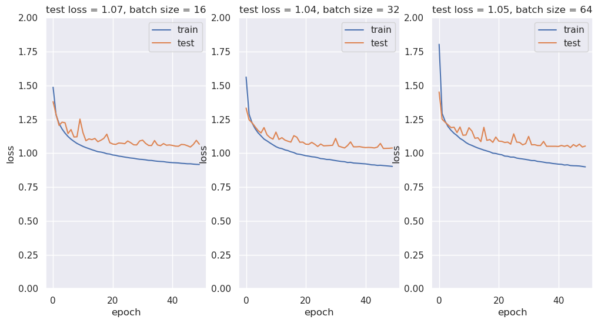
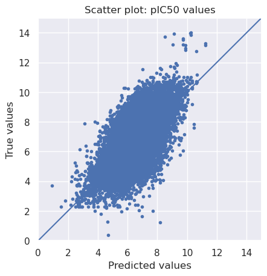
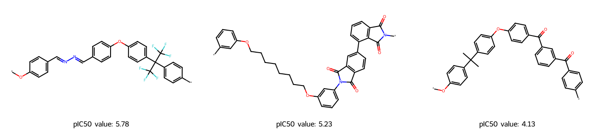

### <font color='lightskyblue'> 0. Import all necessary Libraries </font>


```python
from pathlib import Path
from warnings import filterwarnings

# Silence some expected warnings
filterwarnings("ignore")
!pip install rdkit
!pip install tensorflow
!pip install pandas
!pip install numpy
!pip install scikit-learn
!pip install matplotlib
!pip install seaborn
import pandas as pd
import numpy as np
import rdkit
from rdkit import Chem
from rdkit.Chem import MACCSkeys, Draw, rdFingerprintGenerator
from sklearn.model_selection import train_test_split
import matplotlib.pyplot as plt
from sklearn import metrics
import seaborn as sns

# Neural network specific libraries
from tensorflow.keras.models import Sequential, load_model
from tensorflow.keras.layers import Dense
from tensorflow.keras.callbacks import ModelCheckpoint

print("works")
%matplotlib inline

from IPython.core.interactiveshell import InteractiveShell
InteractiveShell.ast_node_interactivity = "all"
```

    Defaulting to user installation because normal site-packages is not writeable
    Requirement already satisfied: rdkit in ./.local/lib/python3.11/site-packages (2026.3.1)
    Requirement already satisfied: numpy in /software.9/software/Anaconda3/2024.02-1/lib/python3.11/site-packages (from rdkit) (1.26.4)
    Requirement already satisfied: Pillow in /software.9/software/Anaconda3/2024.02-1/lib/python3.11/site-packages (from rdkit) (10.2.0)
    Defaulting to user installation because normal site-packages is not writeable
    Requirement already satisfied: tensorflow in ./.local/lib/python3.11/site-packages (2.21.0)
    Requirement already satisfied: absl-py>=1.0.0 in ./.local/lib/python3.11/site-packages (from tensorflow) (2.4.0)
    Requirement already satisfied: astunparse>=1.6.0 in ./.local/lib/python3.11/site-packages (from tensorflow) (1.6.3)
    Requirement already satisfied: flatbuffers>=25.9.23 in ./.local/lib/python3.11/site-packages (from tensorflow) (25.12.19)
    Requirement already satisfied: gast!=0.5.0,!=0.5.1,!=0.5.2,>=0.2.1 in ./.local/lib/python3.11/site-packages (from tensorflow) (0.7.0)
    Requirement already satisfied: google_pasta>=0.1.1 in ./.local/lib/python3.11/site-packages (from tensorflow) (0.2.0)
    Requirement already satisfied: libclang>=13.0.0 in ./.local/lib/python3.11/site-packages (from tensorflow) (18.1.1)
    Requirement already satisfied: opt_einsum>=2.3.2 in ./.local/lib/python3.11/site-packages (from tensorflow) (3.4.0)
    Requirement already satisfied: packaging in /software.9/software/Anaconda3/2024.02-1/lib/python3.11/site-packages (from tensorflow) (23.1)
    Requirement already satisfied: protobuf<8.0.0,>=6.31.1 in ./.local/lib/python3.11/site-packages (from tensorflow) (7.34.1)
    Requirement already satisfied: requests<3,>=2.21.0 in /software.9/software/Anaconda3/2024.02-1/lib/python3.11/site-packages (from tensorflow) (2.31.0)
    Requirement already satisfied: setuptools in /software.9/software/Anaconda3/2024.02-1/lib/python3.11/site-packages (from tensorflow) (68.2.2)
    Requirement already satisfied: six>=1.12.0 in /software.9/software/Anaconda3/2024.02-1/lib/python3.11/site-packages (from tensorflow) (1.16.0)
    Requirement already satisfied: termcolor>=1.1.0 in ./.local/lib/python3.11/site-packages (from tensorflow) (3.3.0)
    Requirement already satisfied: typing_extensions>=3.6.6 in ./.local/lib/python3.11/site-packages (from tensorflow) (4.15.0)
    Requirement already satisfied: wrapt>=1.11.0 in /software.9/software/Anaconda3/2024.02-1/lib/python3.11/site-packages (from tensorflow) (1.14.1)
    Requirement already satisfied: grpcio<2.0,>=1.24.3 in ./.local/lib/python3.11/site-packages (from tensorflow) (1.80.0)
    Requirement already satisfied: keras>=3.12.0 in ./.local/lib/python3.11/site-packages (from tensorflow) (3.14.0)
    Requirement already satisfied: numpy>=1.26.0 in /software.9/software/Anaconda3/2024.02-1/lib/python3.11/site-packages (from tensorflow) (1.26.4)
    Requirement already satisfied: h5py<3.15.0,>=3.11.0 in ./.local/lib/python3.11/site-packages (from tensorflow) (3.14.0)
    Requirement already satisfied: ml_dtypes<1.0.0,>=0.5.1 in ./.local/lib/python3.11/site-packages (from tensorflow) (0.5.4)
    Requirement already satisfied: wheel<1.0,>=0.23.0 in /software.9/software/Anaconda3/2024.02-1/lib/python3.11/site-packages (from astunparse>=1.6.0->tensorflow) (0.41.2)
    Requirement already satisfied: rich in /software.9/software/Anaconda3/2024.02-1/lib/python3.11/site-packages (from keras>=3.12.0->tensorflow) (13.3.5)
    Requirement already satisfied: namex in ./.local/lib/python3.11/site-packages (from keras>=3.12.0->tensorflow) (0.1.0)
    Requirement already satisfied: optree in ./.local/lib/python3.11/site-packages (from keras>=3.12.0->tensorflow) (0.19.0)
    Requirement already satisfied: charset-normalizer<4,>=2 in /software.9/software/Anaconda3/2024.02-1/lib/python3.11/site-packages (from requests<3,>=2.21.0->tensorflow) (2.0.4)
    Requirement already satisfied: idna<4,>=2.5 in /software.9/software/Anaconda3/2024.02-1/lib/python3.11/site-packages (from requests<3,>=2.21.0->tensorflow) (3.4)
    Requirement already satisfied: urllib3<3,>=1.21.1 in /software.9/software/Anaconda3/2024.02-1/lib/python3.11/site-packages (from requests<3,>=2.21.0->tensorflow) (2.0.7)
    Requirement already satisfied: certifi>=2017.4.17 in /software.9/software/Anaconda3/2024.02-1/lib/python3.11/site-packages (from requests<3,>=2.21.0->tensorflow) (2025.1.31)
    Requirement already satisfied: markdown-it-py<3.0.0,>=2.2.0 in /software.9/software/Anaconda3/2024.02-1/lib/python3.11/site-packages (from rich->keras>=3.12.0->tensorflow) (2.2.0)
    Requirement already satisfied: pygments<3.0.0,>=2.13.0 in /software.9/software/Anaconda3/2024.02-1/lib/python3.11/site-packages (from rich->keras>=3.12.0->tensorflow) (2.15.1)
    Requirement already satisfied: mdurl~=0.1 in /software.9/software/Anaconda3/2024.02-1/lib/python3.11/site-packages (from markdown-it-py<3.0.0,>=2.2.0->rich->keras>=3.12.0->tensorflow) (0.1.0)
    Defaulting to user installation because normal site-packages is not writeable
    Requirement already satisfied: pandas in /software.9/software/Anaconda3/2024.02-1/lib/python3.11/site-packages (2.1.4)
    Requirement already satisfied: numpy<2,>=1.23.2 in /software.9/software/Anaconda3/2024.02-1/lib/python3.11/site-packages (from pandas) (1.26.4)
    Requirement already satisfied: python-dateutil>=2.8.2 in /software.9/software/Anaconda3/2024.02-1/lib/python3.11/site-packages (from pandas) (2.8.2)
    Requirement already satisfied: pytz>=2020.1 in /software.9/software/Anaconda3/2024.02-1/lib/python3.11/site-packages (from pandas) (2023.3.post1)
    Requirement already satisfied: tzdata>=2022.1 in /software.9/software/Anaconda3/2024.02-1/lib/python3.11/site-packages (from pandas) (2023.3)
    Requirement already satisfied: six>=1.5 in /software.9/software/Anaconda3/2024.02-1/lib/python3.11/site-packages (from python-dateutil>=2.8.2->pandas) (1.16.0)
    Defaulting to user installation because normal site-packages is not writeable
    Requirement already satisfied: numpy in /software.9/software/Anaconda3/2024.02-1/lib/python3.11/site-packages (1.26.4)
    Defaulting to user installation because normal site-packages is not writeable
    Requirement already satisfied: scikit-learn in /software.9/software/Anaconda3/2024.02-1/lib/python3.11/site-packages (1.2.2)
    Requirement already satisfied: numpy>=1.17.3 in /software.9/software/Anaconda3/2024.02-1/lib/python3.11/site-packages (from scikit-learn) (1.26.4)
    Requirement already satisfied: scipy>=1.3.2 in /software.9/software/Anaconda3/2024.02-1/lib/python3.11/site-packages (from scikit-learn) (1.11.4)
    Requirement already satisfied: joblib>=1.1.1 in /software.9/software/Anaconda3/2024.02-1/lib/python3.11/site-packages (from scikit-learn) (1.2.0)
    Requirement already satisfied: threadpoolctl>=2.0.0 in /software.9/software/Anaconda3/2024.02-1/lib/python3.11/site-packages (from scikit-learn) (2.2.0)
    Defaulting to user installation because normal site-packages is not writeable
    Requirement already satisfied: matplotlib in /software.9/software/Anaconda3/2024.02-1/lib/python3.11/site-packages (3.8.0)
    Requirement already satisfied: contourpy>=1.0.1 in /software.9/software/Anaconda3/2024.02-1/lib/python3.11/site-packages (from matplotlib) (1.2.0)
    Requirement already satisfied: cycler>=0.10 in /software.9/software/Anaconda3/2024.02-1/lib/python3.11/site-packages (from matplotlib) (0.11.0)
    Requirement already satisfied: fonttools>=4.22.0 in /software.9/software/Anaconda3/2024.02-1/lib/python3.11/site-packages (from matplotlib) (4.25.0)
    Requirement already satisfied: kiwisolver>=1.0.1 in /software.9/software/Anaconda3/2024.02-1/lib/python3.11/site-packages (from matplotlib) (1.4.4)
    Requirement already satisfied: numpy<2,>=1.21 in /software.9/software/Anaconda3/2024.02-1/lib/python3.11/site-packages (from matplotlib) (1.26.4)
    Requirement already satisfied: packaging>=20.0 in /software.9/software/Anaconda3/2024.02-1/lib/python3.11/site-packages (from matplotlib) (23.1)
    Requirement already satisfied: pillow>=6.2.0 in /software.9/software/Anaconda3/2024.02-1/lib/python3.11/site-packages (from matplotlib) (10.2.0)
    Requirement already satisfied: pyparsing>=2.3.1 in /software.9/software/Anaconda3/2024.02-1/lib/python3.11/site-packages (from matplotlib) (3.0.9)
    Requirement already satisfied: python-dateutil>=2.7 in /software.9/software/Anaconda3/2024.02-1/lib/python3.11/site-packages (from matplotlib) (2.8.2)
    Requirement already satisfied: six>=1.5 in /software.9/software/Anaconda3/2024.02-1/lib/python3.11/site-packages (from python-dateutil>=2.7->matplotlib) (1.16.0)
    Defaulting to user installation because normal site-packages is not writeable
    Requirement already satisfied: seaborn in /software.9/software/Anaconda3/2024.02-1/lib/python3.11/site-packages (0.12.2)
    Requirement already satisfied: numpy!=1.24.0,>=1.17 in /software.9/software/Anaconda3/2024.02-1/lib/python3.11/site-packages (from seaborn) (1.26.4)
    Requirement already satisfied: pandas>=0.25 in /software.9/software/Anaconda3/2024.02-1/lib/python3.11/site-packages (from seaborn) (2.1.4)
    Requirement already satisfied: matplotlib!=3.6.1,>=3.1 in /software.9/software/Anaconda3/2024.02-1/lib/python3.11/site-packages (from seaborn) (3.8.0)
    Requirement already satisfied: contourpy>=1.0.1 in /software.9/software/Anaconda3/2024.02-1/lib/python3.11/site-packages (from matplotlib!=3.6.1,>=3.1->seaborn) (1.2.0)
    Requirement already satisfied: cycler>=0.10 in /software.9/software/Anaconda3/2024.02-1/lib/python3.11/site-packages (from matplotlib!=3.6.1,>=3.1->seaborn) (0.11.0)
    Requirement already satisfied: fonttools>=4.22.0 in /software.9/software/Anaconda3/2024.02-1/lib/python3.11/site-packages (from matplotlib!=3.6.1,>=3.1->seaborn) (4.25.0)
    Requirement already satisfied: kiwisolver>=1.0.1 in /software.9/software/Anaconda3/2024.02-1/lib/python3.11/site-packages (from matplotlib!=3.6.1,>=3.1->seaborn) (1.4.4)
    Requirement already satisfied: packaging>=20.0 in /software.9/software/Anaconda3/2024.02-1/lib/python3.11/site-packages (from matplotlib!=3.6.1,>=3.1->seaborn) (23.1)
    Requirement already satisfied: pillow>=6.2.0 in /software.9/software/Anaconda3/2024.02-1/lib/python3.11/site-packages (from matplotlib!=3.6.1,>=3.1->seaborn) (10.2.0)
    Requirement already satisfied: pyparsing>=2.3.1 in /software.9/software/Anaconda3/2024.02-1/lib/python3.11/site-packages (from matplotlib!=3.6.1,>=3.1->seaborn) (3.0.9)
    Requirement already satisfied: python-dateutil>=2.7 in /software.9/software/Anaconda3/2024.02-1/lib/python3.11/site-packages (from matplotlib!=3.6.1,>=3.1->seaborn) (2.8.2)
    Requirement already satisfied: pytz>=2020.1 in /software.9/software/Anaconda3/2024.02-1/lib/python3.11/site-packages (from pandas>=0.25->seaborn) (2023.3.post1)
    Requirement already satisfied: tzdata>=2022.1 in /software.9/software/Anaconda3/2024.02-1/lib/python3.11/site-packages (from pandas>=0.25->seaborn) (2023.3)
    Requirement already satisfied: six>=1.5 in /software.9/software/Anaconda3/2024.02-1/lib/python3.11/site-packages (from python-dateutil>=2.7->matplotlib!=3.6.1,>=3.1->seaborn) (1.16.0)


    WARNING: All log messages before absl::InitializeLog() is called are written to STDERR
    I0000 00:00:1776196857.435954 3038566 port.cc:153] oneDNN custom operations are on. You may see slightly different numerical results due to floating-point round-off errors from different computation orders. To turn them off, set the environment variable `TF_ENABLE_ONEDNN_OPTS=0`.
    I0000 00:00:1776196857.439513 3038566 cudart_stub.cc:31] Could not find cuda drivers on your machine, GPU will not be used.
    I0000 00:00:1776196857.478205 3038566 cpu_feature_guard.cc:227] This TensorFlow binary is optimized to use available CPU instructions in performance-critical operations.
    To enable the following instructions: AVX2 AVX512F AVX512_VNNI AVX512_BF16 FMA, in other operations, rebuild TensorFlow with the appropriate compiler flags.
    WARNING: All log messages before absl::InitializeLog() is called are written to STDERR
    I0000 00:00:1776196866.791186 3038566 port.cc:153] oneDNN custom operations are on. You may see slightly different numerical results due to floating-point round-off errors from different computation orders. To turn them off, set the environment variable `TF_ENABLE_ONEDNN_OPTS=0`.
    I0000 00:00:1776196866.793572 3038566 cudart_stub.cc:31] Could not find cuda drivers on your machine, GPU will not be used.


    works


### <font color='lightskyblue'> Set path to this notebook </font>


```python
# Set path to this notebook
HERE = Path(_dh[-1])
DATA = HERE / "data"
```

### <font color='lightskyblue'> 1. Data preparation </font>
Load table and use important columns


```python
# Load data
df = pd.read_csv(DATA / "kinase.csv", index_col=0)
df = df.reset_index(drop=True)
df.head()

# Check the dimension and missing value of the data
print("Shape of dataframe : ", df.shape)
df.info()
```


<div>
<style scoped>
    .dataframe tbody tr th:only-of-type {
        vertical-align: middle;
    }

    .dataframe tbody tr th {
        vertical-align: top;
    }

    .dataframe thead th {
        text-align: right;
    }
</style>
<table border="1" class="dataframe">
  <thead>
    <tr style="text-align: right;">
      <th></th>
      <th>molecule_chembl_id</th>
      <th>standard_value</th>
      <th>standard_units</th>
      <th>target_chembl_id</th>
      <th>smiles</th>
    </tr>
  </thead>
  <tbody>
    <tr>
      <th>0</th>
      <td>CHEMBL13462</td>
      <td>4000.0</td>
      <td>nM</td>
      <td>CHEMBL1862</td>
      <td>CC(=O)N[C@@H](Cc1ccc(OP(=O)(O)O)cc1)C(=O)N[C@@...</td>
    </tr>
    <tr>
      <th>1</th>
      <td>CHEMBL13462</td>
      <td>16000.0</td>
      <td>nM</td>
      <td>CHEMBL1862</td>
      <td>CC(=O)N[C@@H](Cc1ccc(OP(=O)(O)O)cc1)C(=O)N[C@@...</td>
    </tr>
    <tr>
      <th>2</th>
      <td>CHEMBL13462</td>
      <td>800.0</td>
      <td>nM</td>
      <td>CHEMBL267</td>
      <td>CC(=O)N[C@@H](Cc1ccc(OP(=O)(O)O)cc1)C(=O)N[C@@...</td>
    </tr>
    <tr>
      <th>3</th>
      <td>CHEMBL13462</td>
      <td>9000.0</td>
      <td>nM</td>
      <td>CHEMBL267</td>
      <td>CC(=O)N[C@@H](Cc1ccc(OP(=O)(O)O)cc1)C(=O)N[C@@...</td>
    </tr>
    <tr>
      <th>4</th>
      <td>CHEMBL13462</td>
      <td>1700.0</td>
      <td>nM</td>
      <td>CHEMBL267</td>
      <td>CC(=O)N[C@@H](Cc1ccc(OP(=O)(O)O)cc1)C(=O)N[C@@...</td>
    </tr>
  </tbody>
</table>
</div>


    Shape of dataframe :  (179827, 5)
    <class 'pandas.core.frame.DataFrame'>
    RangeIndex: 179827 entries, 0 to 179826
    Data columns (total 5 columns):
     #   Column              Non-Null Count   Dtype  
    ---  ------              --------------   -----  
     0   molecule_chembl_id  179827 non-null  object 
     1   standard_value      179827 non-null  float64
     2   standard_units      179827 non-null  object 
     3   target_chembl_id    179827 non-null  object 
     4   smiles              179827 non-null  object 
    dtypes: float64(1), object(4)
    memory usage: 6.9+ MB


```python
#Preprocessing data
#Eliminate 0-values, turn into pIC50, keep necessary columns
chembl_df = df.copy()
chembl_df = chembl_df[chembl_df["standard_value"] > 0].copy()
chembl_df["pIC50"]=(-1)*np.log10(chembl_df["standard_value"]/(1000000000))
chembl_df = chembl_df[["smiles","pIC50"]]
chembl_df.head()
```


<div>
<style scoped>
    .dataframe tbody tr th:only-of-type {
        vertical-align: middle;
    }

    .dataframe tbody tr th {
        vertical-align: top;
    }

    .dataframe thead th {
        text-align: right;
    }
</style>
<table border="1" class="dataframe">
  <thead>
    <tr style="text-align: right;">
      <th></th>
      <th>smiles</th>
      <th>pIC50</th>
    </tr>
  </thead>
  <tbody>
    <tr>
      <th>0</th>
      <td>CC(=O)N[C@@H](Cc1ccc(OP(=O)(O)O)cc1)C(=O)N[C@@...</td>
      <td>5.397940</td>
    </tr>
    <tr>
      <th>1</th>
      <td>CC(=O)N[C@@H](Cc1ccc(OP(=O)(O)O)cc1)C(=O)N[C@@...</td>
      <td>4.795880</td>
    </tr>
    <tr>
      <th>2</th>
      <td>CC(=O)N[C@@H](Cc1ccc(OP(=O)(O)O)cc1)C(=O)N[C@@...</td>
      <td>6.096910</td>
    </tr>
    <tr>
      <th>3</th>
      <td>CC(=O)N[C@@H](Cc1ccc(OP(=O)(O)O)cc1)C(=O)N[C@@...</td>
      <td>5.045757</td>
    </tr>
    <tr>
      <th>4</th>
      <td>CC(=O)N[C@@H](Cc1ccc(OP(=O)(O)O)cc1)C(=O)N[C@@...</td>
      <td>5.769551</td>
    </tr>
  </tbody>
</table>
</div>


### <font color='lightskyblue'> 2. Molecular encoding</font>


```python
# needed to import rdkit as a whole because it would give an error message when trying to apply function
# error says "name 'rdkit' is not defined"
def smiles_to_fp(smiles, method="maccs", n_bits=2048):
    """
    Encode a molecule from a SMILES string into a fingerprint.

    Parameters
    ----------
    smiles : str
        The SMILES string defining the molecule.

    method : str
        The type of fingerprint to use. Default is MACCS keys.

    n_bits : int
        The length of the fingerprint.

    Returns
    -------
    array
        The fingerprint array.
    """

    # Convert smiles to RDKit mol object
    mol = rdkit.Chem.MolFromSmiles(smiles)

    if method == "maccs":
        return np.array(MACCSkeys.GenMACCSKeys(mol))
    if method == "morgan2":
        fpg = rdFingerprintGenerator.GetMorganGenerator(radius=2, fpSize=n_bits)
        return np.array(fpg.GetCountFingerprint(mol))
    if method == "morgan3":
        fpg = rdFingerprintGenerator.GetMorganGenerator(radius=3, fpSize=n_bits)
        return np.array(fpg.GetCountFingerprint(mol))
    else:
        print(f"Warning: Wrong method specified: {method}." " Default will be used instead.")
        return np.array(MACCSkeys.GenMACCSKeys(mol))
```


```python
# Converting SMILES to MACCS fingerprints
chembl_df["fingerprints_df"] = chembl_df["smiles"].apply(smiles_to_fp)
# Look at head
print("Shape of dataframe:", chembl_df.shape)
chembl_df.head(3)
chembl_df2 = chembl_df
# NBVAL_CHECK_OUTPUT
```

    Shape of dataframe: (179154, 3)


<div>
<style scoped>
    .dataframe tbody tr th:only-of-type {
        vertical-align: middle;
    }

    .dataframe tbody tr th {
        vertical-align: top;
    }

    .dataframe thead th {
        text-align: right;
    }
</style>
<table border="1" class="dataframe">
  <thead>
    <tr style="text-align: right;">
      <th></th>
      <th>smiles</th>
      <th>pIC50</th>
      <th>fingerprints_df</th>
    </tr>
  </thead>
  <tbody>
    <tr>
      <th>0</th>
      <td>CC(=O)N[C@@H](Cc1ccc(OP(=O)(O)O)cc1)C(=O)N[C@@...</td>
      <td>5.39794</td>
      <td>[0, 0, 0, 0, 0, 0, 0, 0, 0, 0, 0, 0, 0, 0, 0, ...</td>
    </tr>
    <tr>
      <th>1</th>
      <td>CC(=O)N[C@@H](Cc1ccc(OP(=O)(O)O)cc1)C(=O)N[C@@...</td>
      <td>4.79588</td>
      <td>[0, 0, 0, 0, 0, 0, 0, 0, 0, 0, 0, 0, 0, 0, 0, ...</td>
    </tr>
    <tr>
      <th>2</th>
      <td>CC(=O)N[C@@H](Cc1ccc(OP(=O)(O)O)cc1)C(=O)N[C@@...</td>
      <td>6.09691</td>
      <td>[0, 0, 0, 0, 0, 0, 0, 0, 0, 0, 0, 0, 0, 0, 0, ...</td>
    </tr>
  </tbody>
</table>
</div>


```python
# Split the data into training and test set
x_train, x_test, y_train, y_test = train_test_split(
    chembl_df2["fingerprints_df"], chembl_df2["pIC50"], test_size=0.3, random_state=42
)
# Print the shape of training and testing data
print("Shape of training data:", x_train.shape)
print("Shape of test data:", x_test.shape)
# NBVAL_CHECK_OUTPUT
```

    Shape of training data: (125407,)
    Shape of test data: (53747,)


### <font color='lightskyblue'> 3. Define Neural Network </font>


```python
def neural_network_model(hidden1, hidden2):
    """
    Creating a neural network from two hidden layers
    using ReLU as activation function in the two hidden layers
    and a linear activation in the output layer.

    Parameters
    ----------
    hidden1 : int
        Number of neurons in first hidden layer.

    hidden2: int
        Number of neurons in second hidden layer.

    Returns
    -------
    model
        Fully connected neural network model with two hidden layers.
    """

    model = Sequential()
    # First hidden layer
    model.add(Dense(hidden1, activation="relu", name="layer1"))
    # Second hidden layer
    model.add(Dense(hidden2, activation="relu", name="layer2"))
    # Output layer
    model.add(Dense(1, activation="linear", name="layer3"))

    # Compile model
    model.compile(loss="mean_squared_error", optimizer="adam", metrics=["mse", "mae"])
    return model
```

### <font color='lightskyblue'> 4. Train The Model </font>


```python
# Neural network parameters
batch_sizes = [16, 32, 64]
nb_epoch = 50
layer1_size = 64
layer2_size = 32
```


```python
# Plot
fig = plt.figure(figsize=(12, 6))
sns.set(color_codes=True)
for index, batch in enumerate(batch_sizes):
    fig.add_subplot(1, len(batch_sizes), index + 1)
    model = neural_network_model(layer1_size, layer2_size)

    # Fit model on x_train, y_train data
    history = model.fit(
        np.array(list((x_train))).astype(float),
        y_train.values,
        batch_size=batch,
        validation_data=(np.array(list((x_test))).astype(float), y_test.values),
        verbose=1,
        epochs=nb_epoch,
    )
    plt.plot(history.history["loss"], label="train")
    plt.plot(history.history["val_loss"], label="test")
    plt.legend(["train", "test"], loc="upper right")
    plt.ylabel("loss")
    plt.xlabel("epoch")
    plt.ylim((0, 2))
    plt.title(
        f"test loss = {history.history['val_loss'][nb_epoch-1]:.2f}, " f"batch size = {batch}"
    )
plt.show()
```


    <Axes: >


    E0000 00:00:1776197057.753711 3038566 cuda_platform.cc:52] failed call to cuInit: INTERNAL: CUDA error: Failed call to cuInit: UNKNOWN ERROR (303)


    Epoch 1/50
    7838/7838 ━━━━━━━━━━━━━━━━━━━━ 7s 798us/step - loss: 1.4865 - mae: 0.9686 - mse: 1.4865 - val_loss: 1.3799 - val_mae: 0.9387 - val_mse: 1.3799
    Epoch 2/50
    7838/7838 ━━━━━━━━━━━━━━━━━━━━ 6s 786us/step - loss: 1.2816 - mae: 0.9091 - mse: 1.2816 - val_loss: 1.2855 - val_mae: 0.9113 - val_mse: 1.2855
    Epoch 3/50
    7838/7838 ━━━━━━━━━━━━━━━━━━━━ 6s 792us/step - loss: 1.2183 - mae: 0.8845 - mse: 1.2183 - val_loss: 1.2051 - val_mae: 0.8766 - val_mse: 1.2051
    Epoch 4/50
    7838/7838 ━━━━━━━━━━━━━━━━━━━━ 6s 789us/step - loss: 1.1785 - mae: 0.8691 - mse: 1.1785 - val_loss: 1.2286 - val_mae: 0.8930 - val_mse: 1.2286
    Epoch 5/50
    7838/7838 ━━━━━━━━━━━━━━━━━━━━ 6s 756us/step - loss: 1.1478 - mae: 0.8566 - mse: 1.1478 - val_loss: 1.2243 - val_mae: 0.8936 - val_mse: 1.2243
    Epoch 6/50
    7838/7838 ━━━━━━━━━━━━━━━━━━━━ 6s 784us/step - loss: 1.1229 - mae: 0.8471 - mse: 1.1229 - val_loss: 1.1447 - val_mae: 0.8559 - val_mse: 1.1447
    Epoch 7/50
    7838/7838 ━━━━━━━━━━━━━━━━━━━━ 6s 784us/step - loss: 1.1031 - mae: 0.8396 - mse: 1.1031 - val_loss: 1.1742 - val_mae: 0.8717 - val_mse: 1.1742
    Epoch 8/50
    7838/7838 ━━━━━━━━━━━━━━━━━━━━ 6s 795us/step - loss: 1.0868 - mae: 0.8326 - mse: 1.0868 - val_loss: 1.1192 - val_mae: 0.8442 - val_mse: 1.1192
    Epoch 9/50
    7838/7838 ━━━━━━━━━━━━━━━━━━━━ 6s 797us/step - loss: 1.0718 - mae: 0.8262 - mse: 1.0718 - val_loss: 1.1205 - val_mae: 0.8477 - val_mse: 1.1205
    Epoch 10/50
    7838/7838 ━━━━━━━━━━━━━━━━━━━━ 6s 772us/step - loss: 1.0608 - mae: 0.8216 - mse: 1.0608 - val_loss: 1.2515 - val_mae: 0.8844 - val_mse: 1.2515
    Epoch 11/50
    7838/7838 ━━━━━━━━━━━━━━━━━━━━ 6s 788us/step - loss: 1.0501 - mae: 0.8172 - mse: 1.0501 - val_loss: 1.1524 - val_mae: 0.8610 - val_mse: 1.1524
    Epoch 12/50
    7838/7838 ━━━━━━━━━━━━━━━━━━━━ 6s 746us/step - loss: 1.0410 - mae: 0.8132 - mse: 1.0410 - val_loss: 1.0916 - val_mae: 0.8323 - val_mse: 1.0916
    Epoch 13/50
    7838/7838 ━━━━━━━━━━━━━━━━━━━━ 6s 740us/step - loss: 1.0335 - mae: 0.8099 - mse: 1.0335 - val_loss: 1.1056 - val_mae: 0.8411 - val_mse: 1.1056
    Epoch 14/50
    7838/7838 ━━━━━━━━━━━━━━━━━━━━ 7s 877us/step - loss: 1.0254 - mae: 0.8071 - mse: 1.0254 - val_loss: 1.0997 - val_mae: 0.8370 - val_mse: 1.0997
    Epoch 15/50
    7838/7838 ━━━━━━━━━━━━━━━━━━━━ 6s 781us/step - loss: 1.0182 - mae: 0.8041 - mse: 1.0182 - val_loss: 1.1085 - val_mae: 0.8338 - val_mse: 1.1085
    Epoch 16/50
    7838/7838 ━━━━━━━━━━━━━━━━━━━━ 6s 783us/step - loss: 1.0108 - mae: 0.8017 - mse: 1.0108 - val_loss: 1.0845 - val_mae: 0.8297 - val_mse: 1.0845
    Epoch 17/50
    7838/7838 ━━━━━━━━━━━━━━━━━━━━ 6s 740us/step - loss: 1.0078 - mae: 0.7997 - mse: 1.0078 - val_loss: 1.0953 - val_mae: 0.8289 - val_mse: 1.0953
    Epoch 18/50
    7838/7838 ━━━━━━━━━━━━━━━━━━━━ 6s 762us/step - loss: 1.0031 - mae: 0.7971 - mse: 1.0031 - val_loss: 1.1091 - val_mae: 0.8429 - val_mse: 1.1091
    Epoch 19/50
    7838/7838 ━━━━━━━━━━━━━━━━━━━━ 6s 773us/step - loss: 0.9957 - mae: 0.7939 - mse: 0.9957 - val_loss: 1.1401 - val_mae: 0.8562 - val_mse: 1.1401
    Epoch 20/50
    7838/7838 ━━━━━━━━━━━━━━━━━━━━ 6s 756us/step - loss: 0.9934 - mae: 0.7930 - mse: 0.9934 - val_loss: 1.0775 - val_mae: 0.8231 - val_mse: 1.0775
    Epoch 21/50
    7838/7838 ━━━━━━━━━━━━━━━━━━━━ 10s 785us/step - loss: 0.9864 - mae: 0.7900 - mse: 0.9864 - val_loss: 1.0675 - val_mae: 0.8198 - val_mse: 1.0675
    Epoch 22/50
    7838/7838 ━━━━━━━━━━━━━━━━━━━━ 7s 907us/step - loss: 0.9836 - mae: 0.7891 - mse: 0.9836 - val_loss: 1.0645 - val_mae: 0.8186 - val_mse: 1.0645
    Epoch 23/50
    7838/7838 ━━━━━━━━━━━━━━━━━━━━ 6s 791us/step - loss: 0.9780 - mae: 0.7861 - mse: 0.9780 - val_loss: 1.0749 - val_mae: 0.8252 - val_mse: 1.0749
    Epoch 24/50
    7838/7838 ━━━━━━━━━━━━━━━━━━━━ 6s 789us/step - loss: 0.9752 - mae: 0.7853 - mse: 0.9752 - val_loss: 1.0732 - val_mae: 0.8231 - val_mse: 1.0732
    Epoch 25/50
    7838/7838 ━━━━━━━━━━━━━━━━━━━━ 6s 782us/step - loss: 0.9710 - mae: 0.7832 - mse: 0.9710 - val_loss: 1.0697 - val_mae: 0.8200 - val_mse: 1.0697
    Epoch 26/50
    7838/7838 ━━━━━━━━━━━━━━━━━━━━ 6s 788us/step - loss: 0.9676 - mae: 0.7821 - mse: 0.9676 - val_loss: 1.0898 - val_mae: 0.8251 - val_mse: 1.0898
    Epoch 27/50
    7838/7838 ━━━━━━━━━━━━━━━━━━━━ 7s 881us/step - loss: 0.9642 - mae: 0.7799 - mse: 0.9642 - val_loss: 1.0772 - val_mae: 0.8282 - val_mse: 1.0772
    Epoch 28/50
    7838/7838 ━━━━━━━━━━━━━━━━━━━━ 6s 761us/step - loss: 0.9621 - mae: 0.7790 - mse: 0.9621 - val_loss: 1.0616 - val_mae: 0.8173 - val_mse: 1.0616
    Epoch 29/50
    7838/7838 ━━━━━━━━━━━━━━━━━━━━ 6s 744us/step - loss: 0.9578 - mae: 0.7771 - mse: 0.9578 - val_loss: 1.0604 - val_mae: 0.8170 - val_mse: 1.0604
    Epoch 30/50
    7838/7838 ━━━━━━━━━━━━━━━━━━━━ 6s 768us/step - loss: 0.9547 - mae: 0.7759 - mse: 0.9547 - val_loss: 1.0899 - val_mae: 0.8256 - val_mse: 1.0899
    Epoch 31/50
    7838/7838 ━━━━━━━━━━━━━━━━━━━━ 7s 904us/step - loss: 0.9533 - mae: 0.7747 - mse: 0.9533 - val_loss: 1.0960 - val_mae: 0.8368 - val_mse: 1.0960
    Epoch 32/50
    7838/7838 ━━━━━━━━━━━━━━━━━━━━ 7s 911us/step - loss: 0.9506 - mae: 0.7737 - mse: 0.9506 - val_loss: 1.0722 - val_mae: 0.8263 - val_mse: 1.0722
    Epoch 33/50
    7838/7838 ━━━━━━━━━━━━━━━━━━━━ 7s 881us/step - loss: 0.9468 - mae: 0.7720 - mse: 0.9468 - val_loss: 1.0570 - val_mae: 0.8161 - val_mse: 1.0570
    Epoch 34/50
    7838/7838 ━━━━━━━━━━━━━━━━━━━━ 6s 753us/step - loss: 0.9459 - mae: 0.7721 - mse: 0.9459 - val_loss: 1.0563 - val_mae: 0.8173 - val_mse: 1.0563
    Epoch 35/50
    7838/7838 ━━━━━━━━━━━━━━━━━━━━ 6s 752us/step - loss: 0.9426 - mae: 0.7695 - mse: 0.9426 - val_loss: 1.0929 - val_mae: 0.8336 - val_mse: 1.0929
    Epoch 36/50
    7838/7838 ━━━━━━━━━━━━━━━━━━━━ 6s 786us/step - loss: 0.9401 - mae: 0.7690 - mse: 0.9401 - val_loss: 1.0602 - val_mae: 0.8177 - val_mse: 1.0602
    Epoch 37/50
    7838/7838 ━━━━━━━━━━━━━━━━━━━━ 6s 792us/step - loss: 0.9385 - mae: 0.7676 - mse: 0.9385 - val_loss: 1.0551 - val_mae: 0.8129 - val_mse: 1.0551
    Epoch 38/50
    7838/7838 ━━━━━━━━━━━━━━━━━━━━ 7s 906us/step - loss: 0.9373 - mae: 0.7677 - mse: 0.9373 - val_loss: 1.0706 - val_mae: 0.8158 - val_mse: 1.0706
    Epoch 39/50
    7838/7838 ━━━━━━━━━━━━━━━━━━━━ 6s 786us/step - loss: 0.9338 - mae: 0.7662 - mse: 0.9338 - val_loss: 1.0584 - val_mae: 0.8122 - val_mse: 1.0584
    Epoch 40/50
    7838/7838 ━━━━━━━━━━━━━━━━━━━━ 6s 783us/step - loss: 0.9317 - mae: 0.7655 - mse: 0.9317 - val_loss: 1.0607 - val_mae: 0.8157 - val_mse: 1.0607
    Epoch 41/50
    7838/7838 ━━━━━━━━━━━━━━━━━━━━ 7s 909us/step - loss: 0.9299 - mae: 0.7643 - mse: 0.9299 - val_loss: 1.0572 - val_mae: 0.8154 - val_mse: 1.0572
    Epoch 42/50
    7838/7838 ━━━━━━━━━━━━━━━━━━━━ 6s 787us/step - loss: 0.9288 - mae: 0.7636 - mse: 0.9288 - val_loss: 1.0519 - val_mae: 0.8156 - val_mse: 1.0519
    Epoch 43/50
    7838/7838 ━━━━━━━━━━━━━━━━━━━━ 6s 788us/step - loss: 0.9275 - mae: 0.7640 - mse: 0.9275 - val_loss: 1.0509 - val_mae: 0.8117 - val_mse: 1.0509
    Epoch 44/50
    7838/7838 ━━━━━━━━━━━━━━━━━━━━ 6s 798us/step - loss: 0.9248 - mae: 0.7620 - mse: 0.9248 - val_loss: 1.0644 - val_mae: 0.8129 - val_mse: 1.0644
    Epoch 45/50
    7838/7838 ━━━━━━━━━━━━━━━━━━━━ 6s 798us/step - loss: 0.9235 - mae: 0.7615 - mse: 0.9235 - val_loss: 1.0625 - val_mae: 0.8139 - val_mse: 1.0625
    Epoch 46/50
    7838/7838 ━━━━━━━━━━━━━━━━━━━━ 6s 792us/step - loss: 0.9215 - mae: 0.7609 - mse: 0.9215 - val_loss: 1.0550 - val_mae: 0.8127 - val_mse: 1.0550
    Epoch 47/50
    7838/7838 ━━━━━━━━━━━━━━━━━━━━ 6s 786us/step - loss: 0.9215 - mae: 0.7608 - mse: 0.9215 - val_loss: 1.0453 - val_mae: 0.8111 - val_mse: 1.0453
    Epoch 48/50
    7838/7838 ━━━━━━━━━━━━━━━━━━━━ 6s 745us/step - loss: 0.9190 - mae: 0.7595 - mse: 0.9190 - val_loss: 1.0644 - val_mae: 0.8156 - val_mse: 1.0644
    Epoch 49/50
    7838/7838 ━━━━━━━━━━━━━━━━━━━━ 10s 744us/step - loss: 0.9171 - mae: 0.7587 - mse: 0.9171 - val_loss: 1.0946 - val_mae: 0.8353 - val_mse: 1.0946
    Epoch 50/50
    7838/7838 ━━━━━━━━━━━━━━━━━━━━ 6s 776us/step - loss: 0.9163 - mae: 0.7582 - mse: 0.9163 - val_loss: 1.0662 - val_mae: 0.8194 - val_mse: 1.0662


    [<matplotlib.lines.Line2D at 0x7f7bd41a6250>]


    [<matplotlib.lines.Line2D at 0x7f7bd733f5d0>]


    <matplotlib.legend.Legend at 0x7f7bd7355b10>


    Text(0, 0.5, 'loss')


    Text(0.5, 0, 'epoch')


    (0.0, 2.0)


    Text(0.5, 1.0, 'test loss = 1.07, batch size = 16')


    <Axes: >


    Epoch 1/50
    3919/3919 ━━━━━━━━━━━━━━━━━━━━ 4s 826us/step - loss: 1.5618 - mae: 0.9823 - mse: 1.5618 - val_loss: 1.3329 - val_mae: 0.9314 - val_mse: 1.3329
    Epoch 2/50
    3919/3919 ━━━━━━━━━━━━━━━━━━━━ 3s 798us/step - loss: 1.2872 - mae: 0.9111 - mse: 1.2872 - val_loss: 1.2460 - val_mae: 0.8962 - val_mse: 1.2460
    Epoch 3/50
    3919/3919 ━━━━━━━━━━━━━━━━━━━━ 5s 803us/step - loss: 1.2231 - mae: 0.8875 - mse: 1.2231 - val_loss: 1.2244 - val_mae: 0.8842 - val_mse: 1.2244
    Epoch 4/50
    3919/3919 ━━━━━━━━━━━━━━━━━━━━ 3s 808us/step - loss: 1.1818 - mae: 0.8710 - mse: 1.1818 - val_loss: 1.1956 - val_mae: 0.8783 - val_mse: 1.1956
    Epoch 5/50
    3919/3919 ━━━━━━━━━━━━━━━━━━━━ 3s 805us/step - loss: 1.1505 - mae: 0.8575 - mse: 1.1505 - val_loss: 1.1674 - val_mae: 0.8639 - val_mse: 1.1674
    Epoch 6/50
    3919/3919 ━━━━━━━━━━━━━━━━━━━━ 3s 806us/step - loss: 1.1274 - mae: 0.8493 - mse: 1.1274 - val_loss: 1.1492 - val_mae: 0.8570 - val_mse: 1.1492
    Epoch 7/50
    3919/3919 ━━━━━━━━━━━━━━━━━━━━ 3s 808us/step - loss: 1.1040 - mae: 0.8390 - mse: 1.1040 - val_loss: 1.1889 - val_mae: 0.8767 - val_mse: 1.1889
    Epoch 8/50
    3919/3919 ━━━━━━━━━━━━━━━━━━━━ 3s 812us/step - loss: 1.0904 - mae: 0.8331 - mse: 1.0904 - val_loss: 1.1357 - val_mae: 0.8450 - val_mse: 1.1357
    Epoch 9/50
    3919/3919 ━━━━━━━━━━━━━━━━━━━━ 3s 808us/step - loss: 1.0755 - mae: 0.8268 - mse: 1.0755 - val_loss: 1.1151 - val_mae: 0.8451 - val_mse: 1.1151
    Epoch 10/50
    3919/3919 ━━━━━━━━━━━━━━━━━━━━ 3s 807us/step - loss: 1.0615 - mae: 0.8214 - mse: 1.0615 - val_loss: 1.1037 - val_mae: 0.8384 - val_mse: 1.1037
    Epoch 11/50
    3919/3919 ━━━━━━━━━━━━━━━━━━━━ 3s 808us/step - loss: 1.0480 - mae: 0.8157 - mse: 1.0480 - val_loss: 1.1554 - val_mae: 0.8492 - val_mse: 1.1554
    Epoch 12/50
    3919/3919 ━━━━━━━━━━━━━━━━━━━━ 3s 806us/step - loss: 1.0381 - mae: 0.8113 - mse: 1.0381 - val_loss: 1.1013 - val_mae: 0.8325 - val_mse: 1.1013
    Epoch 13/50
    3919/3919 ━━━━━━━━━━━━━━━━━━━━ 5s 810us/step - loss: 1.0335 - mae: 0.8091 - mse: 1.0335 - val_loss: 1.1141 - val_mae: 0.8432 - val_mse: 1.1141
    Epoch 14/50
    3919/3919 ━━━━━━━━━━━━━━━━━━━━ 4s 931us/step - loss: 1.0242 - mae: 0.8052 - mse: 1.0242 - val_loss: 1.0966 - val_mae: 0.8319 - val_mse: 1.0966
    Epoch 15/50
    3919/3919 ━━━━━━━━━━━━━━━━━━━━ 3s 809us/step - loss: 1.0188 - mae: 0.8029 - mse: 1.0188 - val_loss: 1.0883 - val_mae: 0.8309 - val_mse: 1.0883
    Epoch 16/50
    3919/3919 ━━━━━━━━━━━━━━━━━━━━ 3s 804us/step - loss: 1.0100 - mae: 0.7990 - mse: 1.0100 - val_loss: 1.0815 - val_mae: 0.8259 - val_mse: 1.0815
    Epoch 17/50
    3919/3919 ━━━━━━━━━━━━━━━━━━━━ 3s 804us/step - loss: 1.0042 - mae: 0.7972 - mse: 1.0042 - val_loss: 1.1290 - val_mae: 0.8385 - val_mse: 1.1290
    Epoch 18/50
    3919/3919 ━━━━━━━━━━━━━━━━━━━━ 3s 793us/step - loss: 0.9941 - mae: 0.7932 - mse: 0.9941 - val_loss: 1.1179 - val_mae: 0.8470 - val_mse: 1.1179
    Epoch 19/50
    3919/3919 ━━━━━━━━━━━━━━━━━━━━ 3s 801us/step - loss: 0.9915 - mae: 0.7914 - mse: 0.9915 - val_loss: 1.0804 - val_mae: 0.8246 - val_mse: 1.0804
    Epoch 20/50
    3919/3919 ━━━━━━━━━━━━━━━━━━━━ 3s 804us/step - loss: 0.9864 - mae: 0.7886 - mse: 0.9864 - val_loss: 1.0814 - val_mae: 0.8287 - val_mse: 1.0814
    Epoch 21/50
    3919/3919 ━━━━━━━━━━━━━━━━━━━━ 3s 802us/step - loss: 0.9810 - mae: 0.7869 - mse: 0.9810 - val_loss: 1.0663 - val_mae: 0.8212 - val_mse: 1.0663
    Epoch 22/50
    3919/3919 ━━━━━━━━━━━━━━━━━━━━ 3s 805us/step - loss: 0.9778 - mae: 0.7851 - mse: 0.9778 - val_loss: 1.0653 - val_mae: 0.8221 - val_mse: 1.0653
    Epoch 23/50
    3919/3919 ━━━━━━━━━━━━━━━━━━━━ 3s 807us/step - loss: 0.9735 - mae: 0.7838 - mse: 0.9735 - val_loss: 1.0799 - val_mae: 0.8265 - val_mse: 1.0799
    Epoch 24/50
    3919/3919 ━━━━━━━━━━━━━━━━━━━━ 3s 807us/step - loss: 0.9711 - mae: 0.7827 - mse: 0.9711 - val_loss: 1.0659 - val_mae: 0.8162 - val_mse: 1.0659
    Epoch 25/50
    3919/3919 ━━━━━━━━━━━━━━━━━━━━ 3s 815us/step - loss: 0.9665 - mae: 0.7808 - mse: 0.9665 - val_loss: 1.0491 - val_mae: 0.8137 - val_mse: 1.0491
    Epoch 26/50
    3919/3919 ━━━━━━━━━━━━━━━━━━━━ 3s 805us/step - loss: 0.9597 - mae: 0.7779 - mse: 0.9597 - val_loss: 1.0673 - val_mae: 0.8185 - val_mse: 1.0673
    Epoch 27/50
    3919/3919 ━━━━━━━━━━━━━━━━━━━━ 3s 811us/step - loss: 0.9577 - mae: 0.7763 - mse: 0.9577 - val_loss: 1.0539 - val_mae: 0.8130 - val_mse: 1.0539
    Epoch 28/50
    3919/3919 ━━━━━━━━━━━━━━━━━━━━ 3s 813us/step - loss: 0.9533 - mae: 0.7750 - mse: 0.9533 - val_loss: 1.0552 - val_mae: 0.8164 - val_mse: 1.0552
    Epoch 29/50
    3919/3919 ━━━━━━━━━━━━━━━━━━━━ 3s 810us/step - loss: 0.9530 - mae: 0.7749 - mse: 0.9530 - val_loss: 1.0564 - val_mae: 0.8166 - val_mse: 1.0564
    Epoch 30/50
    3919/3919 ━━━━━━━━━━━━━━━━━━━━ 5s 816us/step - loss: 0.9487 - mae: 0.7729 - mse: 0.9487 - val_loss: 1.0582 - val_mae: 0.8131 - val_mse: 1.0582
    Epoch 31/50
    3919/3919 ━━━━━━━━━━━━━━━━━━━━ 3s 817us/step - loss: 0.9449 - mae: 0.7710 - mse: 0.9449 - val_loss: 1.1088 - val_mae: 0.8292 - val_mse: 1.1088
    Epoch 32/50
    3919/3919 ━━━━━━━━━━━━━━━━━━━━ 3s 811us/step - loss: 0.9416 - mae: 0.7696 - mse: 0.9416 - val_loss: 1.0521 - val_mae: 0.8113 - val_mse: 1.0521
    Epoch 33/50
    3919/3919 ━━━━━━━━━━━━━━━━━━━━ 3s 810us/step - loss: 0.9384 - mae: 0.7685 - mse: 0.9384 - val_loss: 1.0447 - val_mae: 0.8106 - val_mse: 1.0447
    Epoch 34/50
    3919/3919 ━━━━━━━━━━━━━━━━━━━━ 3s 807us/step - loss: 0.9367 - mae: 0.7680 - mse: 0.9367 - val_loss: 1.0383 - val_mae: 0.8078 - val_mse: 1.0383
    Epoch 35/50
    3919/3919 ━━━━━━━━━━━━━━━━━━━━ 5s 807us/step - loss: 0.9311 - mae: 0.7651 - mse: 0.9311 - val_loss: 1.0562 - val_mae: 0.8181 - val_mse: 1.0562
    Epoch 36/50
    3919/3919 ━━━━━━━━━━━━━━━━━━━━ 3s 808us/step - loss: 0.9322 - mae: 0.7658 - mse: 0.9322 - val_loss: 1.0830 - val_mae: 0.8202 - val_mse: 1.0830
    Epoch 37/50
    3919/3919 ━━━━━━━━━━━━━━━━━━━━ 3s 812us/step - loss: 0.9270 - mae: 0.7636 - mse: 0.9270 - val_loss: 1.0467 - val_mae: 0.8121 - val_mse: 1.0467
    Epoch 38/50
    3919/3919 ━━━━━━━━━━━━━━━━━━━━ 3s 798us/step - loss: 0.9257 - mae: 0.7628 - mse: 0.9257 - val_loss: 1.0467 - val_mae: 0.8113 - val_mse: 1.0467
    Epoch 39/50
    3919/3919 ━━━━━━━━━━━━━━━━━━━━ 3s 804us/step - loss: 0.9241 - mae: 0.7620 - mse: 0.9241 - val_loss: 1.0482 - val_mae: 0.8099 - val_mse: 1.0482
    Epoch 40/50
    3919/3919 ━━━━━━━━━━━━━━━━━━━━ 3s 819us/step - loss: 0.9223 - mae: 0.7617 - mse: 0.9223 - val_loss: 1.0440 - val_mae: 0.8100 - val_mse: 1.0440
    Epoch 41/50
    3919/3919 ━━━━━━━━━━━━━━━━━━━━ 3s 811us/step - loss: 0.9208 - mae: 0.7605 - mse: 0.9208 - val_loss: 1.0411 - val_mae: 0.8085 - val_mse: 1.0411
    Epoch 42/50
    3919/3919 ━━━━━━━━━━━━━━━━━━━━ 3s 813us/step - loss: 0.9178 - mae: 0.7599 - mse: 0.9178 - val_loss: 1.0424 - val_mae: 0.8085 - val_mse: 1.0424
    Epoch 43/50
    3919/3919 ━━━━━━━━━━━━━━━━━━━━ 4s 925us/step - loss: 0.9139 - mae: 0.7584 - mse: 0.9139 - val_loss: 1.0412 - val_mae: 0.8073 - val_mse: 1.0412
    Epoch 44/50
    3919/3919 ━━━━━━━━━━━━━━━━━━━━ 3s 816us/step - loss: 0.9130 - mae: 0.7574 - mse: 0.9130 - val_loss: 1.0385 - val_mae: 0.8091 - val_mse: 1.0385
    Epoch 45/50
    3919/3919 ━━━━━━━━━━━━━━━━━━━━ 3s 811us/step - loss: 0.9096 - mae: 0.7560 - mse: 0.9096 - val_loss: 1.0447 - val_mae: 0.8138 - val_mse: 1.0447
    Epoch 46/50
    3919/3919 ━━━━━━━━━━━━━━━━━━━━ 4s 924us/step - loss: 0.9106 - mae: 0.7567 - mse: 0.9106 - val_loss: 1.0716 - val_mae: 0.8150 - val_mse: 1.0716
    Epoch 47/50
    3919/3919 ━━━━━━━━━━━━━━━━━━━━ 3s 807us/step - loss: 0.9084 - mae: 0.7552 - mse: 0.9084 - val_loss: 1.0347 - val_mae: 0.8073 - val_mse: 1.0347
    Epoch 48/50
    3919/3919 ━━━━━━━━━━━━━━━━━━━━ 3s 806us/step - loss: 0.9063 - mae: 0.7549 - mse: 0.9063 - val_loss: 1.0355 - val_mae: 0.8042 - val_mse: 1.0355
    Epoch 49/50
    3919/3919 ━━━━━━━━━━━━━━━━━━━━ 3s 812us/step - loss: 0.9044 - mae: 0.7536 - mse: 0.9044 - val_loss: 1.0360 - val_mae: 0.8078 - val_mse: 1.0360
    Epoch 50/50
    3919/3919 ━━━━━━━━━━━━━━━━━━━━ 3s 814us/step - loss: 0.9021 - mae: 0.7526 - mse: 0.9021 - val_loss: 1.0379 - val_mae: 0.8063 - val_mse: 1.0379


    [<matplotlib.lines.Line2D at 0x7f7bd4225450>]


    [<matplotlib.lines.Line2D at 0x7f7bce7b0090>]


    <matplotlib.legend.Legend at 0x7f7bd4171a10>


    Text(0, 0.5, 'loss')


    Text(0.5, 0, 'epoch')


    (0.0, 2.0)


    Text(0.5, 1.0, 'test loss = 1.04, batch size = 32')


    <Axes: >


    Epoch 1/50
    1960/1960 ━━━━━━━━━━━━━━━━━━━━ 2s 871us/step - loss: 1.8037 - mae: 1.0173 - mse: 1.8037 - val_loss: 1.4512 - val_mae: 0.9759 - val_mse: 1.4512
    Epoch 2/50
    1960/1960 ━━━━━━━━━━━━━━━━━━━━ 2s 828us/step - loss: 1.2930 - mae: 0.9145 - mse: 1.2930 - val_loss: 1.2505 - val_mae: 0.8983 - val_mse: 1.2505
    Epoch 3/50
    1960/1960 ━━━━━━━━━━━━━━━━━━━━ 2s 832us/step - loss: 1.2365 - mae: 0.8920 - mse: 1.2365 - val_loss: 1.2290 - val_mae: 0.8884 - val_mse: 1.2290
    Epoch 4/50
    1960/1960 ━━━━━━━━━━━━━━━━━━━━ 2s 832us/step - loss: 1.1958 - mae: 0.8761 - mse: 1.1958 - val_loss: 1.2089 - val_mae: 0.8844 - val_mse: 1.2089
    Epoch 5/50
    1960/1960 ━━━━━━━━━━━━━━━━━━━━ 3s 824us/step - loss: 1.1686 - mae: 0.8648 - mse: 1.1686 - val_loss: 1.1886 - val_mae: 0.8760 - val_mse: 1.1886
    Epoch 6/50
    1960/1960 ━━━━━━━━━━━━━━━━━━━━ 2s 830us/step - loss: 1.1466 - mae: 0.8561 - mse: 1.1466 - val_loss: 1.1916 - val_mae: 0.8661 - val_mse: 1.1916
    Epoch 7/50
    1960/1960 ━━━━━━━━━━━━━━━━━━━━ 2s 831us/step - loss: 1.1297 - mae: 0.8489 - mse: 1.1297 - val_loss: 1.1518 - val_mae: 0.8608 - val_mse: 1.1518
    Epoch 8/50
    1960/1960 ━━━━━━━━━━━━━━━━━━━━ 2s 838us/step - loss: 1.1088 - mae: 0.8407 - mse: 1.1088 - val_loss: 1.1933 - val_mae: 0.8789 - val_mse: 1.1933
    Epoch 9/50
    1960/1960 ━━━━━━━━━━━━━━━━━━━━ 2s 838us/step - loss: 1.0956 - mae: 0.8347 - mse: 1.0956 - val_loss: 1.1320 - val_mae: 0.8472 - val_mse: 1.1320
    Epoch 10/50
    1960/1960 ━━━━━━━━━━━━━━━━━━━━ 2s 845us/step - loss: 1.0783 - mae: 0.8277 - mse: 1.0783 - val_loss: 1.1340 - val_mae: 0.8535 - val_mse: 1.1340
    Epoch 11/50
    1960/1960 ━━━━━━━━━━━━━━━━━━━━ 2s 849us/step - loss: 1.0654 - mae: 0.8225 - mse: 1.0654 - val_loss: 1.1880 - val_mae: 0.8613 - val_mse: 1.1880
    Epoch 12/50
    1960/1960 ━━━━━━━━━━━━━━━━━━━━ 2s 848us/step - loss: 1.0569 - mae: 0.8186 - mse: 1.0569 - val_loss: 1.1627 - val_mae: 0.8651 - val_mse: 1.1627
    Epoch 13/50
    1960/1960 ━━━━━━━━━━━━━━━━━━━━ 2s 837us/step - loss: 1.0469 - mae: 0.8146 - mse: 1.0469 - val_loss: 1.1095 - val_mae: 0.8404 - val_mse: 1.1095
    Epoch 14/50
    1960/1960 ━━━━━━━━━━━━━━━━━━━━ 2s 836us/step - loss: 1.0379 - mae: 0.8112 - mse: 1.0379 - val_loss: 1.1138 - val_mae: 0.8356 - val_mse: 1.1138
    Epoch 15/50
    1960/1960 ━━━━━━━━━━━━━━━━━━━━ 2s 833us/step - loss: 1.0304 - mae: 0.8082 - mse: 1.0304 - val_loss: 1.0852 - val_mae: 0.8319 - val_mse: 1.0852
    Epoch 16/50
    1960/1960 ━━━━━━━━━━━━━━━━━━━━ 2s 826us/step - loss: 1.0226 - mae: 0.8042 - mse: 1.0226 - val_loss: 1.1910 - val_mae: 0.8753 - val_mse: 1.1910
    Epoch 17/50
    1960/1960 ━━━━━━━━━━━━━━━━━━━━ 2s 827us/step - loss: 1.0162 - mae: 0.8017 - mse: 1.0162 - val_loss: 1.0944 - val_mae: 0.8319 - val_mse: 1.0944
    Epoch 18/50
    1960/1960 ━━━━━━━━━━━━━━━━━━━━ 2s 827us/step - loss: 1.0095 - mae: 0.7986 - mse: 1.0095 - val_loss: 1.1005 - val_mae: 0.8309 - val_mse: 1.1005
    Epoch 19/50
    1960/1960 ━━━━━━━━━━━━━━━━━━━━ 2s 825us/step - loss: 0.9999 - mae: 0.7941 - mse: 0.9999 - val_loss: 1.0798 - val_mae: 0.8292 - val_mse: 1.0798
    Epoch 20/50
    1960/1960 ━━━━━━━━━━━━━━━━━━━━ 2s 836us/step - loss: 0.9974 - mae: 0.7933 - mse: 0.9974 - val_loss: 1.1189 - val_mae: 0.8475 - val_mse: 1.1189
    Epoch 21/50
    1960/1960 ━━━━━━━━━━━━━━━━━━━━ 2s 833us/step - loss: 0.9915 - mae: 0.7909 - mse: 0.9915 - val_loss: 1.0888 - val_mae: 0.8263 - val_mse: 1.0888
    Epoch 22/50
    1960/1960 ━━━━━━━━━━━━━━━━━━━━ 2s 843us/step - loss: 0.9880 - mae: 0.7896 - mse: 0.9880 - val_loss: 1.0869 - val_mae: 0.8341 - val_mse: 1.0869
    Epoch 23/50
    1960/1960 ━━━━━━━━━━━━━━━━━━━━ 2s 839us/step - loss: 0.9783 - mae: 0.7850 - mse: 0.9783 - val_loss: 1.0786 - val_mae: 0.8259 - val_mse: 1.0786
    Epoch 24/50
    1960/1960 ━━━━━━━━━━━━━━━━━━━━ 2s 943us/step - loss: 0.9767 - mae: 0.7853 - mse: 0.9767 - val_loss: 1.0815 - val_mae: 0.8244 - val_mse: 1.0815
    Epoch 25/50
    1960/1960 ━━━━━━━━━━━━━━━━━━━━ 2s 831us/step - loss: 0.9707 - mae: 0.7826 - mse: 0.9707 - val_loss: 1.0665 - val_mae: 0.8212 - val_mse: 1.0665
    Epoch 26/50
    1960/1960 ━━━━━━━━━━━━━━━━━━━━ 2s 936us/step - loss: 0.9709 - mae: 0.7824 - mse: 0.9709 - val_loss: 1.1424 - val_mae: 0.8568 - val_mse: 1.1424
    Epoch 27/50
    1960/1960 ━━━━━━━━━━━━━━━━━━━━ 2s 835us/step - loss: 0.9637 - mae: 0.7795 - mse: 0.9637 - val_loss: 1.0816 - val_mae: 0.8295 - val_mse: 1.0816
    Epoch 28/50
    1960/1960 ━━━━━━━━━━━━━━━━━━━━ 2s 834us/step - loss: 0.9600 - mae: 0.7773 - mse: 0.9600 - val_loss: 1.0792 - val_mae: 0.8232 - val_mse: 1.0792
    Epoch 29/50
    1960/1960 ━━━━━━━━━━━━━━━━━━━━ 3s 948us/step - loss: 0.9570 - mae: 0.7764 - mse: 0.9570 - val_loss: 1.0613 - val_mae: 0.8203 - val_mse: 1.0613
    Epoch 30/50
    1960/1960 ━━━━━━━━━━━━━━━━━━━━ 2s 841us/step - loss: 0.9537 - mae: 0.7748 - mse: 0.9537 - val_loss: 1.0706 - val_mae: 0.8211 - val_mse: 1.0706
    Epoch 31/50
    1960/1960 ━━━━━━━━━━━━━━━━━━━━ 2s 948us/step - loss: 0.9498 - mae: 0.7734 - mse: 0.9498 - val_loss: 1.1235 - val_mae: 0.8494 - val_mse: 1.1235
    Epoch 32/50
    1960/1960 ━━━━━━━━━━━━━━━━━━━━ 2s 856us/step - loss: 0.9452 - mae: 0.7716 - mse: 0.9452 - val_loss: 1.0615 - val_mae: 0.8202 - val_mse: 1.0615
    Epoch 33/50
    1960/1960 ━━━━━━━━━━━━━━━━━━━━ 2s 831us/step - loss: 0.9451 - mae: 0.7706 - mse: 0.9451 - val_loss: 1.0624 - val_mae: 0.8171 - val_mse: 1.0624
    Epoch 34/50
    1960/1960 ━━━━━━━━━━━━━━━━━━━━ 2s 850us/step - loss: 0.9392 - mae: 0.7685 - mse: 0.9392 - val_loss: 1.0565 - val_mae: 0.8170 - val_mse: 1.0565
    Epoch 35/50
    1960/1960 ━━━━━━━━━━━━━━━━━━━━ 2s 852us/step - loss: 0.9367 - mae: 0.7671 - mse: 0.9367 - val_loss: 1.0564 - val_mae: 0.8190 - val_mse: 1.0564
    Epoch 36/50
    1960/1960 ━━━━━━━━━━━━━━━━━━━━ 3s 835us/step - loss: 0.9334 - mae: 0.7660 - mse: 0.9334 - val_loss: 1.0864 - val_mae: 0.8326 - val_mse: 1.0864
    Epoch 37/50
    1960/1960 ━━━━━━━━━━━━━━━━━━━━ 2s 835us/step - loss: 0.9293 - mae: 0.7644 - mse: 0.9293 - val_loss: 1.0506 - val_mae: 0.8145 - val_mse: 1.0506
    Epoch 38/50
    1960/1960 ━━━━━━━━━━━━━━━━━━━━ 2s 836us/step - loss: 0.9281 - mae: 0.7638 - mse: 0.9281 - val_loss: 1.0508 - val_mae: 0.8145 - val_mse: 1.0508
    Epoch 39/50
    1960/1960 ━━━━━━━━━━━━━━━━━━━━ 2s 839us/step - loss: 0.9237 - mae: 0.7620 - mse: 0.9237 - val_loss: 1.0506 - val_mae: 0.8134 - val_mse: 1.0506
    Epoch 40/50
    1960/1960 ━━━━━━━━━━━━━━━━━━━━ 2s 853us/step - loss: 0.9215 - mae: 0.7610 - mse: 0.9215 - val_loss: 1.0506 - val_mae: 0.8130 - val_mse: 1.0506
    Epoch 41/50
    1960/1960 ━━━━━━━━━━━━━━━━━━━━ 3s 855us/step - loss: 0.9187 - mae: 0.7596 - mse: 0.9187 - val_loss: 1.0494 - val_mae: 0.8158 - val_mse: 1.0494
    Epoch 42/50
    1960/1960 ━━━━━━━━━━━━━━━━━━━━ 2s 854us/step - loss: 0.9176 - mae: 0.7588 - mse: 0.9176 - val_loss: 1.0568 - val_mae: 0.8175 - val_mse: 1.0568
    Epoch 43/50
    1960/1960 ━━━━━━━━━━━━━━━━━━━━ 2s 899us/step - loss: 0.9123 - mae: 0.7568 - mse: 0.9123 - val_loss: 1.0502 - val_mae: 0.8116 - val_mse: 1.0502
    Epoch 44/50
    1960/1960 ━━━━━━━━━━━━━━━━━━━━ 2s 925us/step - loss: 0.9138 - mae: 0.7571 - mse: 0.9138 - val_loss: 1.0575 - val_mae: 0.8149 - val_mse: 1.0575
    Epoch 45/50
    1960/1960 ━━━━━━━━━━━━━━━━━━━━ 2s 908us/step - loss: 0.9085 - mae: 0.7549 - mse: 0.9085 - val_loss: 1.0410 - val_mae: 0.8081 - val_mse: 1.0410
    Epoch 46/50
    1960/1960 ━━━━━━━━━━━━━━━━━━━━ 2s 891us/step - loss: 0.9071 - mae: 0.7543 - mse: 0.9071 - val_loss: 1.0632 - val_mae: 0.8222 - val_mse: 1.0632
    Epoch 47/50
    1960/1960 ━━━━━━━━━━━━━━━━━━━━ 2s 875us/step - loss: 0.9065 - mae: 0.7538 - mse: 0.9065 - val_loss: 1.0498 - val_mae: 0.8162 - val_mse: 1.0498
    Epoch 48/50
    1960/1960 ━━━━━━━━━━━━━━━━━━━━ 2s 866us/step - loss: 0.9051 - mae: 0.7538 - mse: 0.9051 - val_loss: 1.0664 - val_mae: 0.8142 - val_mse: 1.0664
    Epoch 49/50
    1960/1960 ━━━━━━━━━━━━━━━━━━━━ 2s 869us/step - loss: 0.9019 - mae: 0.7515 - mse: 0.9019 - val_loss: 1.0454 - val_mae: 0.8087 - val_mse: 1.0454
    Epoch 50/50
    1960/1960 ━━━━━━━━━━━━━━━━━━━━ 2s 884us/step - loss: 0.8988 - mae: 0.7505 - mse: 0.8988 - val_loss: 1.0525 - val_mae: 0.8133 - val_mse: 1.0525


    [<matplotlib.lines.Line2D at 0x7f7bcca9b910>]


    [<matplotlib.lines.Line2D at 0x7f7bcc74e2d0>]


    <matplotlib.legend.Legend at 0x7f7bcc77cf10>


    Text(0, 0.5, 'loss')


    Text(0.5, 0, 'epoch')


    (0.0, 2.0)


    Text(0.5, 1.0, 'test loss = 1.05, batch size = 64')


    

    


```python
# Save the trained model
filepath = DATA / "best_weights.weights.h5"
checkpoint = ModelCheckpoint(
    str(filepath),
    monitor="loss",
    verbose=1,
    save_best_only=True,
    mode="min",
    save_weights_only=True,
)
callbacks_list = [checkpoint]

# Fit the model
# batch size 32 because test loss lowest among the three
model.fit(
    np.array(list((x_train))).astype(float),
    y_train.values,
    epochs=nb_epoch,
    batch_size=32,
    callbacks=callbacks_list,
    verbose=1,
)
```

    Epoch 1/50
    3841/3919 ━━━━━━━━━━━━━━━━━━━━ 0s 629us/step - loss: 0.9308 - mae: 0.7664 - mse: 0.9308
    Epoch 1: loss improved from None to 0.93297, saving model to /storage/homefs/xc20t071/data/best_weights.weights.h5
    
    Epoch 1: finished saving model to /storage/homefs/xc20t071/data/best_weights.weights.h5
    3919/3919 ━━━━━━━━━━━━━━━━━━━━ 3s 640us/step - loss: 0.9330 - mae: 0.7659 - mse: 0.9330
    Epoch 2/50
    3881/3919 ━━━━━━━━━━━━━━━━━━━━ 0s 648us/step - loss: 0.9137 - mae: 0.7576 - mse: 0.9137
    Epoch 2: loss improved from 0.93297 to 0.92393, saving model to /storage/homefs/xc20t071/data/best_weights.weights.h5
    
    Epoch 2: finished saving model to /storage/homefs/xc20t071/data/best_weights.weights.h5
    3919/3919 ━━━━━━━━━━━━━━━━━━━━ 3s 658us/step - loss: 0.9239 - mae: 0.7622 - mse: 0.9239
    Epoch 3/50
    3841/3919 ━━━━━━━━━━━━━━━━━━━━ 0s 629us/step - loss: 0.9132 - mae: 0.7573 - mse: 0.9132
    Epoch 3: loss improved from 0.92393 to 0.91966, saving model to /storage/homefs/xc20t071/data/best_weights.weights.h5
    
    Epoch 3: finished saving model to /storage/homefs/xc20t071/data/best_weights.weights.h5
    3919/3919 ━━━━━━━━━━━━━━━━━━━━ 3s 637us/step - loss: 0.9197 - mae: 0.7603 - mse: 0.9197
    Epoch 4/50
    3863/3919 ━━━━━━━━━━━━━━━━━━━━ 0s 612us/step - loss: 0.9122 - mae: 0.7573 - mse: 0.9122
    Epoch 4: loss did not improve from 0.91966
    3919/3919 ━━━━━━━━━━━━━━━━━━━━ 2s 615us/step - loss: 0.9199 - mae: 0.7596 - mse: 0.9199
    Epoch 5/50
    3856/3919 ━━━━━━━━━━━━━━━━━━━━ 0s 614us/step - loss: 0.9077 - mae: 0.7545 - mse: 0.9077
    Epoch 5: loss improved from 0.91966 to 0.91794, saving model to /storage/homefs/xc20t071/data/best_weights.weights.h5
    
    Epoch 5: finished saving model to /storage/homefs/xc20t071/data/best_weights.weights.h5
    3919/3919 ━━━━━━━━━━━━━━━━━━━━ 2s 621us/step - loss: 0.9179 - mae: 0.7592 - mse: 0.9179
    Epoch 6/50
    3844/3919 ━━━━━━━━━━━━━━━━━━━━ 0s 615us/step - loss: 0.9071 - mae: 0.7552 - mse: 0.9071
    Epoch 6: loss improved from 0.91794 to 0.91354, saving model to /storage/homefs/xc20t071/data/best_weights.weights.h5
    
    Epoch 6: finished saving model to /storage/homefs/xc20t071/data/best_weights.weights.h5
    3919/3919 ━━━━━━━━━━━━━━━━━━━━ 2s 623us/step - loss: 0.9135 - mae: 0.7574 - mse: 0.9135
    Epoch 7/50
    3860/3919 ━━━━━━━━━━━━━━━━━━━━ 0s 613us/step - loss: 0.9109 - mae: 0.7568 - mse: 0.9109
    Epoch 7: loss improved from 0.91354 to 0.91156, saving model to /storage/homefs/xc20t071/data/best_weights.weights.h5
    
    Epoch 7: finished saving model to /storage/homefs/xc20t071/data/best_weights.weights.h5
    3919/3919 ━━━━━━━━━━━━━━━━━━━━ 2s 620us/step - loss: 0.9116 - mae: 0.7569 - mse: 0.9116
    Epoch 8/50
    3879/3919 ━━━━━━━━━━━━━━━━━━━━ 0s 622us/step - loss: 0.9003 - mae: 0.7515 - mse: 0.9003
    Epoch 8: loss improved from 0.91156 to 0.90974, saving model to /storage/homefs/xc20t071/data/best_weights.weights.h5
    
    Epoch 8: finished saving model to /storage/homefs/xc20t071/data/best_weights.weights.h5
    3919/3919 ━━━━━━━━━━━━━━━━━━━━ 2s 629us/step - loss: 0.9097 - mae: 0.7553 - mse: 0.9097
    Epoch 9/50
    3846/3919 ━━━━━━━━━━━━━━━━━━━━ 0s 615us/step - loss: 0.9008 - mae: 0.7521 - mse: 0.9008
    Epoch 9: loss improved from 0.90974 to 0.90723, saving model to /storage/homefs/xc20t071/data/best_weights.weights.h5
    
    Epoch 9: finished saving model to /storage/homefs/xc20t071/data/best_weights.weights.h5
    3919/3919 ━━━━━━━━━━━━━━━━━━━━ 2s 621us/step - loss: 0.9072 - mae: 0.7547 - mse: 0.9072
    Epoch 10/50
    3867/3919 ━━━━━━━━━━━━━━━━━━━━ 0s 598us/step - loss: 0.9086 - mae: 0.7547 - mse: 0.9086
    Epoch 10: loss improved from 0.90723 to 0.90647, saving model to /storage/homefs/xc20t071/data/best_weights.weights.h5
    
    Epoch 10: finished saving model to /storage/homefs/xc20t071/data/best_weights.weights.h5
    3919/3919 ━━━━━━━━━━━━━━━━━━━━ 2s 605us/step - loss: 0.9065 - mae: 0.7550 - mse: 0.9065
    Epoch 11/50
    3863/3919 ━━━━━━━━━━━━━━━━━━━━ 0s 598us/step - loss: 0.8949 - mae: 0.7502 - mse: 0.8949
    Epoch 11: loss improved from 0.90647 to 0.90349, saving model to /storage/homefs/xc20t071/data/best_weights.weights.h5
    
    Epoch 11: finished saving model to /storage/homefs/xc20t071/data/best_weights.weights.h5
    3919/3919 ━━━━━━━━━━━━━━━━━━━━ 3s 605us/step - loss: 0.9035 - mae: 0.7533 - mse: 0.9035
    Epoch 12/50
    3849/3919 ━━━━━━━━━━━━━━━━━━━━ 0s 588us/step - loss: 0.8965 - mae: 0.7499 - mse: 0.8965
    Epoch 12: loss improved from 0.90349 to 0.90212, saving model to /storage/homefs/xc20t071/data/best_weights.weights.h5
    
    Epoch 12: finished saving model to /storage/homefs/xc20t071/data/best_weights.weights.h5
    3919/3919 ━━━━━━━━━━━━━━━━━━━━ 2s 595us/step - loss: 0.9021 - mae: 0.7526 - mse: 0.9021
    Epoch 13/50
    3890/3919 ━━━━━━━━━━━━━━━━━━━━ 0s 582us/step - loss: 0.8982 - mae: 0.7507 - mse: 0.8982
    Epoch 13: loss improved from 0.90212 to 0.90048, saving model to /storage/homefs/xc20t071/data/best_weights.weights.h5
    
    Epoch 13: finished saving model to /storage/homefs/xc20t071/data/best_weights.weights.h5
    3919/3919 ━━━━━━━━━━━━━━━━━━━━ 2s 592us/step - loss: 0.9005 - mae: 0.7516 - mse: 0.9005
    Epoch 14/50
    3877/3919 ━━━━━━━━━━━━━━━━━━━━ 0s 584us/step - loss: 0.8970 - mae: 0.7503 - mse: 0.8970
    Epoch 14: loss improved from 0.90048 to 0.89885, saving model to /storage/homefs/xc20t071/data/best_weights.weights.h5
    
    Epoch 14: finished saving model to /storage/homefs/xc20t071/data/best_weights.weights.h5
    3919/3919 ━━━━━━━━━━━━━━━━━━━━ 2s 590us/step - loss: 0.8988 - mae: 0.7505 - mse: 0.8988
    Epoch 15/50
    3884/3919 ━━━━━━━━━━━━━━━━━━━━ 0s 583us/step - loss: 0.8900 - mae: 0.7466 - mse: 0.8900
    Epoch 15: loss improved from 0.89885 to 0.89564, saving model to /storage/homefs/xc20t071/data/best_weights.weights.h5
    
    Epoch 15: finished saving model to /storage/homefs/xc20t071/data/best_weights.weights.h5
    3919/3919 ━━━━━━━━━━━━━━━━━━━━ 2s 589us/step - loss: 0.8956 - mae: 0.7500 - mse: 0.8956
    Epoch 16/50
    3868/3919 ━━━━━━━━━━━━━━━━━━━━ 0s 586us/step - loss: 0.8878 - mae: 0.7478 - mse: 0.8878
    Epoch 16: loss improved from 0.89564 to 0.89440, saving model to /storage/homefs/xc20t071/data/best_weights.weights.h5
    
    Epoch 16: finished saving model to /storage/homefs/xc20t071/data/best_weights.weights.h5
    3919/3919 ━━━━━━━━━━━━━━━━━━━━ 2s 592us/step - loss: 0.8944 - mae: 0.7490 - mse: 0.8944
    Epoch 17/50
    3880/3919 ━━━━━━━━━━━━━━━━━━━━ 0s 583us/step - loss: 0.8818 - mae: 0.7435 - mse: 0.8818
    Epoch 17: loss improved from 0.89440 to 0.89158, saving model to /storage/homefs/xc20t071/data/best_weights.weights.h5
    
    Epoch 17: finished saving model to /storage/homefs/xc20t071/data/best_weights.weights.h5
    3919/3919 ━━━━━━━━━━━━━━━━━━━━ 2s 589us/step - loss: 0.8916 - mae: 0.7482 - mse: 0.8916
    Epoch 18/50
    3884/3919 ━━━━━━━━━━━━━━━━━━━━ 0s 583us/step - loss: 0.8940 - mae: 0.7484 - mse: 0.8940
    Epoch 18: loss did not improve from 0.89158
    3919/3919 ━━━━━━━━━━━━━━━━━━━━ 2s 586us/step - loss: 0.8920 - mae: 0.7477 - mse: 0.8920
    Epoch 19/50
    3878/3919 ━━━━━━━━━━━━━━━━━━━━ 0s 584us/step - loss: 0.8837 - mae: 0.7449 - mse: 0.8837
    Epoch 19: loss improved from 0.89158 to 0.88917, saving model to /storage/homefs/xc20t071/data/best_weights.weights.h5
    
    Epoch 19: finished saving model to /storage/homefs/xc20t071/data/best_weights.weights.h5
    3919/3919 ━━━━━━━━━━━━━━━━━━━━ 2s 590us/step - loss: 0.8892 - mae: 0.7471 - mse: 0.8892
    Epoch 20/50
    3839/3919 ━━━━━━━━━━━━━━━━━━━━ 0s 590us/step - loss: 0.8757 - mae: 0.7416 - mse: 0.8757
    Epoch 20: loss did not improve from 0.88917
    3919/3919 ━━━━━━━━━━━━━━━━━━━━ 2s 593us/step - loss: 0.8893 - mae: 0.7465 - mse: 0.8893
    Epoch 21/50
    3914/3919 ━━━━━━━━━━━━━━━━━━━━ 0s 591us/step - loss: 0.8778 - mae: 0.7429 - mse: 0.8778
    Epoch 21: loss improved from 0.88917 to 0.88623, saving model to /storage/homefs/xc20t071/data/best_weights.weights.h5
    
    Epoch 21: finished saving model to /storage/homefs/xc20t071/data/best_weights.weights.h5
    3919/3919 ━━━━━━━━━━━━━━━━━━━━ 2s 597us/step - loss: 0.8862 - mae: 0.7458 - mse: 0.8862
    Epoch 22/50
    3860/3919 ━━━━━━━━━━━━━━━━━━━━ 0s 586us/step - loss: 0.8754 - mae: 0.7417 - mse: 0.8754
    Epoch 22: loss improved from 0.88623 to 0.88412, saving model to /storage/homefs/xc20t071/data/best_weights.weights.h5
    
    Epoch 22: finished saving model to /storage/homefs/xc20t071/data/best_weights.weights.h5
    3919/3919 ━━━━━━━━━━━━━━━━━━━━ 2s 593us/step - loss: 0.8841 - mae: 0.7447 - mse: 0.8841
    Epoch 23/50
    3856/3919 ━━━━━━━━━━━━━━━━━━━━ 0s 588us/step - loss: 0.8713 - mae: 0.7383 - mse: 0.8713
    Epoch 23: loss improved from 0.88412 to 0.88233, saving model to /storage/homefs/xc20t071/data/best_weights.weights.h5
    
    Epoch 23: finished saving model to /storage/homefs/xc20t071/data/best_weights.weights.h5
    3919/3919 ━━━━━━━━━━━━━━━━━━━━ 2s 595us/step - loss: 0.8823 - mae: 0.7438 - mse: 0.8823
    Epoch 24/50
    3840/3919 ━━━━━━━━━━━━━━━━━━━━ 0s 590us/step - loss: 0.8764 - mae: 0.7407 - mse: 0.8764
    Epoch 24: loss improved from 0.88233 to 0.88183, saving model to /storage/homefs/xc20t071/data/best_weights.weights.h5
    
    Epoch 24: finished saving model to /storage/homefs/xc20t071/data/best_weights.weights.h5
    3919/3919 ━━━━━━━━━━━━━━━━━━━━ 2s 596us/step - loss: 0.8818 - mae: 0.7435 - mse: 0.8818
    Epoch 25/50
    3879/3919 ━━━━━━━━━━━━━━━━━━━━ 0s 584us/step - loss: 0.8672 - mae: 0.7378 - mse: 0.8672
    Epoch 25: loss improved from 0.88183 to 0.87895, saving model to /storage/homefs/xc20t071/data/best_weights.weights.h5
    
    Epoch 25: finished saving model to /storage/homefs/xc20t071/data/best_weights.weights.h5
    3919/3919 ━━━━━━━━━━━━━━━━━━━━ 2s 591us/step - loss: 0.8789 - mae: 0.7429 - mse: 0.8789
    Epoch 26/50
    3853/3919 ━━━━━━━━━━━━━━━━━━━━ 0s 587us/step - loss: 0.8729 - mae: 0.7406 - mse: 0.8729
    Epoch 26: loss did not improve from 0.87895
    3919/3919 ━━━━━━━━━━━━━━━━━━━━ 2s 591us/step - loss: 0.8797 - mae: 0.7430 - mse: 0.8797
    Epoch 27/50
    3875/3919 ━━━━━━━━━━━━━━━━━━━━ 0s 584us/step - loss: 0.8680 - mae: 0.7379 - mse: 0.8680
    Epoch 27: loss improved from 0.87895 to 0.87680, saving model to /storage/homefs/xc20t071/data/best_weights.weights.h5
    
    Epoch 27: finished saving model to /storage/homefs/xc20t071/data/best_weights.weights.h5
    3919/3919 ━━━━━━━━━━━━━━━━━━━━ 2s 590us/step - loss: 0.8768 - mae: 0.7404 - mse: 0.8768
    Epoch 28/50
    3855/3919 ━━━━━━━━━━━━━━━━━━━━ 0s 587us/step - loss: 0.8649 - mae: 0.7359 - mse: 0.8649
    Epoch 28: loss improved from 0.87680 to 0.87601, saving model to /storage/homefs/xc20t071/data/best_weights.weights.h5
    
    Epoch 28: finished saving model to /storage/homefs/xc20t071/data/best_weights.weights.h5
    3919/3919 ━━━━━━━━━━━━━━━━━━━━ 2s 594us/step - loss: 0.8760 - mae: 0.7406 - mse: 0.8760
    Epoch 29/50
    3863/3919 ━━━━━━━━━━━━━━━━━━━━ 0s 586us/step - loss: 0.8617 - mae: 0.7361 - mse: 0.8617
    Epoch 29: loss improved from 0.87601 to 0.87457, saving model to /storage/homefs/xc20t071/data/best_weights.weights.h5
    
    Epoch 29: finished saving model to /storage/homefs/xc20t071/data/best_weights.weights.h5
    3919/3919 ━━━━━━━━━━━━━━━━━━━━ 2s 593us/step - loss: 0.8746 - mae: 0.7402 - mse: 0.8746
    Epoch 30/50
    3839/3919 ━━━━━━━━━━━━━━━━━━━━ 0s 589us/step - loss: 0.8625 - mae: 0.7361 - mse: 0.8625
    Epoch 30: loss improved from 0.87457 to 0.87405, saving model to /storage/homefs/xc20t071/data/best_weights.weights.h5
    
    Epoch 30: finished saving model to /storage/homefs/xc20t071/data/best_weights.weights.h5
    3919/3919 ━━━━━━━━━━━━━━━━━━━━ 2s 597us/step - loss: 0.8740 - mae: 0.7401 - mse: 0.8740
    Epoch 31/50
    3871/3919 ━━━━━━━━━━━━━━━━━━━━ 0s 624us/step - loss: 0.8657 - mae: 0.7364 - mse: 0.8657
    Epoch 31: loss improved from 0.87405 to 0.87343, saving model to /storage/homefs/xc20t071/data/best_weights.weights.h5
    
    Epoch 31: finished saving model to /storage/homefs/xc20t071/data/best_weights.weights.h5
    3919/3919 ━━━━━━━━━━━━━━━━━━━━ 2s 630us/step - loss: 0.8734 - mae: 0.7399 - mse: 0.8734
    Epoch 32/50
    3837/3919 ━━━━━━━━━━━━━━━━━━━━ 0s 590us/step - loss: 0.8601 - mae: 0.7350 - mse: 0.8601
    Epoch 32: loss improved from 0.87343 to 0.86996, saving model to /storage/homefs/xc20t071/data/best_weights.weights.h5
    
    Epoch 32: finished saving model to /storage/homefs/xc20t071/data/best_weights.weights.h5
    3919/3919 ━━━━━━━━━━━━━━━━━━━━ 2s 596us/step - loss: 0.8700 - mae: 0.7384 - mse: 0.8700
    Epoch 33/50
    3910/3919 ━━━━━━━━━━━━━━━━━━━━ 0s 592us/step - loss: 0.8691 - mae: 0.7388 - mse: 0.8691
    Epoch 33: loss did not improve from 0.86996
    3919/3919 ━━━━━━━━━━━━━━━━━━━━ 2s 596us/step - loss: 0.8701 - mae: 0.7381 - mse: 0.8701
    Epoch 34/50
    3848/3919 ━━━━━━━━━━━━━━━━━━━━ 0s 589us/step - loss: 0.8605 - mae: 0.7349 - mse: 0.8605
    Epoch 34: loss improved from 0.86996 to 0.86798, saving model to /storage/homefs/xc20t071/data/best_weights.weights.h5
    
    Epoch 34: finished saving model to /storage/homefs/xc20t071/data/best_weights.weights.h5
    3919/3919 ━━━━━━━━━━━━━━━━━━━━ 2s 595us/step - loss: 0.8680 - mae: 0.7368 - mse: 0.8680
    Epoch 35/50
    3839/3919 ━━━━━━━━━━━━━━━━━━━━ 0s 589us/step - loss: 0.8609 - mae: 0.7351 - mse: 0.8609
    Epoch 35: loss did not improve from 0.86798
    3919/3919 ━━━━━━━━━━━━━━━━━━━━ 2s 593us/step - loss: 0.8686 - mae: 0.7376 - mse: 0.8686
    Epoch 36/50
    3842/3919 ━━━━━━━━━━━━━━━━━━━━ 0s 590us/step - loss: 0.8625 - mae: 0.7359 - mse: 0.8625
    Epoch 36: loss improved from 0.86798 to 0.86736, saving model to /storage/homefs/xc20t071/data/best_weights.weights.h5
    
    Epoch 36: finished saving model to /storage/homefs/xc20t071/data/best_weights.weights.h5
    3919/3919 ━━━━━━━━━━━━━━━━━━━━ 2s 596us/step - loss: 0.8674 - mae: 0.7371 - mse: 0.8674
    Epoch 37/50
    3838/3919 ━━━━━━━━━━━━━━━━━━━━ 0s 590us/step - loss: 0.8602 - mae: 0.7334 - mse: 0.8602
    Epoch 37: loss improved from 0.86736 to 0.86619, saving model to /storage/homefs/xc20t071/data/best_weights.weights.h5
    
    Epoch 37: finished saving model to /storage/homefs/xc20t071/data/best_weights.weights.h5
    3919/3919 ━━━━━━━━━━━━━━━━━━━━ 2s 596us/step - loss: 0.8662 - mae: 0.7364 - mse: 0.8662
    Epoch 38/50
    3904/3919 ━━━━━━━━━━━━━━━━━━━━ 0s 593us/step - loss: 0.8568 - mae: 0.7317 - mse: 0.8568
    Epoch 38: loss improved from 0.86619 to 0.86484, saving model to /storage/homefs/xc20t071/data/best_weights.weights.h5
    
    Epoch 38: finished saving model to /storage/homefs/xc20t071/data/best_weights.weights.h5
    3919/3919 ━━━━━━━━━━━━━━━━━━━━ 2s 599us/step - loss: 0.8648 - mae: 0.7359 - mse: 0.8648
    Epoch 39/50
    3907/3919 ━━━━━━━━━━━━━━━━━━━━ 0s 592us/step - loss: 0.8543 - mae: 0.7306 - mse: 0.8543
    Epoch 39: loss improved from 0.86484 to 0.86232, saving model to /storage/homefs/xc20t071/data/best_weights.weights.h5
    
    Epoch 39: finished saving model to /storage/homefs/xc20t071/data/best_weights.weights.h5
    3919/3919 ━━━━━━━━━━━━━━━━━━━━ 2s 598us/step - loss: 0.8623 - mae: 0.7346 - mse: 0.8623
    Epoch 40/50
    3836/3919 ━━━━━━━━━━━━━━━━━━━━ 0s 590us/step - loss: 0.8509 - mae: 0.7301 - mse: 0.8509
    Epoch 40: loss did not improve from 0.86232
    3919/3919 ━━━━━━━━━━━━━━━━━━━━ 2s 593us/step - loss: 0.8624 - mae: 0.7347 - mse: 0.8624
    Epoch 41/50
    3835/3919 ━━━━━━━━━━━━━━━━━━━━ 0s 590us/step - loss: 0.8503 - mae: 0.7287 - mse: 0.8503
    Epoch 41: loss improved from 0.86232 to 0.85908, saving model to /storage/homefs/xc20t071/data/best_weights.weights.h5
    
    Epoch 41: finished saving model to /storage/homefs/xc20t071/data/best_weights.weights.h5
    3919/3919 ━━━━━━━━━━━━━━━━━━━━ 2s 596us/step - loss: 0.8591 - mae: 0.7326 - mse: 0.8591
    Epoch 42/50
    3892/3919 ━━━━━━━━━━━━━━━━━━━━ 0s 595us/step - loss: 0.8556 - mae: 0.7315 - mse: 0.8556
    Epoch 42: loss did not improve from 0.85908
    3919/3919 ━━━━━━━━━━━━━━━━━━━━ 2s 598us/step - loss: 0.8599 - mae: 0.7337 - mse: 0.8599
    Epoch 43/50
    3884/3919 ━━━━━━━━━━━━━━━━━━━━ 0s 595us/step - loss: 0.8578 - mae: 0.7325 - mse: 0.8578
    Epoch 43: loss improved from 0.85908 to 0.85900, saving model to /storage/homefs/xc20t071/data/best_weights.weights.h5
    
    Epoch 43: finished saving model to /storage/homefs/xc20t071/data/best_weights.weights.h5
    3919/3919 ━━━━━━━━━━━━━━━━━━━━ 2s 602us/step - loss: 0.8590 - mae: 0.7331 - mse: 0.8590
    Epoch 44/50
    3863/3919 ━━━━━━━━━━━━━━━━━━━━ 0s 599us/step - loss: 0.8434 - mae: 0.7269 - mse: 0.8434
    Epoch 44: loss improved from 0.85900 to 0.85686, saving model to /storage/homefs/xc20t071/data/best_weights.weights.h5
    
    Epoch 44: finished saving model to /storage/homefs/xc20t071/data/best_weights.weights.h5
    3919/3919 ━━━━━━━━━━━━━━━━━━━━ 2s 605us/step - loss: 0.8569 - mae: 0.7319 - mse: 0.8569
    Epoch 45/50
    3841/3919 ━━━━━━━━━━━━━━━━━━━━ 0s 629us/step - loss: 0.8520 - mae: 0.7308 - mse: 0.8520
    Epoch 45: loss did not improve from 0.85686
    3919/3919 ━━━━━━━━━━━━━━━━━━━━ 2s 632us/step - loss: 0.8577 - mae: 0.7330 - mse: 0.8577
    Epoch 46/50
    3863/3919 ━━━━━━━━━━━━━━━━━━━━ 0s 599us/step - loss: 0.8456 - mae: 0.7272 - mse: 0.8456
    Epoch 46: loss improved from 0.85686 to 0.85629, saving model to /storage/homefs/xc20t071/data/best_weights.weights.h5
    
    Epoch 46: finished saving model to /storage/homefs/xc20t071/data/best_weights.weights.h5
    3919/3919 ━━━━━━━━━━━━━━━━━━━━ 2s 605us/step - loss: 0.8563 - mae: 0.7315 - mse: 0.8563
    Epoch 47/50
    3859/3919 ━━━━━━━━━━━━━━━━━━━━ 0s 600us/step - loss: 0.8453 - mae: 0.7274 - mse: 0.8453
    Epoch 47: loss improved from 0.85629 to 0.85606, saving model to /storage/homefs/xc20t071/data/best_weights.weights.h5
    
    Epoch 47: finished saving model to /storage/homefs/xc20t071/data/best_weights.weights.h5
    3919/3919 ━━━━━━━━━━━━━━━━━━━━ 2s 606us/step - loss: 0.8561 - mae: 0.7310 - mse: 0.8561
    Epoch 48/50
    3876/3919 ━━━━━━━━━━━━━━━━━━━━ 0s 597us/step - loss: 0.8512 - mae: 0.7292 - mse: 0.8512
    Epoch 48: loss improved from 0.85606 to 0.85324, saving model to /storage/homefs/xc20t071/data/best_weights.weights.h5
    
    Epoch 48: finished saving model to /storage/homefs/xc20t071/data/best_weights.weights.h5
    3919/3919 ━━━━━━━━━━━━━━━━━━━━ 2s 603us/step - loss: 0.8532 - mae: 0.7304 - mse: 0.8532
    Epoch 49/50
    3871/3919 ━━━━━━━━━━━━━━━━━━━━ 0s 598us/step - loss: 0.8479 - mae: 0.7264 - mse: 0.8479
    Epoch 49: loss did not improve from 0.85324
    3919/3919 ━━━━━━━━━━━━━━━━━━━━ 2s 601us/step - loss: 0.8536 - mae: 0.7302 - mse: 0.8536
    Epoch 50/50
    3868/3919 ━━━━━━━━━━━━━━━━━━━━ 0s 598us/step - loss: 0.8394 - mae: 0.7241 - mse: 0.8394
    Epoch 50: loss improved from 0.85324 to 0.85126, saving model to /storage/homefs/xc20t071/data/best_weights.weights.h5
    
    Epoch 50: finished saving model to /storage/homefs/xc20t071/data/best_weights.weights.h5
    3919/3919 ━━━━━━━━━━━━━━━━━━━━ 2s 604us/step - loss: 0.8513 - mae: 0.7297 - mse: 0.8513


    <keras.src.callbacks.history.History at 0x7f7bc2fc5d90>


### <font color='lightskyblue'> 5. Evaluation & prediction on test set </font>


```python
# Evalute the model
print(f"Evaluate the model on the test data")
scores = model.evaluate(np.array(list((x_test))), y_test.values, verbose=0)
print(f" loss: {scores[0]:.2f}")
print(f" mse (same as loss): {scores[1]:.2f}")
print(f" mae: {scores[2]:.2f}")
```

    Evaluate the model on the test data
     loss: 1.10
     mse (same as loss): 1.10
     mae: 0.83


```python
# Predict pIC50 values on x_test data
y_pred = model.predict(np.array(list((x_test))))

# Print 5 first pIC50 predicted values
first_5_prediction = [print(f"{value[0]:.2f}") for value in y_pred[0:5]]
```

    1680/1680 ━━━━━━━━━━━━━━━━━━━━ 1s 308us/step
    6.07
    5.87
    6.77
    6.62
    6.65


#### <font color='red'> Scatter Plot </font>


```python
# Scatter plot
limits = 0, 15
fig, ax = plt.subplots()
ax.scatter(y_pred, y_test, marker=".")
lin = np.linspace(*limits, 100)
ax.plot(lin, lin)
ax.set_aspect("equal", adjustable="box")
ax.set_xlabel("Predicted values")
ax.set_ylabel("True values")
ax.set_title("Scatter plot: pIC50 values")
ax.set_xlim(limits)
ax.set_ylim(limits)
plt.show()
```


    <matplotlib.collections.PathCollection at 0x7f7bcd4b94d0>


    [<matplotlib.lines.Line2D at 0x7f7bcd4eba90>]


    Text(0.5, 0, 'Predicted values')


    Text(0, 0.5, 'True values')


    Text(0.5, 1.0, 'Scatter plot: pIC50 values')


    (0.0, 15.0)


    (0.0, 15.0)


    

    


#### <font color='cerulean'> Prediction on external/unlabeled data </font>


```python
# Load external/unlabeled data set
external_data = pd.read_csv(DATA / "test.csv", index_col=0)
external_data = external_data.reset_index(drop=True)
external_data.head()
# NBVAL_CHECK_OUTPUT
```


<div>
<style scoped>
    .dataframe tbody tr th:only-of-type {
        vertical-align: middle;
    }

    .dataframe tbody tr th {
        vertical-align: top;
    }

    .dataframe thead th {
        text-align: right;
    }
</style>
<table border="1" class="dataframe">
  <thead>
    <tr style="text-align: right;">
      <th></th>
      <th>SMILES</th>
    </tr>
  </thead>
  <tbody>
    <tr>
      <th>0</th>
      <td>*Oc1ccc(C=NN=Cc2ccc(Oc3ccc(C(c4ccc(*)cc4)(C(F)...</td>
    </tr>
    <tr>
      <th>1</th>
      <td>*Oc1ccc(C(C)(C)c2ccc(Oc3ccc(C(=O)c4cccc(C(=O)c...</td>
    </tr>
    <tr>
      <th>2</th>
      <td>*c1cccc(OCCCCCCCCOc2cccc(N3C(=O)c4ccc(-c5cccc6...</td>
    </tr>
  </tbody>
</table>
</div>


```python
# Convert SMILES strings to MACCS fingerprints
external_data["fingerprints_df"] = external_data["SMILES"].apply(smiles_to_fp)

# Look at head
print("Shape of dataframe : ", external_data.shape)
external_data.head(3)
# NBVAL_CHECK_OUTPUT
```

    Shape of dataframe :  (3, 2)


<div>
<style scoped>
    .dataframe tbody tr th:only-of-type {
        vertical-align: middle;
    }

    .dataframe tbody tr th {
        vertical-align: top;
    }

    .dataframe thead th {
        text-align: right;
    }
</style>
<table border="1" class="dataframe">
  <thead>
    <tr style="text-align: right;">
      <th></th>
      <th>SMILES</th>
      <th>fingerprints_df</th>
    </tr>
  </thead>
  <tbody>
    <tr>
      <th>0</th>
      <td>*Oc1ccc(C=NN=Cc2ccc(Oc3ccc(C(c4ccc(*)cc4)(C(F)...</td>
      <td>[0, 0, 0, 0, 0, 0, 0, 0, 0, 0, 0, 0, 0, 0, 0, ...</td>
    </tr>
    <tr>
      <th>1</th>
      <td>*Oc1ccc(C(C)(C)c2ccc(Oc3ccc(C(=O)c4cccc(C(=O)c...</td>
      <td>[0, 0, 0, 0, 0, 0, 0, 0, 0, 0, 0, 0, 0, 0, 0, ...</td>
    </tr>
    <tr>
      <th>2</th>
      <td>*c1cccc(OCCCCCCCCOc2cccc(N3C(=O)c4ccc(-c5cccc6...</td>
      <td>[0, 0, 0, 0, 0, 0, 0, 0, 0, 0, 0, 0, 0, 0, 0, ...</td>
    </tr>
  </tbody>
</table>
</div>


```python
# Prediction on external/unlabeled data
predictions = model.predict(
    np.array(list((external_data["fingerprints_df"]))).astype(float), callbacks=callbacks_list
)

predicted_pIC50 = pd.DataFrame(predictions, columns=["predicted_pIC50"])
predicted_pIC50_df = external_data.join(predicted_pIC50)

predicted_pIC50_df.head(3)
```

    1/1 ━━━━━━━━━━━━━━━━━━━━ 0s 32ms/step


<div>
<style scoped>
    .dataframe tbody tr th:only-of-type {
        vertical-align: middle;
    }

    .dataframe tbody tr th {
        vertical-align: top;
    }

    .dataframe thead th {
        text-align: right;
    }
</style>
<table border="1" class="dataframe">
  <thead>
    <tr style="text-align: right;">
      <th></th>
      <th>SMILES</th>
      <th>fingerprints_df</th>
      <th>predicted_pIC50</th>
    </tr>
  </thead>
  <tbody>
    <tr>
      <th>0</th>
      <td>*Oc1ccc(C=NN=Cc2ccc(Oc3ccc(C(c4ccc(*)cc4)(C(F)...</td>
      <td>[0, 0, 0, 0, 0, 0, 0, 0, 0, 0, 0, 0, 0, 0, 0, ...</td>
      <td>5.784811</td>
    </tr>
    <tr>
      <th>1</th>
      <td>*Oc1ccc(C(C)(C)c2ccc(Oc3ccc(C(=O)c4cccc(C(=O)c...</td>
      <td>[0, 0, 0, 0, 0, 0, 0, 0, 0, 0, 0, 0, 0, 0, 0, ...</td>
      <td>4.131966</td>
    </tr>
    <tr>
      <th>2</th>
      <td>*c1cccc(OCCCCCCCCOc2cccc(N3C(=O)c4ccc(-c5cccc6...</td>
      <td>[0, 0, 0, 0, 0, 0, 0, 0, 0, 0, 0, 0, 0, 0, 0, ...</td>
      <td>5.231239</td>
    </tr>
  </tbody>
</table>
</div>


```python
# Save the predicted values in a csv file in the data folder
predicted_pIC50_df.to_csv(DATA / "predicted_pIC50_df.csv")
```

#### <font color='cerulean'> Select the top 3 compounds </font>


```python
# Select top 3 drugs
predicted_pIC50_df = pd.read_csv(DATA / "predicted_pIC50_df.csv", index_col=0)
top3_drug = predicted_pIC50_df.nlargest(3, "predicted_pIC50")
top3_drug
```


<div>
<style scoped>
    .dataframe tbody tr th:only-of-type {
        vertical-align: middle;
    }

    .dataframe tbody tr th {
        vertical-align: top;
    }

    .dataframe thead th {
        text-align: right;
    }
</style>
<table border="1" class="dataframe">
  <thead>
    <tr style="text-align: right;">
      <th></th>
      <th>SMILES</th>
      <th>fingerprints_df</th>
      <th>predicted_pIC50</th>
    </tr>
  </thead>
  <tbody>
    <tr>
      <th>0</th>
      <td>*Oc1ccc(C=NN=Cc2ccc(Oc3ccc(C(c4ccc(*)cc4)(C(F)...</td>
      <td>[0 0 0 0 0 0 0 0 0 0 0 0 0 0 0 0 0 0 0 0 0 0 0...</td>
      <td>5.784811</td>
    </tr>
    <tr>
      <th>2</th>
      <td>*c1cccc(OCCCCCCCCOc2cccc(N3C(=O)c4ccc(-c5cccc6...</td>
      <td>[0 0 0 0 0 0 0 0 0 0 0 0 0 0 0 0 0 0 0 0 0 0 0...</td>
      <td>5.231239</td>
    </tr>
    <tr>
      <th>1</th>
      <td>*Oc1ccc(C(C)(C)c2ccc(Oc3ccc(C(=O)c4cccc(C(=O)c...</td>
      <td>[0 0 0 0 0 0 0 0 0 0 0 0 0 0 0 0 0 0 0 0 0 0 0...</td>
      <td>4.131966</td>
    </tr>
  </tbody>
</table>
</div>


```python
# Draw the drug molecules
highest_pIC50 = predicted_pIC50_df["SMILES"][top3_drug.index]

mols_EGFR = [Chem.MolFromSmiles(smile) for smile in highest_pIC50]
pIC50_EGFR = top3_drug["predicted_pIC50"].tolist()
pIC50_values = [(f"pIC50 value: {value:.2f}") for value in pIC50_EGFR]

Draw.MolsToGridImage(mols_EGFR, molsPerRow=3, subImgSize=(450, 300), legends=pIC50_values)
```


    

    


### <font color='navy'> Discussion </font>


```python
top3_drug['SMILES'].iloc[0]
top3_drug['SMILES'].iloc[1]
top3_drug['SMILES'].iloc[2]
```


    '*Oc1ccc(C=NN=Cc2ccc(Oc3ccc(C(c4ccc(*)cc4)(C(F)(F)F)C(F)(F)F)cc3)cc2)cc1'


    '*c1cccc(OCCCCCCCCOc2cccc(N3C(=O)c4ccc(-c5cccc6c5C(=O)N(*)C6=O)cc4C3=O)c2)c1'


    '*Oc1ccc(C(C)(C)c2ccc(Oc3ccc(C(=O)c4cccc(C(=O)c5ccc(*)cc5)c4)cc3)cc2)cc1'


```python

```
